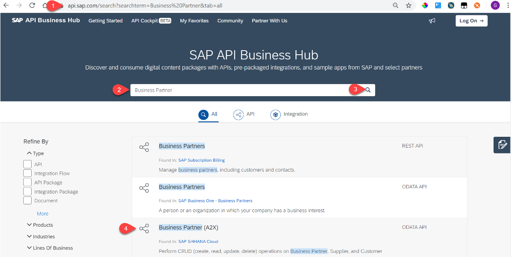
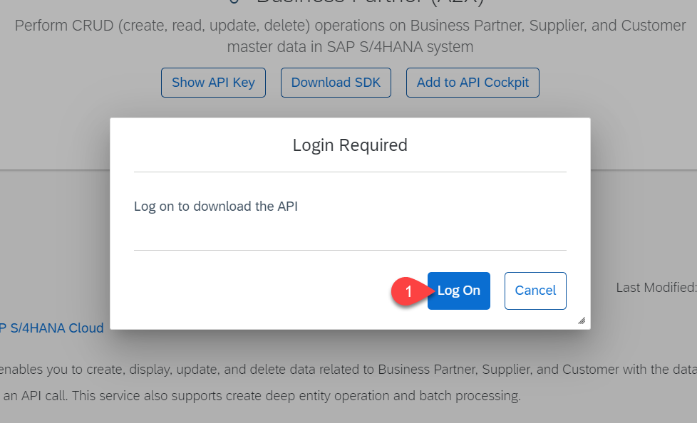

# Lookup API in API Business Hub

## Introduction
You will look up the required API on API Business Hub and download its specification as an EDMX file. 

**Persona:** BTP Developer

### Find and download API

1. Open http://api.sap.com
2. Enter Business Partner in the Search Tab. 
3. Click on the Search Button
4. Click on Business Partner (A2X)

 
 
5. Click on Details Tab

**Optionally if you want to use the API in another SAP Cloud Application Programming Model application**: 
> The GitHub repository including source code you will later on clone already has the OData metadata specification incorporated.
6. Click on Download API Specification
7. Select EDMX in the Pop Up

 
 
8. Log On to Download the EDMX file

 

9. Download the EDMX file to your machine so you could later on use it while developing the SAP Cloud Application Programming Model application.
