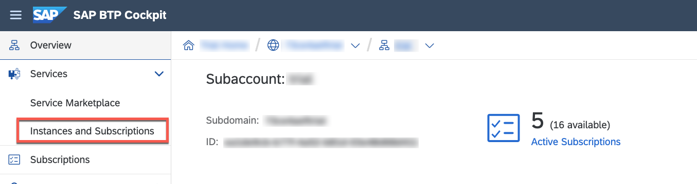
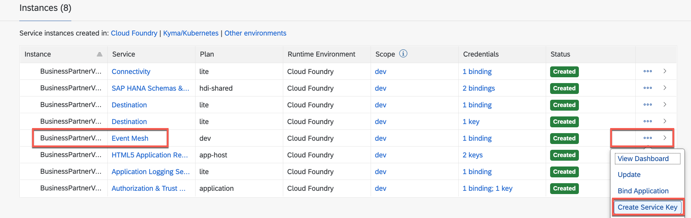
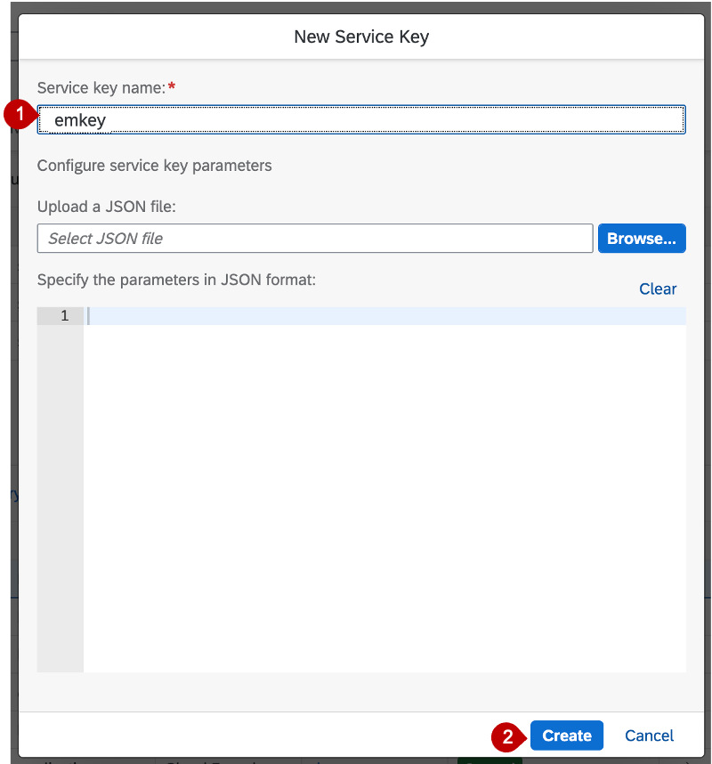
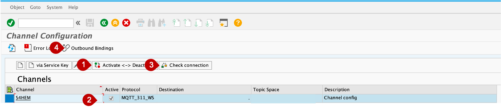

# Configure event based communication between S/4 and SAP Event Mesh
## Introduction

In this how to guide, you will establish a connection between your S/4HANA on Premise System and Event Mesh. This connection is needed to transport events from the SAP S/4HANA system to Event Mesh. 

Additional documentation on configuring trust and creating the RFC destination can be found in the official guide:
 
https://help.sap.com/viewer/810dfd34f2cc4f39aa8d946b5204fd9c/1809.000/en-US/12559a8c26f34e0bbe8c6d82b7501424.html

**Persona:** S/4HANA Developer

### Configure Endpoint

1. Open your browser and navigate to your subaccount in the SAP BTP Cockpit. 
2. Click on *Instances & Subscriptions* in the menu on the left.
   
 

3. Scroll to the Instances tab, and look for Event Mesh in the table. Now click on the 3 dots to open the dropdown and choose 'Create Serive Key'

 
 
5. Provide a service key name e.g. EMServiceKey. Click on create.

 
 
6.  Click on your created Service Key to open the detail view
  
7. Find and copy your Event Mesh token endpoint URL. Look for token endpoint and then copy the URL. Make sure you have selected the Service Key in the dropdown

 
 
 ### Configure Channel
 
 1. Open your S/4 HANA system and navigate to the transaction */IWXBE/CONFIG*
 2. Click on *via Service Key*
 
 
 
 3. In the popup choose a *channel name* e.g. 'S4EM', provide a description and paste the *Service Key* you have created in the ealier steps
 4. Then click on *save configuration*

  
  
 5. After your configuration is saved, click on the *Activate - Deactivate* button
 6. Click on *Check connection*
 7. Then click on *Outbound Bindings* to start the configuration
 
  
  
 8. In the next screen first click on *Create*, then select the *topic*
 
 