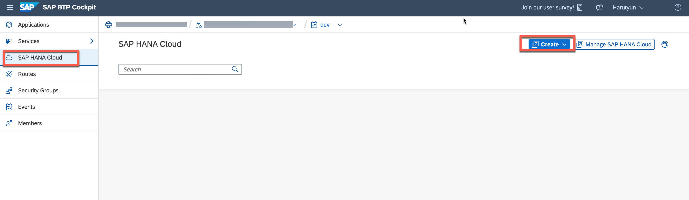
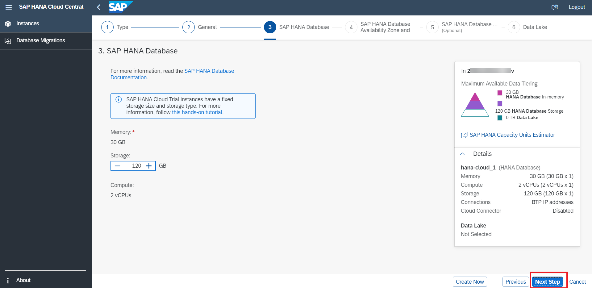
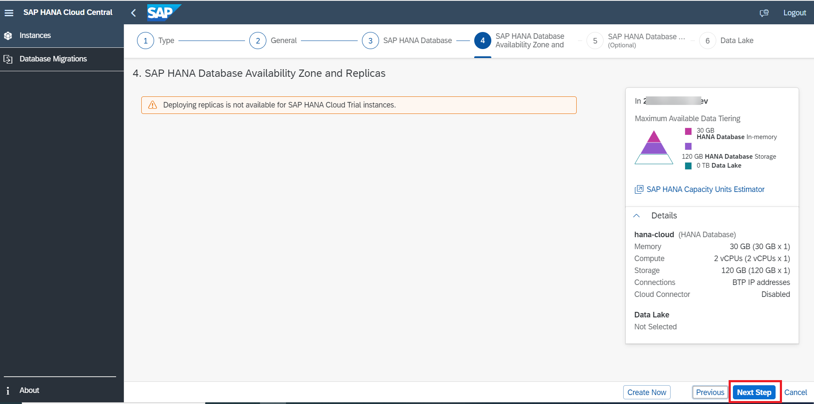
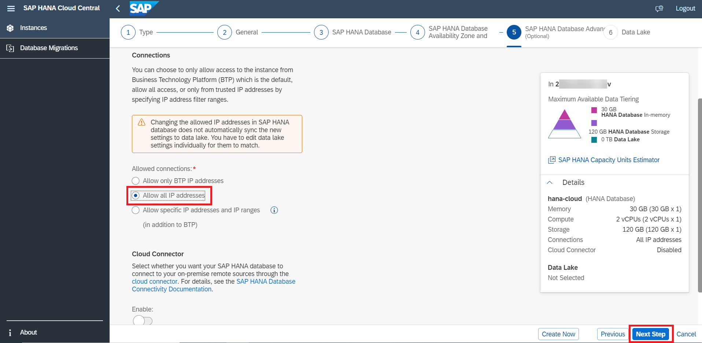
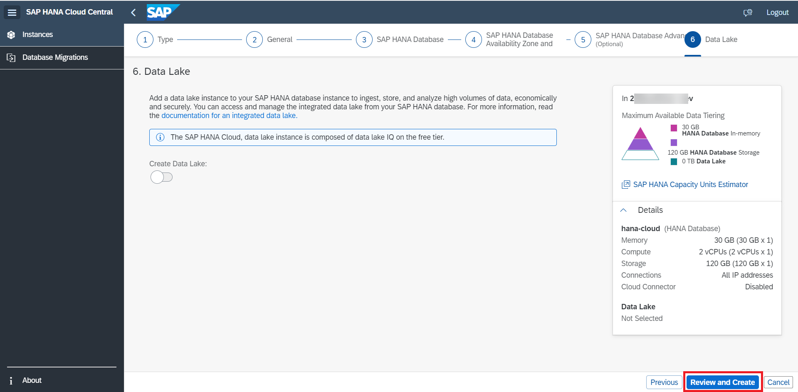
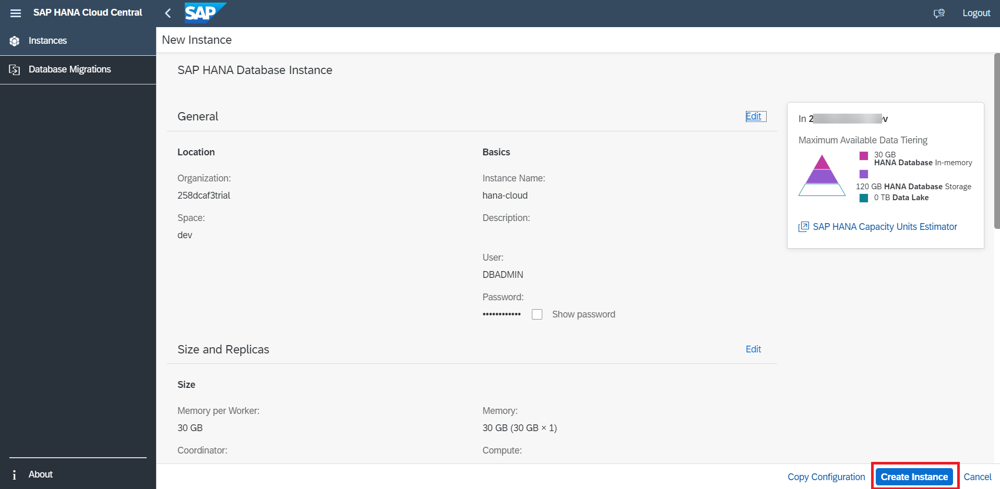

# Create HANA Cloud Instance 

This step is required for newly created accounts, e.g. with Boosters where you don't have HANA Cloud instance. In case of existing subaccount with HANA Cloud instance, you can skip this section

1. Open your *Subaccount* and go to the *Space* 

2. Open *SAP HANA Cloud* tab and create new instance 
   
    

3. Click on _SAP HANA Database_ 

    

3. It will route you to **SAP HANA Cloud Central**. Then Click on _SAP HANA Cloud, SAP HANA Database_ and click on _Next Step_

    

3. Give an Instance Name and the Password for DBADMIN user and click on _Next Step_

    

4. Choose the Database Memory size and click on _Next Step_
   
   

5. In _SAP HANA Database Availability Zone and Replicas_ click on _Next Step_
   
   

5. Select who can have access to you SAP HANA database instance (allowed connections) and click on _Next Step_
   
   

6. Click on _Review and Create_

    
    
6. Review the selections and click on _Create Instance_

    
    
6. Wait couple of minutes until the HANA Cloud Instance is created

    

[< Back to Usecase](../usecase.md)