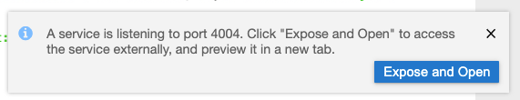

# Develop SAP Cloud Application Programming Model Application

## Introduction

In this how to guide, you will clone an existing CAP application in SAP Business Application Studio and test your application.

**Persona:** BTP Developer

### Create a new application in SAP Business Application Studio

1.	Make sure you have opened your *SAP BTP Account* and navigate to your *Subaccount* 
   
2.	Open the menu *Services* and navigate to *Instances and Subscriptions*
   
3.	Choose "SAP Business Application Studio" unter the *Subscriptions* tab and click on the icon to open the application
     
     
 
4.	 After opening the home sceen of SAP Business Application Studio, click the button *Create Dev Space*

     
 
5.	On the next screen you will create the new Dev Sapce. For this enter a Dev space name e.g 'BusinessProcess', select the type *SAP Cloud Business Application*.
    Don´t forget to click on the button *Create Dev Space*

      
      
 
6.	Your Dev Space is now being created. As soon as the Dev Space is running you can click on your Dev Spaces name to  access

7.	Choose *Terminal -> New Terminal* in the menu on the top of your screen.

    
 
8. In the opened terminal go to projects folder with executing
   
   ``` 
   cd projects
   ``` 

9. Clone the provided sample GitHub repository for this mission. 

    ```
    git clone https://github.com/SAP-samples/s4hana-btp-extension-devops
    ```

10.	Click on *File* in the menu on the top and choose *Open Workspace* in the drop down.

    
 
11.	Open the project by selecting projects -> s4hana-btp-extension-devops and click on *Open*

12. Run the application locally in your SAP Business Application Studio environment by executing the following command in the root directory of your project in the terminal:

    ```
    cds watch
    ```

    Click on `Expose and Open` in the appearing PopUp. 

    


13. Logon to the SAP BTP, Cloud Foundry Runtime. 

    - Click on **View > Find Command** in the menu on the top.
   
      
    - Search for **Login to Cloud Foundry** and press **Enter** to confirm.
      

    - Copy & Paste the API Endpoint of your subaccount from the SAP BTP Cockpit. 
      
 
    - Follow the process by entering the credentials of your SAP BTP account and by selecting the Cloud Foundry org and space you want to deploy the application to.

14. Build the Multi-Target Application Archive (MTA Archive) by executing the following command in the root directory of your project in the terminal:

    ```
    mbt build
    ```

>this will produce a .mtar file in the mta_archives directory

15. Deploy the application to SAP BTP, Cloud Foundry Runtime by executing the following command in the root directory of your project in the terminal:

    ```
    cf deploy mta_archives/BusinessPartnerVerification_1.1.0.mtar
    ```

    This will trigger the deployment to SAP BTP, Cloud Foundry Runtime including the creation of the necessary service instances and service bindings to the corresponding apps. 

16. 