# S/4HANA Extension over BTP Private Link (BETA) to Azure

In this section you can find all required steps for your Extension Application to use SAP Private Link Service to consume OData resources from S/4HANA system located on **Azure** subscription. 
More details about [BTP Private Link Service ](https://blogs.sap.com/2021/06/28/sap-private-link-service-beta-is-available/).

In our use case we are going to use the SAP Private Link service to communicate with an SAP S/4HANA system (or other SAP or non-SAP system running on a VM in your own Azure account) privately from within SAP BTP Cloud Foundry without SAP Cloud Connector.

Having BTP Private Link will not require anymore to expose the systems and communication through internet and the whole traffic is secured by internal hyperscaler network without any exposure. 

Current use case is describing a S/4HANA extension, of course having a S/4HANA solution deployed on Azure.

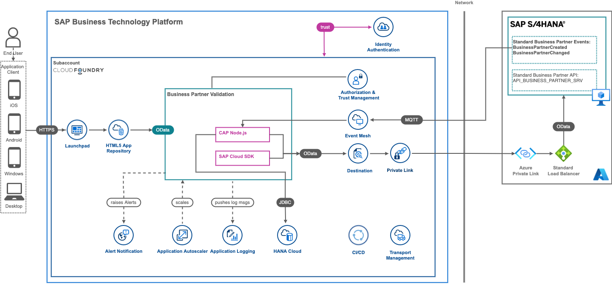

## Architecture Description
With SAP Private Link service, Cloud Foundry applications running on SAP BTP with Microsoft Azure as IaaS provider  can communicate with Azure Private Link services via a private connection. 
This ensures that traffic is not routed through the public internet but stays within the Azure infrastructure.


This connection can be established by creating an Azure Private Link service that exposes a load balancer which routes traffic to the SAP S/4HANA system. This Azure Private Link service must then be used as the resource to which the SAP Private Link service connects to. As soon as the connection is established successfully, the SAP Private Link service provides a private IP pointing to the Azure Private Link service.

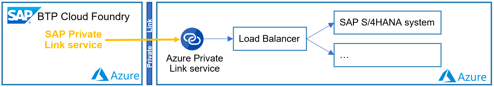

## Set Up SAP Private Link Service on BTP

The BETA version of Private link service is available on BTP accounts running on Azure and should be enabled under your BTP subaccount.

To be able to use the functionalities of SAP Private Link service, you first need to set the entitlements in your subaccount.
On <code>SAP BTP Cockpit -> Entitlements</code>, the <code>Private Link Service</code> should be configured.

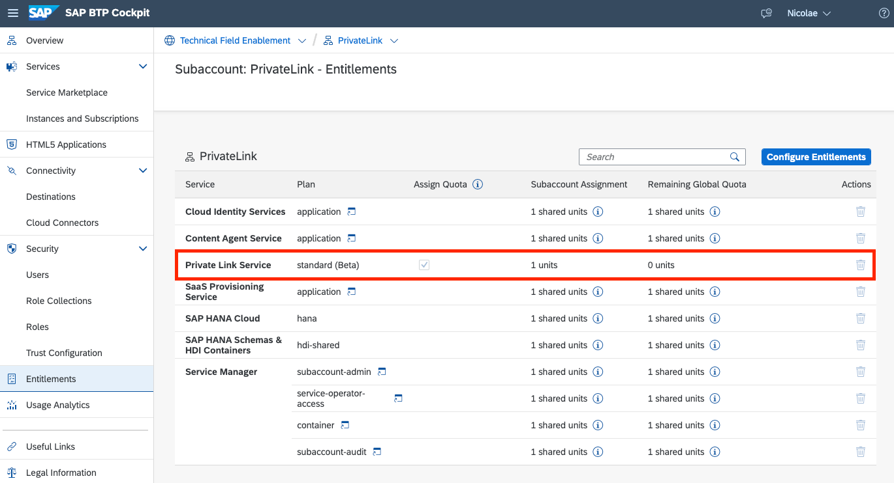


## Azure Private Link Service

Azure Private Link Service can be created only by using a Azure Load Balancer. 

**Very Important**:  [Azure Private Link Service is only supported on Standard Load Balancer.](https://docs.microsoft.com/en-gb/azure/private-link/private-link-service-overview#properties)

### Creation of Azure Load Balancer

As reference see bellow, where all properties should be yours, the only two properties have to remain unchanged:
- Type: Internal
- SKU: Standard


Once created, navigate to it, under the <code>Settings -> Health probes</code>, health probes records should be added 
by clicking the <code>+ Add</code> button.


For S/4HANA VM as health probe will serve port 22.


Now is time to add Virtual Machines which will serve the load coming to current load balancer.

Under the created load balancer, navigate to <code>Settings -> Backend pools</code>, a pools of virtual machines should be added
by clicking the <code>+ Add</code> button. 


**Very Important**:  If Virtual Machine which is supposed to be added into the pool do have associated a Public IP,
then the Public IP should have the Standard SKU. Usually VMs created using CAL do have Public IP on Basic SKU, 
so manually should be changed to Standard. 

Make sure that a pool has been created and Virtual Machine has been added.

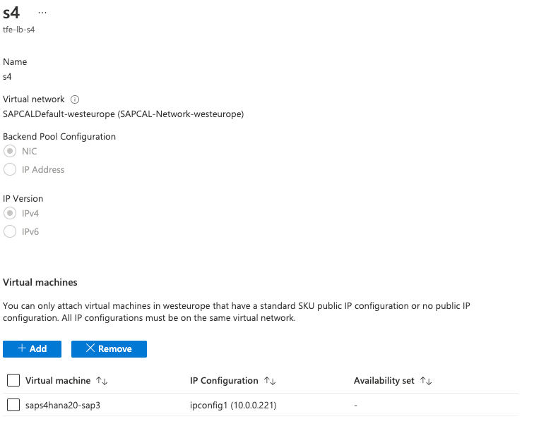

Under the <code>Settings -> Load balancing rules</code>, records should be added
by clicking the <code>+ Add</code> button. Two rules should be created having port and backend port 50000 & 44300 
using early create pool and health probe, as reference:

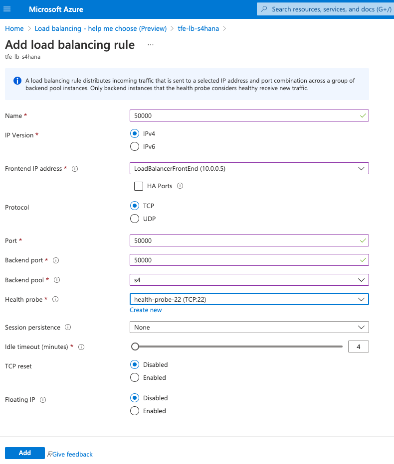

After the status can be checked navigating <code>Monitoring ->Insights</code>, green status required.


### Creation of Azure Private Link Service

A private link service required in order to have a private link as endpoint. 

Navigate to <code>Private Link Center -> Private link services</code> and add new one by clicking the <code>+ Add</code> button. 

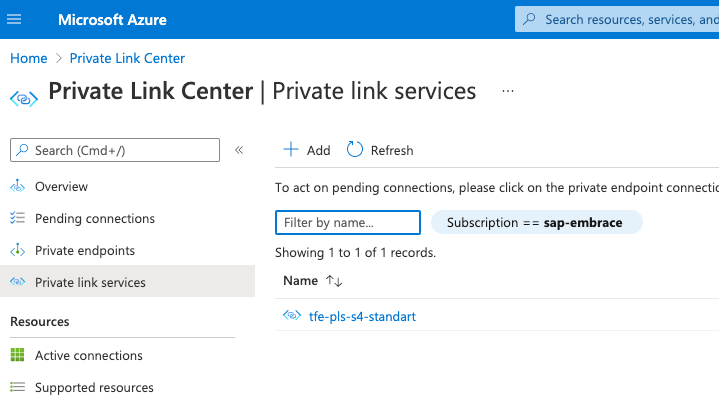

Specifying Basics information:


Specifying Outbound information, by selecting early created load balancer:


**Very Important**:  Enable TCP V2 option should be on "No". 

At the end of wizard click on <code>Create</code> button.

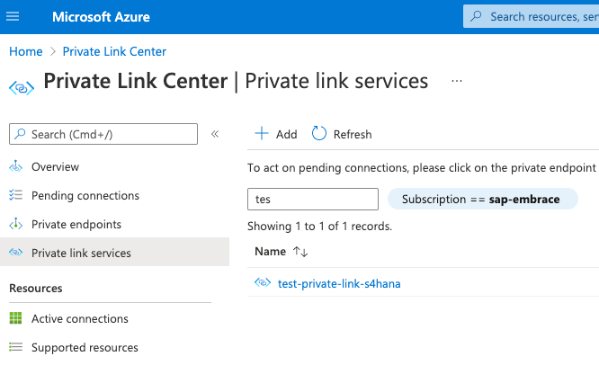

Once create the private link service click on it and look for <code>JSON View</code> link and click on it.


Collect the resource id.

## Create the BTP Private Link Instance

Having the Private Link Service create on Azure and collected the Resource ID, 
ready to start the creation of private link instance on BTP.

Navigate to BTP Cockpit, select the sub account, under the <code>Instances and Subscriptions</code>, 
click <code>Create</code> button.

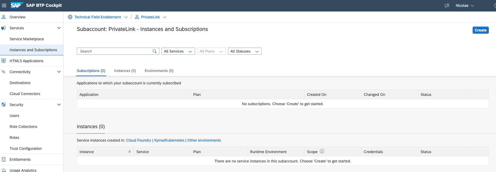

Select from list of service the <code>Private Link Service</code> and give a name to instance.

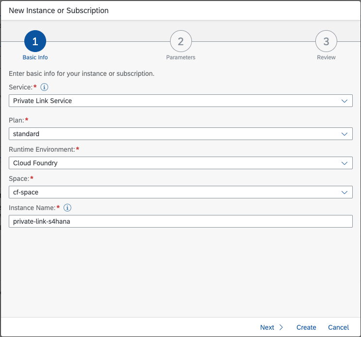

Click the <code>Next ></code> button.

You will find a JSON text where "resourceId" field should have as value collected from 
Azure created Private Link Service Resource ID. 

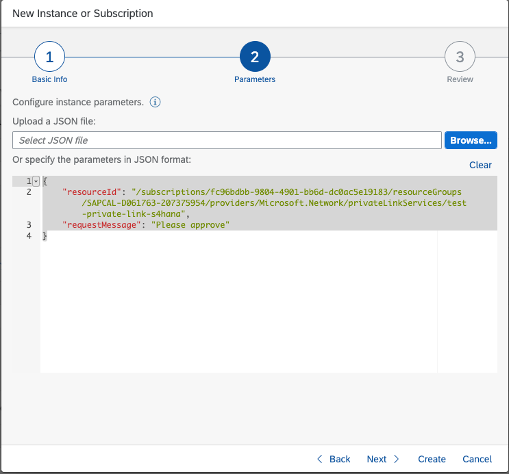

Click the <code>Create</code> button.

New instance of private link creation with status <code>Creation in Progress</code> will come up on BTP instances list.


In order to change the status to <code>Created</code>, an operation on Azure portal is required.

Navigate to Azure Portal on <code>Private Link Center -> Pending connections</code>,
and a waiting connection to be approved, if no records wait by clicking refresh button. 

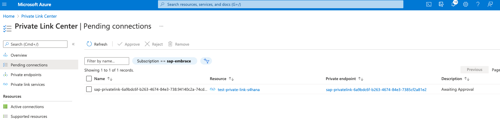

Once pending connection displayed, select it and click the <code>Approve</code> and <code>Yes</code> buttons. 
After some time the record will go away as approved.

Go back to SAP BTP Cockpit, and the private link instance should have green <code>Created</code> status.

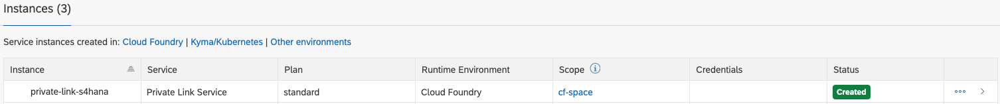

Now Ready to bind the BTP application to private link instance to get the private link ip,
which will have direct connection to S/4HANA Virtual Machines.


## Prepare the CAP Application for PrivateLink communication

There are two steps required to enable the private link connection in CAP Application. First we need to bind the Private Link service to our extension application and second make the changes in **Destination**

### Bind application to Private Link service

Open the MTA deployment descriptor and add following resource to your MTA and assign it to *BusinessPartnerVerification-srv*

```json

modules:
  - name: BusinessPartnerVerification-srv
    type: nodejs
    path: gen/srv
    requires:
      - name: BusinessPartnerVerification-pl
      - ...

...

resources:
  # PrivateLink Service
  - name: BusinessPartnerVerification-pl
    parameters:
      service: privatelink
      service-name: private-link-s4hana
      service-plan: standard
    type: org.cloudfoundry.managed-service
```

### Configure the "BusinessPartner" destination

Open your SAP BTP Account and navigate to your Subaccount
Choose Connectivity in the menu on the left then choose Destinations
Create new destination and enter the following information to the Destination Configuration:

>Note: Use ProxyType: Internet and provide Private IP address defined in PrivateLink Service Instance.

## Destination config
Property | Value |
--- | --- |
Name | BusinessPartner |
Tyoe | HTTP |
URL | https\://10.220.0.4\:44300 (replace with your Private link Private IP) |
Proxy Type | Internet |
Authentication | BasicAuthentication |
User | <<  username >> |
Password | <<  password >> |

### Additional Properties
Property | Value |
--- | --- |
sap-client | 400 (or the client you want to connect to) |
TrustAll | true |
HTML5.DynamicDestination | true |
WebIDEEnabled | true |
WebIDEUsage | odata_abap |

> Note, **TrustAll** needed with **HTTPS** connection. For maximum security we need to be a bit patient with the BETA version until all requirements are compiled and a general solution to this can be offered.