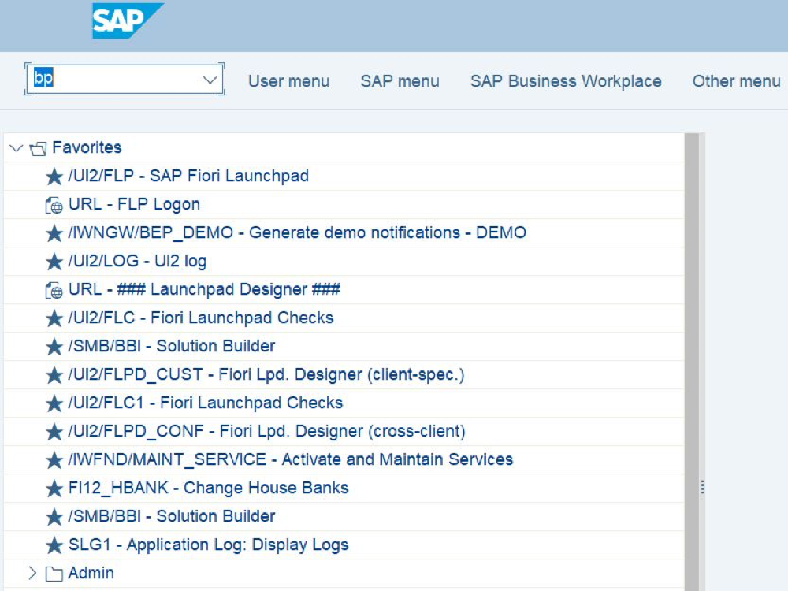
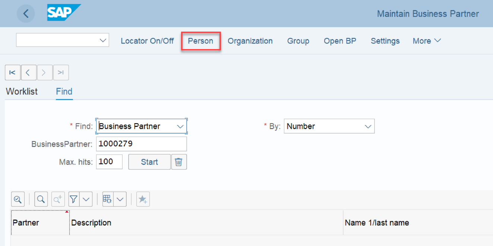
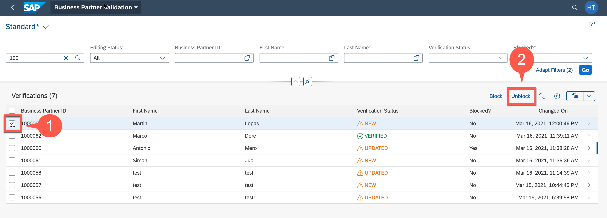

# Test Basic Scenario End to End
## Introduction

Now it is time to test your basic scenario. As a result of the following steps you will be able start up your application, create an event in your S/4HANA On Premise system and see the Business Partner you have created appear in your application.

# Run Application and test entire Business Scenario

1. To access the application, it require to assign **BPAdmin** role collection to respective user. 
   
   - Go to BTP cockpit, open Security -> User
   - Assign **BPAdmin** role collection to respective user
  
    

2. Start your Business Partner Validation Application

    - In BTP Cockpit go to the *HTML5 Applications*

    - Find the BusinessPartnerValidation app and launch the URL

        

    - Click on Business Partner Validation tile
    
        

    - The list of BusinessPartners along with their verification status gets displayed.

        

3. Now we can switch to S/4HANA System to create new business partners or modify existing ones.

4. Login to your SAP S/4HANA On Prem System

    

5. Enter transaction code *bp*

    

6. Create a new Business Partner

- Click on Person

    
 
- Provide first name, last name for the business partner
 
    
  
- Provide the address  
  
    
 
 - Move to the status tab and check mark the 'Central Block' lock. Save the BP. This will create a new Business Partner
   
    

5. Now go back to the BusinessPartnerValidation application on BTP to see if the new BusinessPartners has come on the UI

    

6. You can select the business partner to *block* or *unblock* it or you can navigate to details to edit the address and status information
   

7. Go to the details page for the new BusinessPartner.
8. Click on Edit and update the address or set status e.g. *verified*

    
    

9.  Go to your S/4HANA On Prem System 
10. Go to transaction *bp*

    

11. Open the details of the Business Partner you have just updated and check the changes

    

12. Go to the Status tab. You can see that the central Block lock has been removed.

    

[< Back to Usecase](../usecase.md)