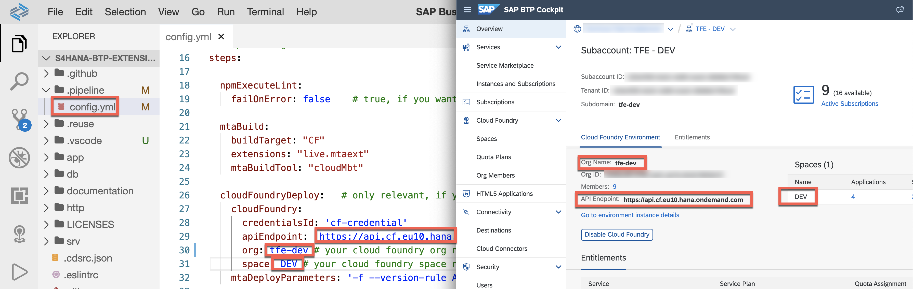

# Setup CI/CD Pipeline

This section describes how to configure and run a predefined continuous integration and delivery (CI/CD) pipeline that automatically tests, builds, and deploys your code changes to speed up your development and delivery cycles.

The steps below will guide your through settting up your pipeline.

1. Enable SAP Continuous Integration and Delivery (Optional - in case you used Booster)
   
    >Note, you can skip this step, if you used previously the Booster to initiate the Subaccount

   - Go to your subaccount in SAP BTP
   - Navigate to the Service Marketplace
   - Find the Continuous Integration & Delivery Service and subscribe to the Service.

    

   - Assign the Role Collection **"CICD Administrator"** to your user
   - Find your user and choose Assign Role Collection

    


2.  Configure the pipeline

    - Click on *Service Marketplace* or *Instances and Subscriptions*
    - Find *Continuous Integration & Delivery* (you might use the search functionality)
    - Click on “Go to application”

    

3. Add BTP credentials

    - Click on credentials tab
    - Click on ‘+’

    

    - Enter a freely chosen name for your credential, which is unique in your SAP BTP subaccount. In this example, the name of the credential is *cf-credential*.
    - As type select *Basic Authentication* 
    - For Username, enter your BTP Account username/email.
    - For Password, use the BTP Account password
    - Click on create

    >Note, if you choose other credential name then our example, you need to make the changes in pipline config.yml as well.

    

4.  Add GitHub credentials

    - Click on ‘+’
    - Enter a name for your credential, which is unique in your SAP BTP subaccount. In this example, the name of the credential is *githubtools*.
    - As type select *Basic Authentication* 
    - For Username, enter your GitHub username.
    - For Password, use the personal access token for GitHub
    - (Hint: access tokens can be created in GitHub by going to *Settings* -> *Developer Settings*)
    - Click on create


    


5. Add your Repository
   - Navigate to **"Repository"** Tab in CI/CD Service and click on ‘+’ to add your repository
   - Give a name for repository. e.g. **s4hana-ext-cap** 
   - Enter the *Repository URL*, which you **forked** to your Github account. (github.com/**YourUser**/s4hana-btp-extension/devops)
   - Select the github credentials (githubtools) created in previous step. 

   

6. Create a GitHub Webhook
   
   In this step we will configure the Github Hook by entering the CI/CD endpoint URL and credentials. This will allow Github to notify CI/CD service that there are code changes in repository.

   To create a webhook in GitHub, you need some data that has been automatically created during the previous step. You can find this data (Payload URL and Secret) when you open the detail view of an existing repository in the Repositories tab

   - Click on Repositories
   - Open on the Detail View of your repository by clicking on the arrow at the end of the row
   - The detail view opens up on the right hand side
   - Click on Webhook Data
   
    
   
   - You will see a pop-up like the one below
   
    

7.  Add Webhook in GitHub

    - In your repository (github.com/**YourUser**/s4hana-btp-extension/devops) in GitHub go to the Settings tab.
    - From the navigation pane, choose Webhooks.
    - Choose Add webhook.

     

    The data required below can be found in the CI/CD popup.

    - Enter payload url
    - Select content type as application/json
    - Enter the secret

    The details to be entered as available in the pop up in CI/CD.

    - Click on ‘Add webhook’

    


8.  Configure a CI/CD Job

    - In the Jobs tab in SAP Continuous Integration and Delivery, choose *+* to create a new job.
    - For Job Name, enter a freely chosen name for your job, which is unique in your SAP BTP subaccount, for example ‘s4hana-btp-extension’.
    - Under Repository, select the previously configured repository
    - For Branch, enter the GitHub branch from which you want to receive push events. In this example, **main**.
    - As Pipeline, choose SAP Cloud Application Programming Model.
    - Keep the default values in the BUILD RETENTION tab.
    - In the Stages tab, choose **'Source Repository'** from the Configuration Mode dropdown list. Alternative for this is the Job Editor, where you can configure the pipline steps in UI. In our example we defined the pipline configuration in "source code" and the configuration file can be found in *.pipline/config.yml*
    - Choose *Create*.
    


9. Open the *.pipeline/config.yml* file in the SAP Business Application Studio. 
   
10. Update the following values for your deployment target and **Save** the file after you have made the changes.

    

    > the left half of the screenshot shows the config.yml file, the right half of the screenshot shows the subaccount information of SAP BTP Cockpit with the needed values. 
    >
    > NOTE: In case you are using SAP BTP Trial enviroment, change the **_mtaBuild > extensions_ ** to **"trial.mtaext"**

11.Go to the terminal and execute the commands below to push the changes to your fork. This will also trigger the first job if everything went fine. 

```shell
git add .
git commit -m "config.yml configured for deployment target"
git push
```

 - Goto the CI/CD app 
 - Check on the right hand side that the build has been triggered

 

