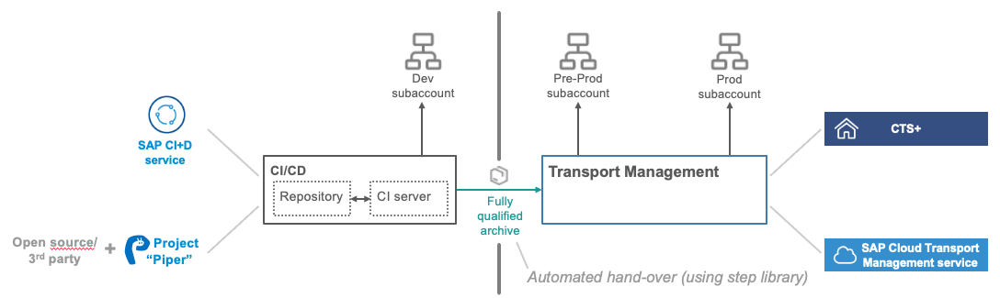
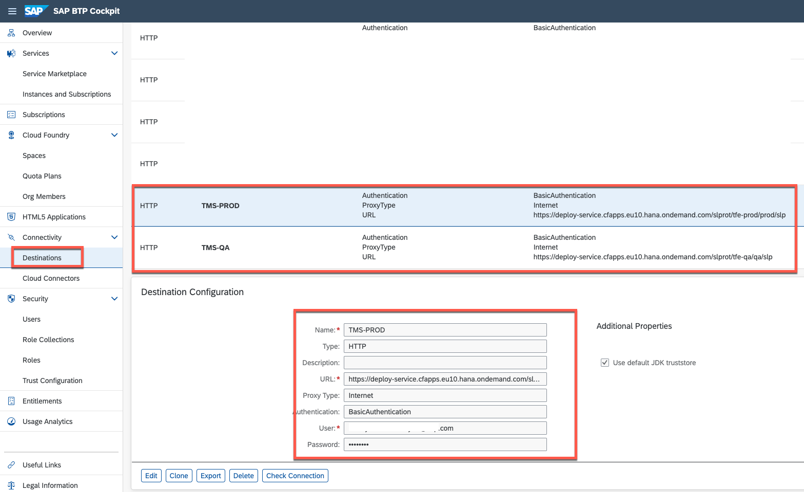

# Setup Cloud Transport Management Service

As soon as you have a release candidate of your app version in form of a fully qualified archive, you want to propagate it towards your production subaccount.
You can do it either fully automated as part of a pipeline – ideally based on the Continuous Integration best practices or pipeline templates or with a standardized, enterprise-ready change management process, if you desire more control especially of your production environment – using our cloud-based SAP Cloud Transport Management service. 

In this extension usecase we will show how to combine Continuous Integration & Transport Management
It will show the best of both worlds (with a combination of CI and transport management).

We can differeciate 
  * A *development* landscape, based on **Continuous Integration** principles and used to verify single developer changes by an automated pipeline and
  * A *delivery* landscape, based on strict **transport management rules** (such as policies, schedules and roles) and used to verify release candidate versions, where propagation towards production is typically done with manual confirmation)

> Note, this is not possible to run on **BTP trial** landscape due to limited quote for having multiple subaccounts. 

> Prerequisites: make sure that you have 3 subaccounts (Dev, QA/Pre-Prod, Prod) to successfully execute the transport and release. Additionally to *Dev* Subaccount, create Pre-Prod and Prod Subaccounts with sufficient Quota to deploy the application.

TODO: Share HANA Cloud with the other subaccount.
TODO: Quota indication for preprod and prod.

Before we can combine both services, we need to setup Cloud Transport Management. The required steps are described below:

> Note, in case you used at the beginning of the mission the **booster** to setup the account, you can skip first 2 Steps, it's done by booster automatically.

1. Enable/Subscribe to SAP Cloud Transport Management

   - In the subaccount, choose Services > Service Marketplace.
   - The entitled subscriptions are shown.
   - Search for Cloud Transport Management
   - On the Cloud Transport Management tile, choose (Actions)and Create.
   - In the subsequent dialog, the Cloud Transport Management service is preselected. Select the saas-application plan and create.

   

2. Assign User Roles and Permissions in Cloud Transport Management

    After successful subscription, you need to configure user access to the application. You need different role collections for the different Cloud Transport Management roles, and assign roles to the role collections based on the application templates. Afterwards, you assign the role collections to users or user groups.

   - Create 2 role collections for the Cloud Transport Management
      * TMS Import Operator
      * TMS Admin

   - To create a new role collection, in your subaccount, choose Security  Role Collections.
   - Choose ... (Create New Role Collection).
     
     

   - Enter a name (*TMS Import Operator*) for the new role collection, and choose Create. 
     
     

   - Repeat the previous steps to create the *TMS Admin* role collection.
   - The new role collections are added to the list.
     
     

   - In your subaccount, choose Services  > Instances and Subscriptions.
  
     
    
   - On the Subscriptions tab, in the Cloud Transport Management row, choose ... (Actions) and Manage Roles.
  
     

   - The default role templates are displayed
  
     
  
   - Assign the  Cloud Transport Management roles to the role collections
     * ImportOperator > TMS Import Operator
     * Administrator > TMS Admin
  
     
   
   - Assign Role Collections (TMS Import Operator & TMS Admin) to your user
     
     

4. Configuring the Landscape
   Before you can use SAP Cloud Transport Management to transport cloud applications or application content between different subaccounts, you must configure your landscape for transports.
   Following steeps are required to setup the landscape
   * Create Transport Destinations
   * Use the Transport Landscape Wizard
   
   Follow the next steps to configure the transport landscape

5. Create Transport Destinations
   
   In SAP Cloud Transport Management, transport destinations are used to address the target end point of a deployment process.

   - Go to Subaccount where you activated the Cloud Transport management
   - Create 2 Destinations pointing to QA/Pre-Prod and Prod Subaccuonts
  
    | Destination  | URL                                                                                          | Authentication | User/Password |
    | -------------| -------------------------------------------------------------------------------------------- | -------------- |------------- |
    | **TMS-QA**   | https://deploy-service.cfapps.< default-domain >/slprot/< myorg-qa >/< myspace-qa >/slp      | Basic Authentication | username & password of the technical user |
    | **TMS-PROD** | https://deploy-service.cfapps.< default-domain >/slprot/< myorg-prod >/< myspace-prod >/slp  | Basic Authentication | username & password of the technical user |

    

    > Instead of Basic Authentication, it is also possible to use OAuth2Password Authentication. More details can be found [here](https://help.sap.com/viewer/7f7160ec0d8546c6b3eab72fb5ad6fd8/Cloud/en-US/c9905c142cf14aea86fe2451434faed9.html)

6. Use the Transport Landscape Wizard
   
   You can use the Transport Landscape Wizard to configure the transport nodes and transport routes of simple transport landscapes.

   - Open SAP Cloud Transport Management 
   - 'Go to Application' link is available that allows you to start the user interface of SAP Cloud Transport Management, as shown in the image below:
  
    

   - Start the Landscape Wizard.
   - Choose Two-Node Landscape (QA/Pre-Prod and Prod) and go to next step.
   > Reminder: 2 Nodes, since **Dev** Node/Subaccount is part of Development Landscape and is delivered by CI.

    

   - Provide the details of Nodes:
  
    | Node | Name | Allow Upload | Forward Mode | Content Type | Destination |
    | -----| ---- | -------------| ------------ | -------------|-------------|
    | Node 1 | QA | true | Auto | Multi-Target App | TMS-QA | 
    | Node 2 | PROD | false | Auto | Multi-Target App | TMS-PROD |
  
   - Give a name for the transport route: **route_qa_prod**
    
    
  
   - After successfully finishing the step, you will find the newly defind Nodes in **Landscape Visualization**

   