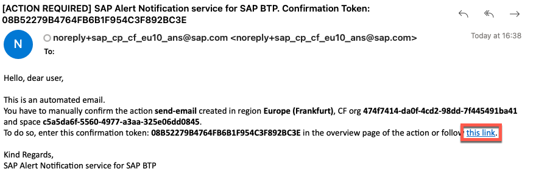

# SAP Alert Notification 

SAP Alert Notification service is a service in the DevOps portfolio of SAP BTP. It supports the operations by exposing real-time information about cloud-native as well as hybrid solutions. The service standardizes an environment-agnostic model across SAP BTP, so that users can benefit from the same configuration lifecycle and information model.


Service offers a variety of Built-In Events. The complete list can be found [here](https://help.sap.com/viewer/5967a369d4b74f7a9c2b91f5df8e6ab6/Cloud/en-US/2ef9c72833df4f2690f071c47f50f5af.html)

For our extension use-case we will define following Alerts:
* *Application Events* - get notifications when app stopped, crash, process crash, etc.
* *Multitarget Application Evetns* - get notification when the deployment or removal of a specific multitarget application has been initiated
* *SAP Cloud Transport Management Events* - get notification when an SAP Cloud Transport Management import has started or finished.

1. Create Alert Notification Service instance
   - Go to Service Marketplace and create new instance
    
   - Give a name (e.b. alert-notification) and create
    

2. Go to Alert Notification cockpit
   - Select newly created instance and click on *"Manage Instance"*
   
   

3. Import Configuration
   
   

   - Copy the Configuration JSON and replace **<your@email.com>** with your email, where you want to receive the notifications
   - Past it and import

    ```json
    {
        "actions": [
            {
                "type": "STORE",
                "name": "tmp-store",
                "state": "ENABLED"
            },
            {
                "type": "EMAIL",
                "name": "send-email",
                "state": "ENABLED",
                "properties": {
                    "destination": "your@email.com",
                    "useHtml": "false"
                }
            }
        ],
        "conditions": [
            {
                "name": "Audit-App-Stop",
                "mandatory": false,
                "propertyKey": "eventType",
                "predicate": "CONTAINS",
                "propertyValue": "audit.app.stop",
                "labels": [],
                "description": ""
            },
            {
                "name": "tms-import",
                "mandatory": false,
                "propertyKey": "eventType",
                "predicate": "EQUALS",
                "propertyValue": "TmsImportStarted",
                "labels": [],
                "description": ""
            },
            {
                "name": "qa-node",
                "mandatory": false,
                "propertyKey": "tags.nodeName",
                "predicate": "EQUALS",
                "propertyValue": "QA",
                "labels": [],
                "description": ""
            },
            {
                "name": "tms-import-finished",
                "mandatory": false,
                "propertyKey": "eventType",
                "predicate": "EQUALS",
                "propertyValue": "TmsImportFinished",
                "labels": [],
                "description": ""
            },
            {
                "name": "Audit-App-Update",
                "mandatory": false,
                "propertyKey": "eventType",
                "predicate": "EQUALS",
                "propertyValue": "audit.app.update",
                "labels": [],
                "description": ""
            },
            {
                "name": "mta-deployment",
                "mandatory": false,
                "propertyKey": "eventType",
                "predicate": "EQUALS",
                "propertyValue": "DEPLOYMENT",
                "labels": [],
                "description": ""
            },
            {
                "name": "prod-node",
                "mandatory": false,
                "propertyKey": "tags.nodeName",
                "predicate": "EQUALS",
                "propertyValue": "PROD",
                "labels": [],
                "description": ""
            },
            {
                "name": "mta-category",
                "mandatory": false,
                "propertyKey": "category",
                "predicate": "EQUALS",
                "propertyValue": "NOTIFICATION",
                "labels": [],
                "description": ""
            },
            {
                "name": "Audit-App-Start",
                "mandatory": false,
                "propertyKey": "eventType",
                "predicate": "EQUALS",
                "propertyValue": "audit.app.start",
                "labels": [],
                "description": ""
            }
        ],
        "subscriptions": [
            {
                "name": "MTA",
                "conditions": [
                    "mta-deployment"
                ],
                "actions": [
                    "tmp-store",
                    "send-email"
                ],
                "state": "ENABLED"
            },
            {
                "name": "App-Audit",
                "conditions": [
                    "Audit-App-Stop",
                    "Audit-App-Update",
                    "Audit-App-Start"
                ],
                "actions": [
                    "tmp-store",
                    "send-email"
                ],
                "state": "ENABLED"
            },
            {
                "name": "TMS",
                "conditions": [
                    "tms-import",
                    "prod-node",
                    "qa-node",
                    "tms-import-finished"
                ],
                "actions": [
                    "tmp-store",
                    "send-email"
                ],
                "state": "ENABLED",
                "description": "Transport Management Events"
            }
        ]
    }
    ```

4. After Import you will find 2 Actions
   
   * *send-email*: will send e-mail when alert happens
   * *tmp-store*: stores the alert temporary in the service. Later it can be accessed e.g. via Cloud ALM
  
   
  
 >There are much more notification channels like slack, MS Teams, etc. The full list can be found [here](https://help.sap.com/viewer/5967a369d4b74f7a9c2b91f5df8e6ab6/Cloud/en-US/8a7e092eebc74b3ea01d506265e8c8f8.html). You can follow the documentation to configure further actions

5. Confirm your E-mail to activate the E-mail channel
   
   

6. 