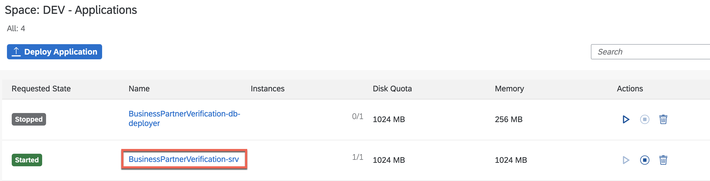
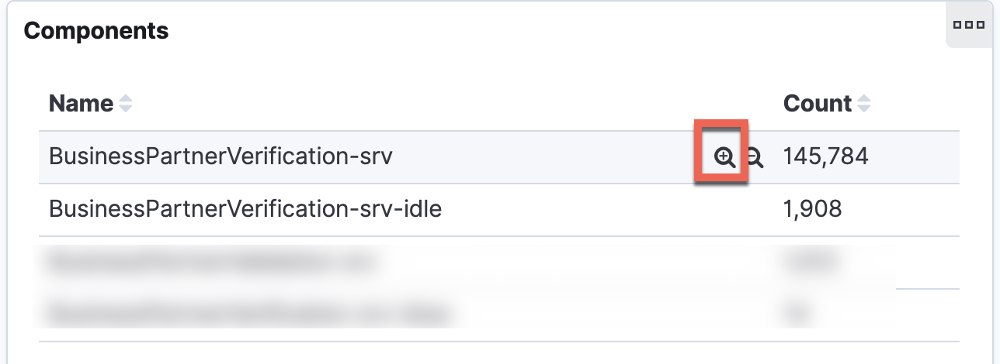
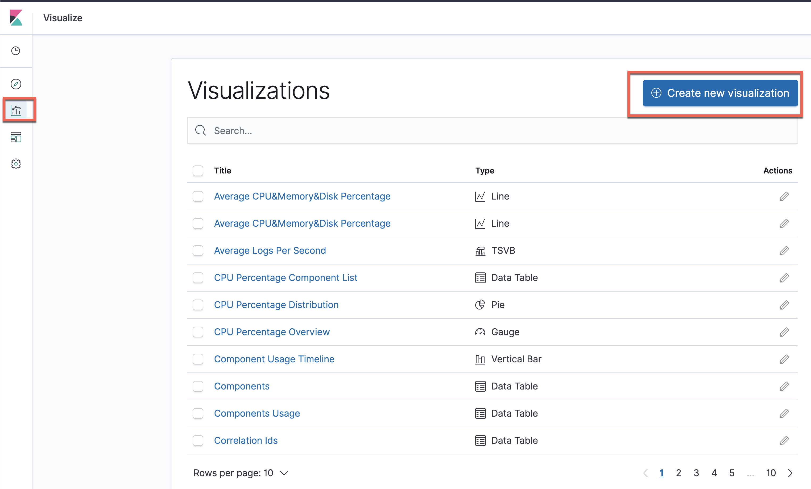

# Access Application Logging

This section guides you through how to access the [Application Logging service](https://help.sap.com/viewer/ee8e8a203e024bbb8c8c2d03fce527dc/Cloud/en-US/68454d44ad41458788959485a24305e2.html) to gain insights in how your application behaves, what potential problems occur and much more. Through binding your application to a service instance of the application logging service (see the [responsible line in the mta.yaml](https://github.com/SAP-samples/s4hana-btp-extension-devops/blob/main/mta.yaml#L23)) the underlying managed [ELK Stack](https://www.elastic.co/what-is/elk-stack) already receives log messages from the application. 

1. Go the the SAP BTP Cockpit and navigate to the subaccount where the application is running in.
   
2. Click on the number of apps of the Cloud Foundry space your application is running in. 

    

3. Click on the **BusinessPartnerVerification-srv** app. 

    

4. Open the **Logs** page. 

    

5. Click on **Open Kibana Dashboard**. 

6. Enter your SAP BTP credentials. 

7. You should now be able to see the default overview with some predefined dashboards. In some cases you won't see any data displayed because of the automatically selected time range. 

    

8. Change the time selection to **Last 30 days**. The dashboard rendering should update immediately and display some of your application KPIs. 

> make sure you hit refresh or adjust the time selection whenever you don't see any data displayed.

    

9.  In the lower half of the page you do see a **Drill Down** of all Cloud Foundry organizations, spaces, components and app instances you have access with your SAP BTP user. 

    > This pages do not only display and visualize the logs of the application you used to navigate here. It contains all the logs of the entire region (for instance EU10) but only of those subaccounts you are assigned to. 

     

10. Hover the line of **BusinessPartnerVerification-srv** in the **Components** section. Then click on the icon to **Filter for value**. 

     

    As a result of that, you'll only receive data for the application **BusinessPartnerVerification-srv** wherever you navigate in Kibana until you remove the filter again. 

     

11.  Use the navigation section in the upper part of the page to navigate to different predefined dashboards that visualize more data in detail. For instance, use the **Metrics** link to get some more insights about CPU and Memory usage. 

> Make yourself familiar with the navigation section and what insights you get out of the box. 

 

12. You can also access different predefined visualizations or create new visualizations using the icon in the sidebar. 

 

13. Click on the **Discover** icon in the sidebar to execute custom query operations in the collected data. Search for **caught** in the last 30 days and only display the **msg** field. (fields can be added to output if hover the item and click on **add**)

Hit **Refresh** to show the output. 

>> You will only get log data for this custom search once you have already either created or changed a business partner in the S/4HANA on premise system that causes the log output of the received event in the CAP application on SAP BTP. 

 

You can use create more complex queries using the [Kibana Query Language](https://www.elastic.co/guide/en/kibana/7.4/kuery-query.html).

   

