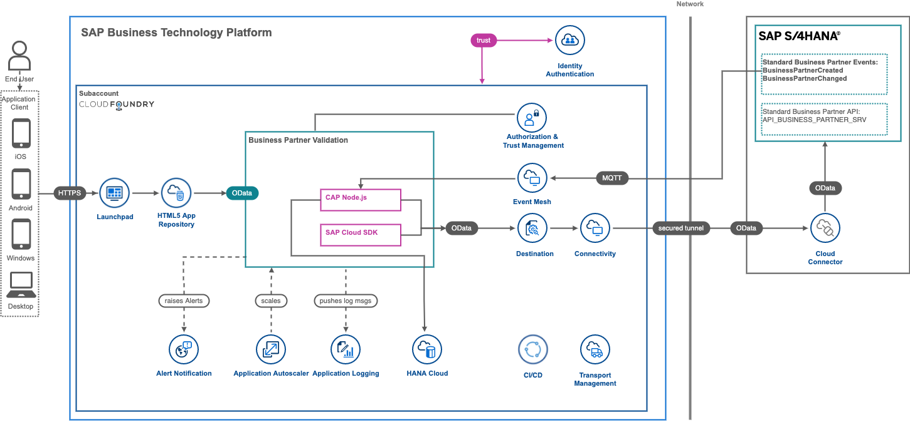

# Enhance core ERP business processes with resilient applications on SAP BTP

## Description

Extension applications built on SAP Business Technology Platform fulfill critical business processes. Ensuring their availability and stability, even in the face of service disruptions at the application, service, or platform level, is the responsibility of application developers and administrators.
This scenario demonstrates patterns for building resilient applications on SAP BTP, such as use of DevOps, observability, integration with business process workflows, and multi-region failover.

### Challenge
Extension applications provide customers with unlimited flexibility but bring added considerations about topics such as high availability, fault tolerance, and the software development lifecycle. Solving for these problems is the responsibility of the application developer.

### Solution
Apply DevOps to your custom development through use of unit tests and automation of builds and deployments. Enhance microservices with auto-scaling and monitoring for observability and implement multi-region failover of services such as the SAP Fiori Launchpad to create truly resilient applications.

### Outcome
Infuse qualities of resilience into your extension applications from the first step. Doing so will maximize a consistent and performant user experience, while empowering developers to continuously improve and enhance the value delivered to business users.

## Business Scenario  

This business scenario is used to showcase how to build an SAP S/4HANA on-premise extension application on SAP BTP. The scenario in a nutshell:

John who is an employee of Business Partner Validation Firm iCredible, which is a third-party vendor of ACME Corporation would like to get notifications whenever new Business Partners are added in the S/4HANA backend system of ACME Corporation. John would then be able to review the Business Partner details in his extension app. He would proceed to visit the Business Partner’s registered office and do some background verification. John would then proceed to update/validate the verification details into the extension app. Once the details are verified, the Business Partner gets activated in the S/4HANA system of ACME Corporation.

This means:

- You will deploy a custom extension application on SAP Business Technology Platform that works independently from the SAP S/4HANA system

- Changes in the SAP S/4HANA system are communicated via events in real-time to the extension application

- The Vendor personnel only needs access to the extension application and not to SAP S/4HANA

### Solution Diagram

The Business Partner Validation application is developed using the SAP Cloud Application Programming Model (CAP) and runs on the SAP BTP, Cloud Foundry runtime. It leverages platform services like SAP Event Mesh, SAP HANA Cloud and the SAP Private Link service. Whenever a change in the SAP S/4HANA on-premise system occurs, an event on SAP Event Mesh is triggered. The CAP application on SAP BTP will asynchronously consume the event and process the payload. This means, some additional data is read using OData APIs from the SAP S/4HANA on-premise backend and stored in SAP HANA Cloud on SAP BTP to be independent from the actual SAP S/4HANA system. In case of changes, the SAP Cloud Application Programming Model is again used to write data back into the SAP S/4HANA system. 

## Requirements
The required systems and components are:

- SAP S/4HANA on premise system.
- SAP BTP account

Entitlements/Quota required in your SAP Business Technology Platform Account:

| Service                            | Plan        | Number of instances |
| ---------------------------------- | ----------- | ------------------- |
| Connectivity                       | lite        | 1                   |
| Destination                        | lite        | 1                   |
| HTML5 Application Repository       | app-host    | 1                   |
| Event Mesh                         | default     | 1                   |
| Application Logging                | lite        | 1                   |
| Authorization & Trust Management   | application | 1                   |
| SAP HANA Schemas & HDI Containers  | hdi-shared  | 1                   |
| SAP HANA Cloud                     |             |                     |
| Cloud Foundry runtime              |             |                     |
| Application Autoscaler             | standard    | 1                   |

Subscriptions required in your SAP Business Technology Platform Account:

| Subscription                      | Plan             |
| --------------------------------- | ---------------- |
| SAP Business Application Studio   | standard         |
| Event Mesh                        | standard         |
| Launchpad Service                 | standard         |
| Continuous Integration & Delivery | default          |
| Cloud Transport Management        | saas-application |

## Setup & Configuration

- Step 1: [Enable OData API in SAP S/4HANA on-premise](./tutorials/01_enable_odata_apis/)
- Step 2a: [Create and Entitle SAP BTP subaccount](./tutorials/02_setupbtp/) or
- Step 2a: [Create and Entitle SAP BTP Trial subaccount](./tutorials/03_setupbtptrial/) or
- Step 3: [Create SAP HANA Cloud instance](./tutorials/04_setuphanacloud/)
- Step 4: [Connect SAP BTP subaccount and SAP S/4HANA using Cloud Connector or SAP Private Link](./tutorials/05_setupconnectivity/README.md)
- Step 5: [Configure Business Application Studio and Build/Deploy the CAP application ](./tutorials/06_deploycapapp/)
- Step 6: [Configure Event Based Communication between SAP S/4HANA and SAP Event Mesh](./tutorials/07_setupeventmesh/)
- Step 7: [Test scenario End to End](./tutorials/08_testappe2e/)
- Step 8: [Access and Discover Application Logs and Metrics](./tutorials/09_setuplogging/)
- Step 9: [Setup of SAP Continuous Integration and Delivery (CI/CD) service](./tutorials/10_setupcicd/)
- Step 10: [Setup SAP Cloud Transport Management ](./tutorials/11_setuptms/)
- Step 11: [Setup SAP Alert Notification service ](./tutorials/12_setupans/)
- Step 12 (optional): [Test Application Autoscaler ](./tutorials/13_setupautoscaler/)

## How to obtain support

[Create an issue](https://github.com/SAP-samples/<repository-name>/issues) in this repository if you find a bug or have questions about the content.
 
For additional support, [ask a question in SAP Community](https://answers.sap.com/questions/ask.html).

## Contributing

If you wish to contribute code, offer fixes or improvements, please send a pull request. Due to legal reasons, contributors will be asked to accept a DCO when they create the first pull request to this project. This happens in an automated fashion during the submission process. SAP uses the standard DCO text of the Linux Foundation.

## License
Copyright (c) 2023 SAP SE or an SAP affiliate company. All rights reserved. This project is licensed under the Apache Software License, version 2.0 except as noted otherwise in the [LICENSE](LICENSES/Apache-2.0.txt) file.

