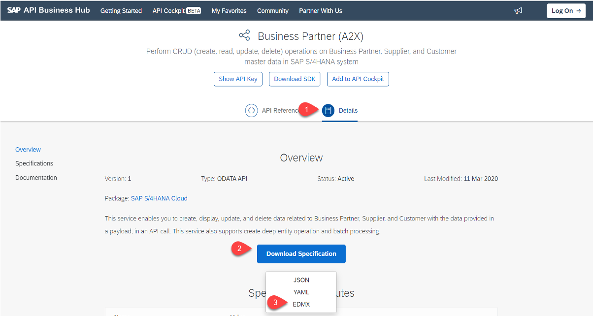

# Lookup API in SAP API Business Hub

## Introduction

Learn how to figure out available out-of-the-box APIs using the SAP API Business Hub and how to further use them in applications like SAP Cloud Application Programming Model. 

### Find and download API

1. Open http://api.sap.com
2. Enter Business Partner in the Search Tab. 
3. Click on the Search Button
4. Click on Business Partner (A2X)

 
 
5. Click on Details Tab

**Optionally if you want to use the API in another SAP Cloud Application Programming Model application**: 
> The GitHub repository including source code you will later on clone already has the OData metadata specification incorporated.
6. Click on Download API Specification
7. Select EDMX in the Pop Up

 
 
8. Log On to Download the EDMX file

 

9. Download the EDMX file to your machine so you could later on use it while developing the SAP Cloud Application Programming Model application. Find out more: [How to import EDMX files into SAP Cloud Application Programming Model applications](https://blogs.sap.com/2021/05/19/importing-external-edmx-files-using-the-cds-graphical-modeler/
