# Prepare SAP S/4HANA System: Activating the corresponding OData service and creating a technical user in SAP S/4HANA system 

## Introduction

An OData connection is essential for your extension application to SAP S/4HANA. Before you can use the associated API, you must enable OData APIs in the SAP S/4HANA on-premise system and create a technical user to retrieve data.

### Activate OData service in SAP S/4HANA on-premise backend system

1.	Logon to your SAP S/4HANA system, enter the transaction code **/n/IWFND/MAINT_SERVICE** (*Activate and Maintain Services*) and hit enter.

      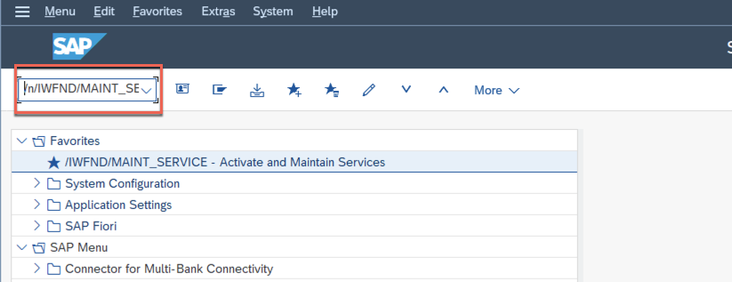

2.	Click on **Add Service** in the Service Catalog.
   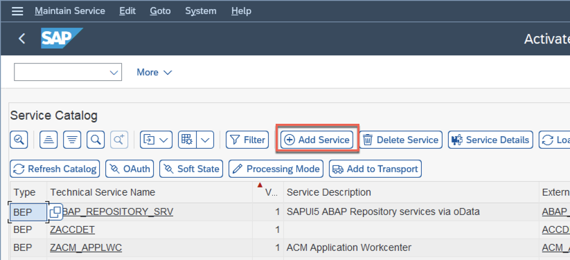

3.	Enter the following values:
   - **System Alias**: LOCAL
   - **External Service Name**: API_BUSINESS_PARTNER
   
   Hit enter to search for all matching services. 

4.	Select the matching line and click on **Add Selected Services**.
   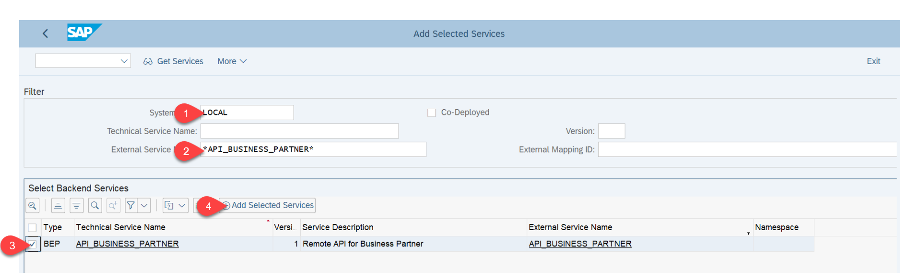
   
5.	On the next screen specify *Package Assignment** e.g. $TMP by clicking on **Local Object**.

6.	Check checkbox for "Enable OAuth for Service“ and click on *Continue*
   
### Create Technical User and Assign Role

Now you are going to create an user in the SAP S/4HANA on-premise system and assign the required authorizations. This user will be used for the OData API that the extension application on SAP Business Technology Platform will use to retrieve data about Business Partners.

1.	Navigate to transaction code **SU01**.

      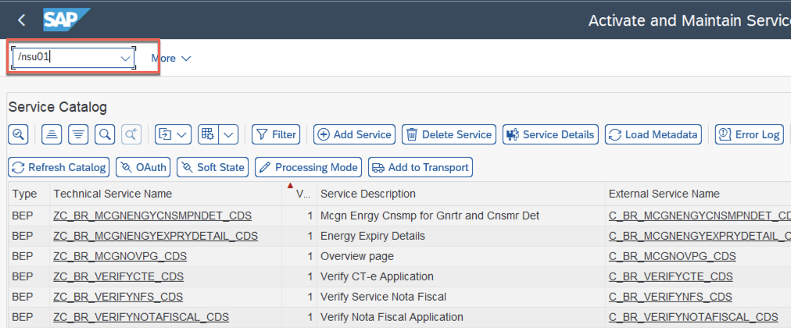
   
2.	Enter a **new User ID** in the field *User* and click on the **Create** button to create new user.
   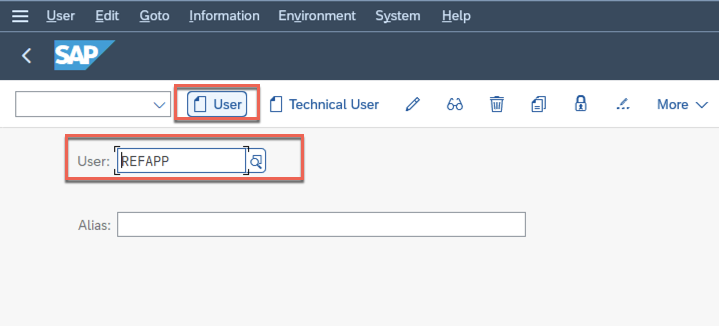
   
3.	Switch to the **Logon Data** tab, change **User Type** to **Dialog** and create a password for the user (repeat it to verify it). **Save** your user. 

      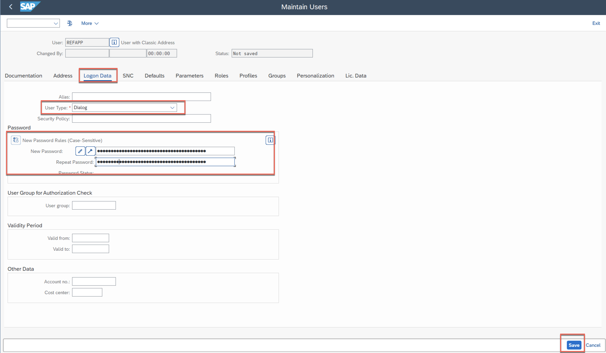

4.	Navigate to transaction code **/nPFCG**.
5.	Enter **EVENTMESH** in the *Role* field, then click on the *Single Role* button.
   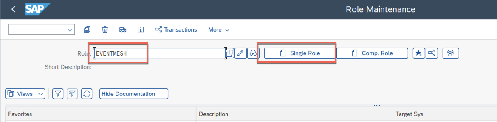

6.	On the next screen enter a description first, then switch to the **Menu** tab and **save** the role in the pop-up window.
7.	Click on the **Transaction** button on the menu tab,enter the transaction code **BP** and click on **Assign Transactions** to finish.
   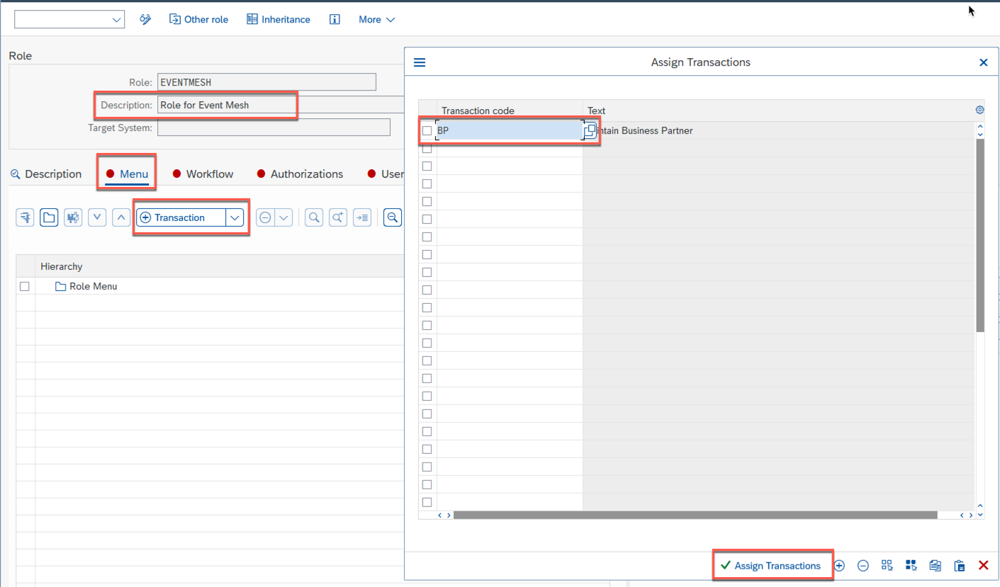
   
8. Select **Authorization Default** from the Transaction dropdown in the menu tab.
 
    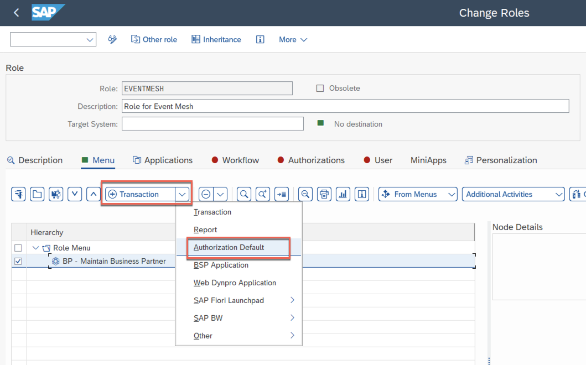

9. Select **SAP Gateway: Service Groups Metadata** as Authorization Default from the pull down menu and enter the name of the activated Business Partner API - you can look this up using the menu - into to the table and click on **Copy**.
   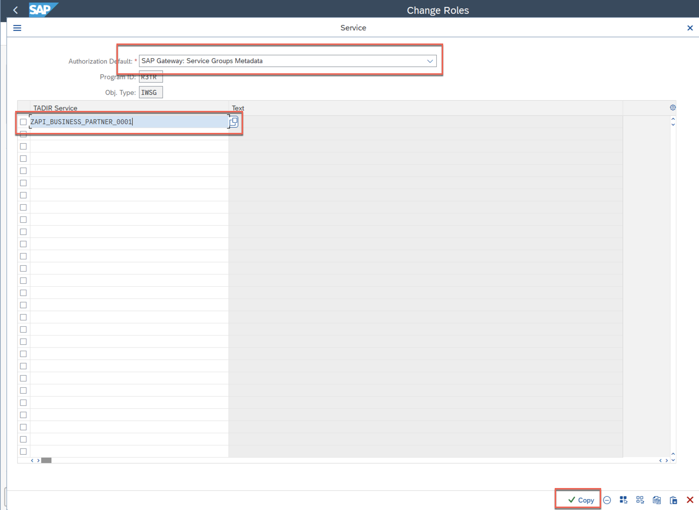
   
10. Now switch to the **Authorizations** tab and click on **Change Authorization Data**. 
   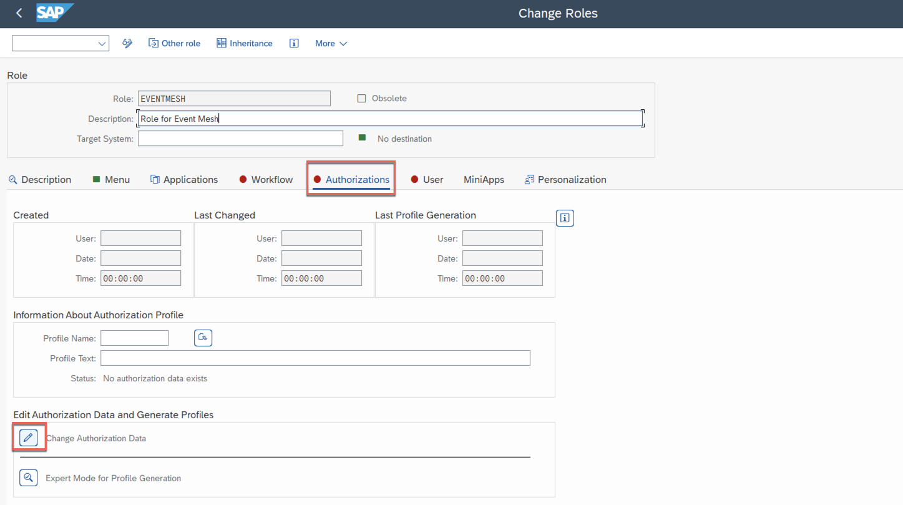
   
11. Don´t forget to **Save** the role first.
12. Navigate to **Edit -> Insert Authorizations -> From template**
   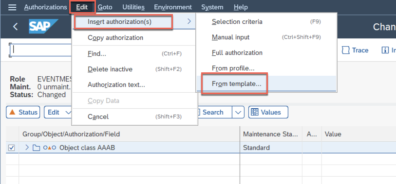

13. Search for **/IWFND/RT_GW_USER** and **/IWXBE/RT_XBE_ADM** in the pop-up window and click on the checkmark for both entries to apply the templates.
    
      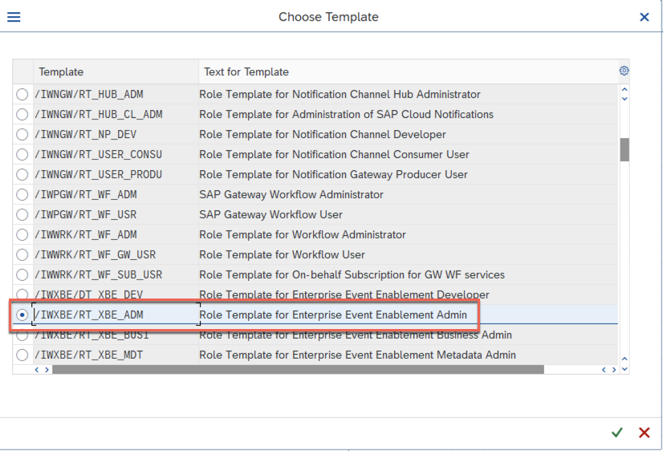

      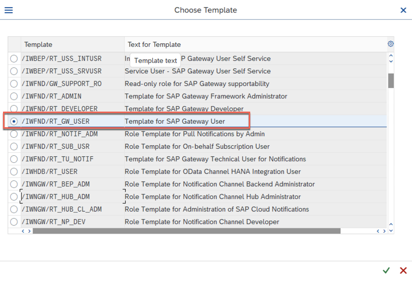

14. Now click on **Status** and hit the checkmark in appearing pop-up. 
   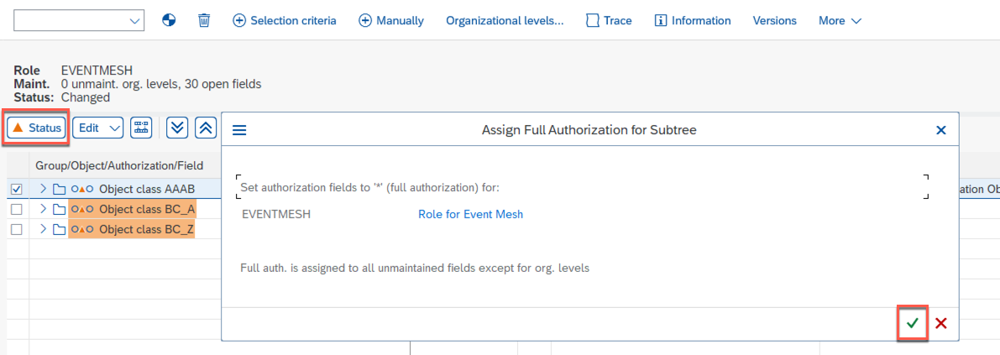

15. Trigger the generation with the icon on the top and **save** the profile in the pop-up.
   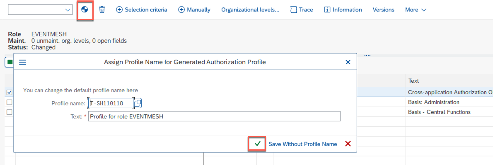
   
16. Go back and Switch to the **User** tab.
   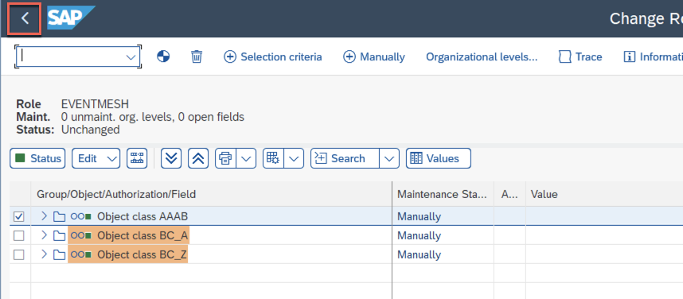
   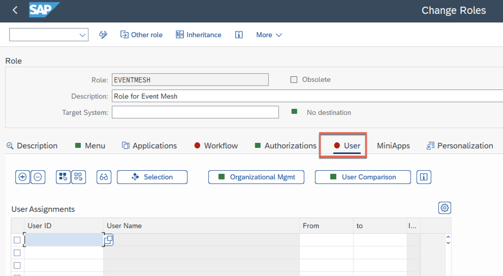

17. Enter the technical user you have created in one of the previous steps, execute the **User Comparison** and select **full comparison** in the pop-up.
   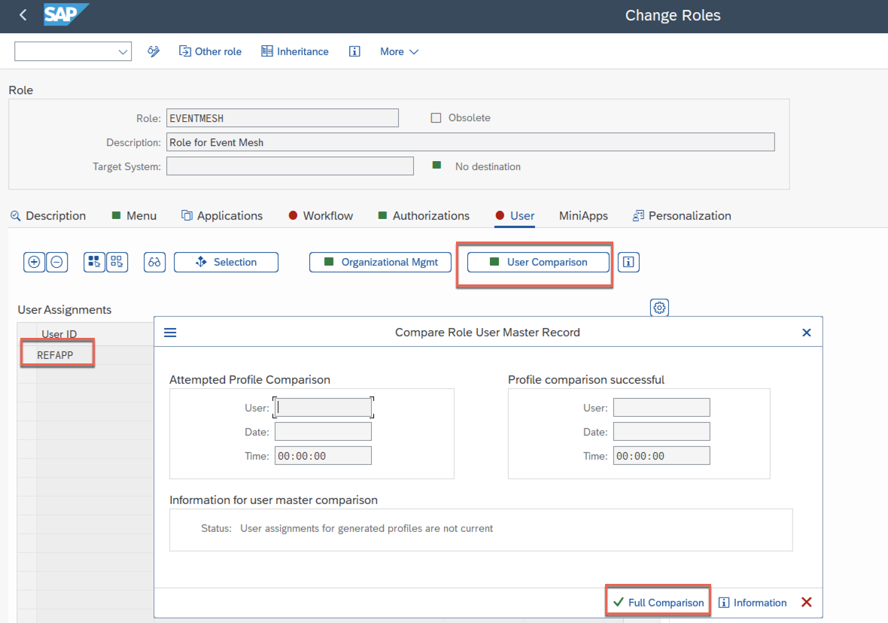

18. **Log off** from the system by entering the transaction **/nEX**.

### Test newly created user

1. To verifiy the creation of the newly created user, **log on** to your SAP S/4HANA on-premise system again with the newly created user. 

2. Go to the transaction **BP**. In case you cannot see the following transaction, please go back and verify the steps you have done in this tutorial. If you were able to open the transaction, your user is correctly configured for this scenario. 
   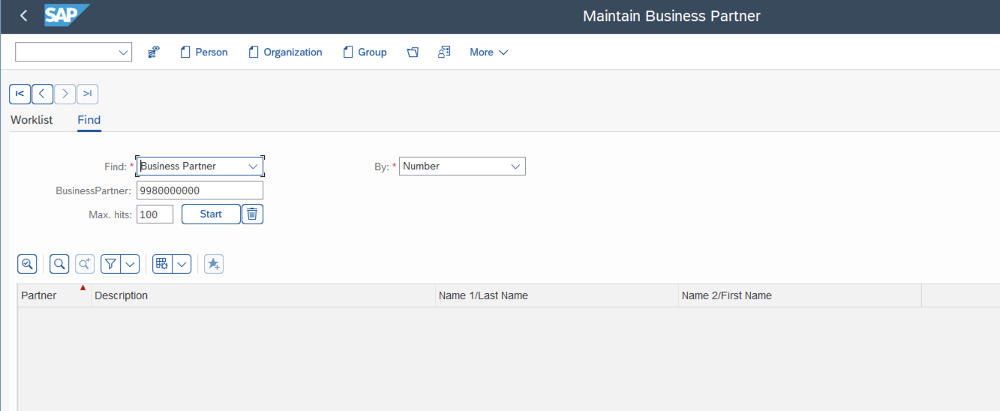
