# Prepare and configure your SAP Business Technology Platform Enterprise environment with the help of boosters

## Introduction

You will now prepare your SAP Business Technology Platform (Enterprise) account, configure the needed entitlements and configure your account for the subsequent steps of this extension scenario.

> Note : In case you are using the SAP Business Technology Platform Trial, please follow these manual steps to [prepare and configure the account](../03-PrepareBTPTrial/README.md)

### Prepare your SAP Business Technology Platform Enterprise Account

1. Go to [SAP Business Technology Platform Cockpit](https://cockpit.eu10.hana.ondemand.com). 
2. Navigate to **Boosters**.
3. Search for 'Prepare an Account for Developing Extension Applications' (This booster is not available for the SAP BTP Trial account, please follow the manual steps to [setup the trial account](../03-PrepareBTPTrial/README.md))
   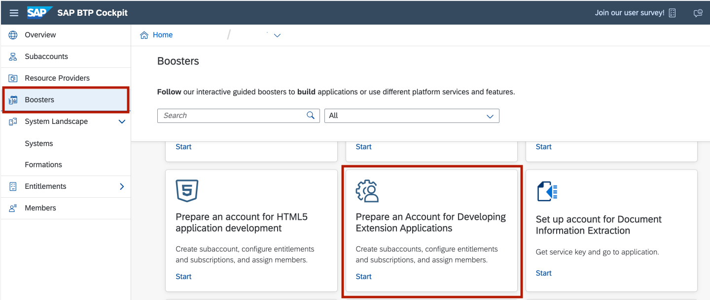

4. Click on the tile and chosse the **Start** button to start the creation of your account.
   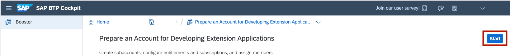

5. Check if you fulfill all prerequisites and select **Next**.
   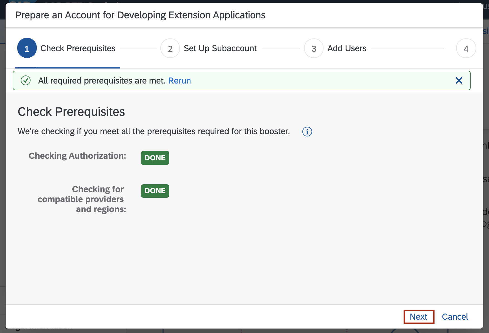

   - In case you see **WARNING**, it means _some optional services_ are not entitled in your global account. You can create the account, but without missing services
   - In case you see **ERROR**, it means _some mandatory services_ are missing and you need to check your global account entitlements 
   - In case you see **DONE**, it means _all necessary services_ are entitled and you can continue with next step
   
6. On the next screen you can set up your Subaccount: 
    - Enter Subaccount name - eg: "BTP Extensions"
    - Choose a region and a provider for your SAP BTP subaccount. 
    - You can change **Subdomain**, **Org Name** and **Space Name** depending to your needs. 
    - Continue with **Next**.
   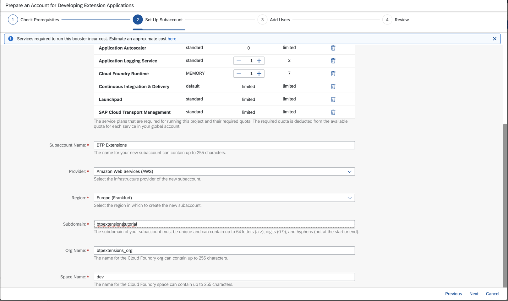

7. On the next screen you can add your needed Users:
 - Enter email addresses of the SAP BTP account you want to assign the **Administrator** Role Collection.
 - Enter email addresses of the SAP BTP account you want to assign the **Developer** Role Collection.
   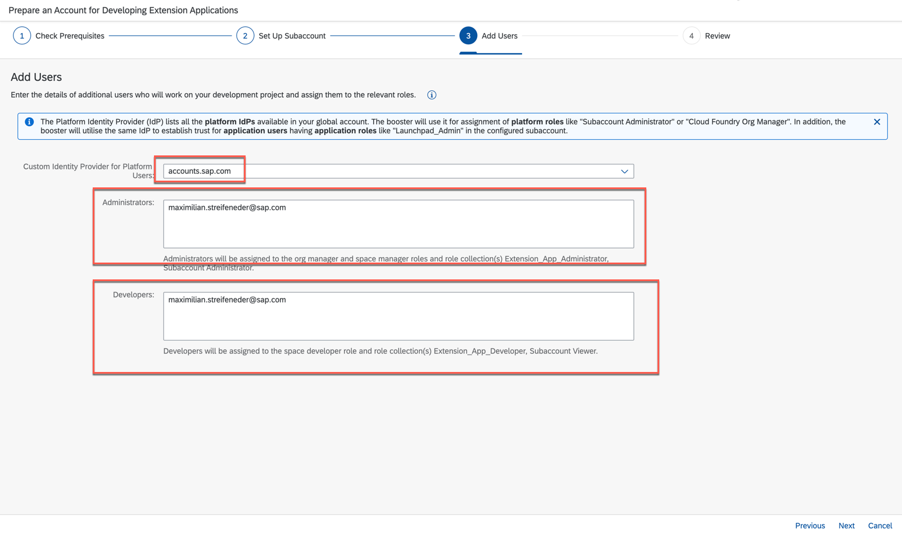

   > In case you are using a custom Identity Provider already, make sure to choose the right value for **Custom Identity Provider for Platform Users**. Otherwise stick to **acounts.sap.com**.
 
8. Select **Next**.

9.  After you reviewed your account click on **Finish**.
   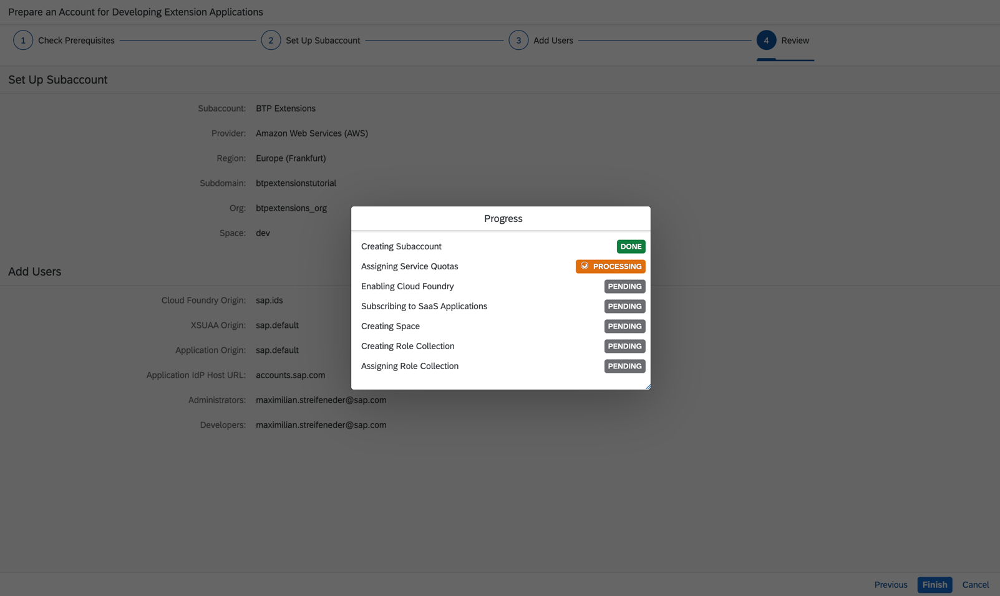
   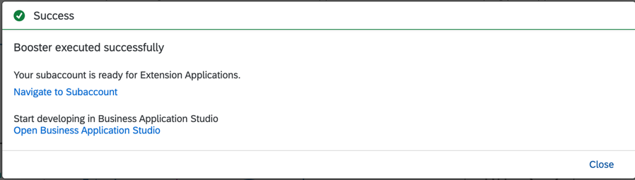

10. Hit **Navigate to Subaccount**.

11. Navigate to **Entitlements** and select on **Configure Entitlements**.
   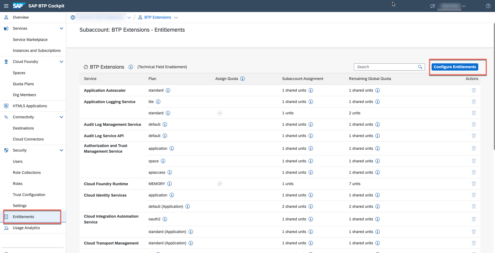

12. Choose *Add Service Plans*.
   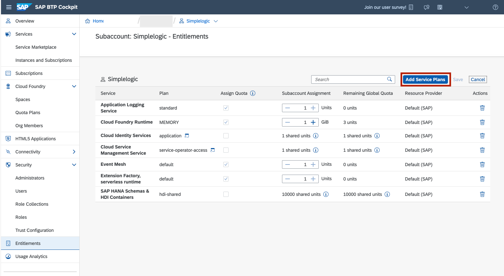

13. Search for **HANA** and select **SAP HANA Cloud**.

14. Click on the checkbox below **Available Plans** for either **hana** or **hana-free** depending on your requirements. The technical limitations for the SAP BTP Free Tier (plan **hana-free**) can be found in the the corresponding service description in the SAP Discovery Center.
   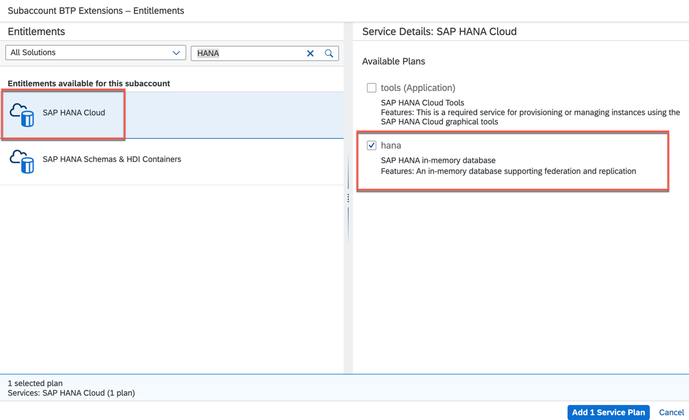
   
   > NOTE: SAP HANA Cloud instances with plan **hana-free* are stopped on a nightly basis. You have 30 days to restart your instances or they will be deleted.

15. Search for **Alert Notification** in the pop-up window instead of **HANA** and select **Alert Notification**.

16. Click on the checkbox below **Available Plans** for either **standard** or **free** depending on your requirements. The technical limitiations for the SAP BTP Free Tier (plan **free**) can be found in corresponding [service description](https://discovery-center.cloud.sap/serviceCatalog/alert-notification?region=all&tab=service_plan) in the SAP Discovery Center.

17. Click on **Add 2 Service Plan**. 
   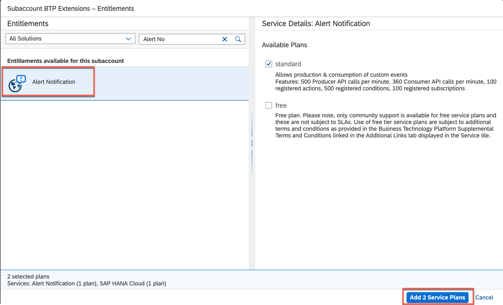

18. Don't forget to **Save** the changes you made. 
   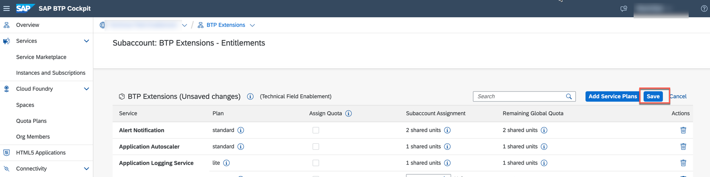
--- 

Congratulations! You have successfully entitled your SAP BTP subaccount. Now, let's proceed to setting up your SAP HANA Cloud instance.