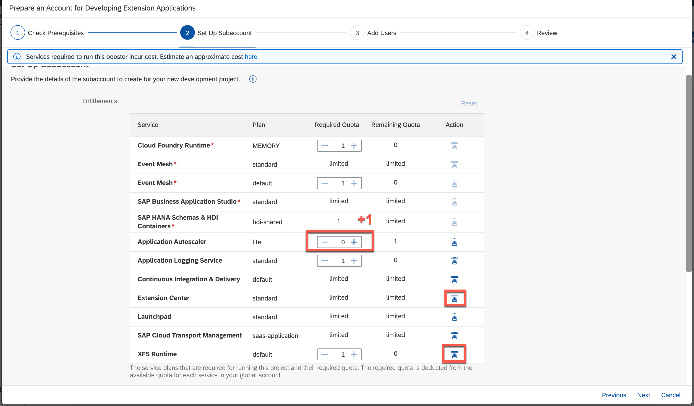

# Prepare and configure your SAP Business Technology Platform Enterprise environment with the help of boosters

## Introduction

You will now prepare your SAP Business Technology Platform (Enterprise) account, configure the needed entitlements and configure your account for the subsequent steps of this extension scenario.

> Note : In case you are using the SAP Business Technology Platform Trial, please follow these manual steps to [prepare and configure the account](../03-PrepareBTPTrial/README.md)

### Prepare your SAP Business Technology Platform Enterprise Account

1. Go to [SAP Business Technology Platform Cockpit](https://cockpit.eu10.hana.ondemand.com). 
2. Navigate to **Boosters**.
3. Search for 'Prepare an Account for Developing Extension Applications' (This booster is not available for the SAP BTP Trial account, please follow the manual steps to [setup the trial account](../03-PrepareBTPTrial/README.md))
   

4. Click on the tile and chosse the **Start** button to start the creation of your account.
   

5. Check if you fulfill all prerequisites and select **Next**.
   

   - In case you see **WARNING**, it means _some optional services_ are not entitled in your global account. You can create the account, but without missing services
   - In case you see **ERROR**, it means _some mandatory services_ are missing and you need to check your global account entitlements 
   - In case you see **DONE**, it means _all necessary services_ are entitled and you can continue with next step
   
6. On the next screen you can set up your Subaccount: 
    - Configure the Entitlements
    - Remove: XFS Runtime and Extension Center
    - Add 1 Quota to Application Autoscaler
   

    - Enter Subaccount name - eg: "Development"
    - You can edit the smaller org name, space name (optional)
    
7. Select **Next**.

   

8. On the next screen you can add your needed Users:
 - Enter email addresses of the SAP BTP account you want to assign the **Administrator** Role Collection.
 - Enter email addresses of the SAP BTP account you want to assign the **Developer** Role Collection.
 
9. Select **Next**.

 

10. After you reviewed your account click on *Finish* 
   

11. To navigate to the subaccount, click on the subaccounts name. 

12. Navigate to *Entitlements* and select on *Configure Entitlements*.
   

13. Choose *Add Service Plans*.
   

14. Search for **HANA** and select **SAP HANA Cloud**.

15. Click on the checkbox below *Available Plans* for HANA.
   

16. Search for **Alert Notification** in the pop-up window and select **Alert Notification**.

17. Click on the checkbox below *Available Plans* for standard.

18. Click on *Add 2 Service Plan* and **save** the changes.
   

--- 

Congrats! You can now continue with setting up your SAP HANA Cloud instance - Step 4.
