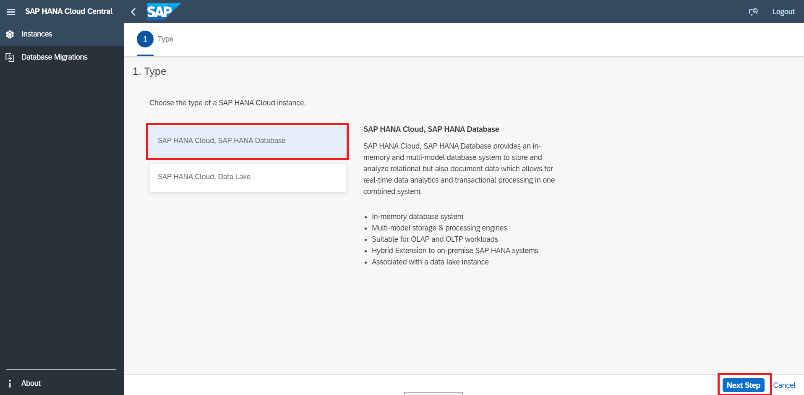
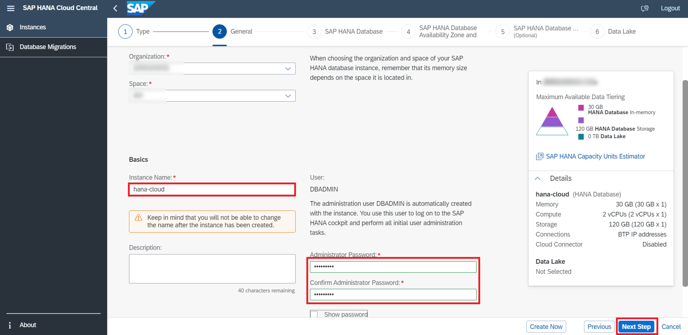
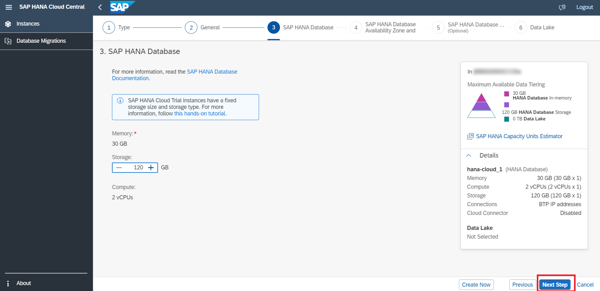
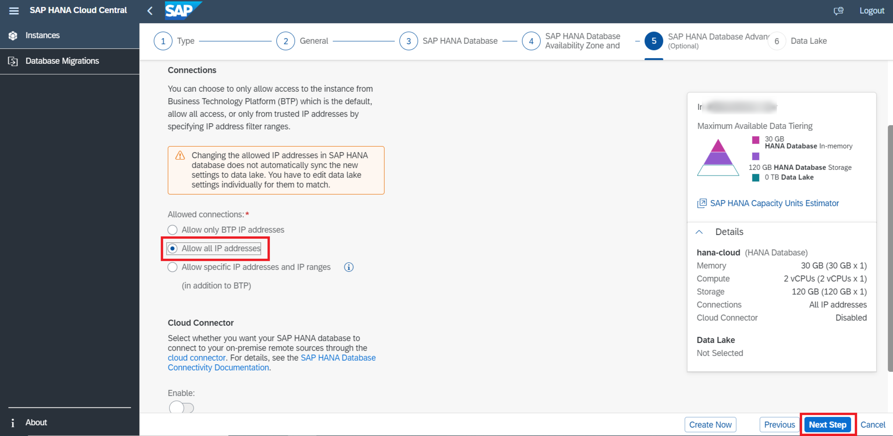
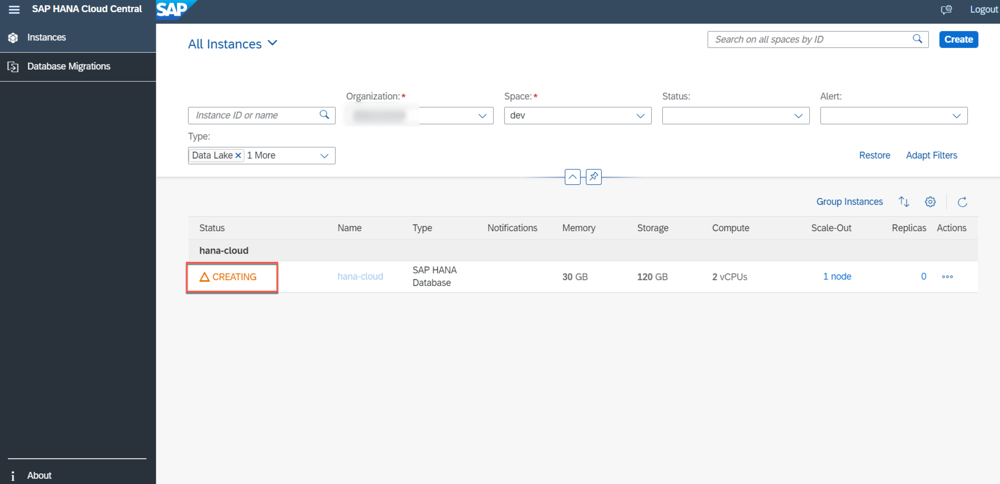

# Create SAP HANA Cloud Instance 

This step is required for newly created SAP BTP subaccounts, e.g. created with Boosters where you don't have any SAP HANA Cloud instance yet. In case of existing subaccounts with an SAP HANA Cloud instance, you can skip this section. Just make sure that your SAP HANA Cloud instance is started. 

---

1. Open your **Subaccount** and go to the **Space**. 

2. Open **SAP HANA Cloud** tab and create new instance.
   

3. Select **SAP HANA Database**. 
   

4. It will route you to **SAP HANA Cloud Central**. Select **SAP HANA Cloud, SAP HANA Database** and continue with **Next Step**.
   

5. Provide an **Instance Name**. Additionally set the password for the DBADMIN user and continue with **Next Step**.
    > The DBADMIN password is very important and you will most likely needed it again, so make sure that you don't forget it. 
   

6. Keep the default **Database Memory size** and continue with **Next Step**. 
   

7. Skip the _SAP HANA Database Availability Zone and Replicas_ settings continue with **Next Step**.
   

8. **Allow all IP addresses** to you SAP HANA database instance (allowed connections) and continue with **Next Step**. 
   > this setting might be different in productive scenarios depending on your security requirement. 
   

9. Continue with **Review and Create**.
   
    
10. Review the selections and finish the configuration with **Create Instance**.
   
    
11. The creation of your SAP HANA Cloud instance might take a few moments and will then appear in the list of instances. 
   
