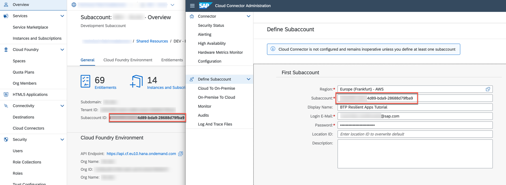
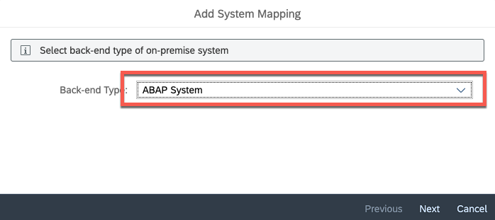
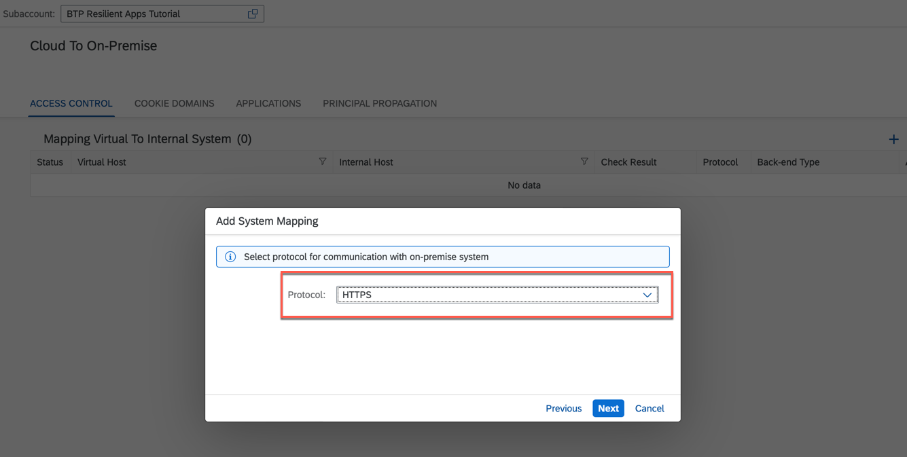
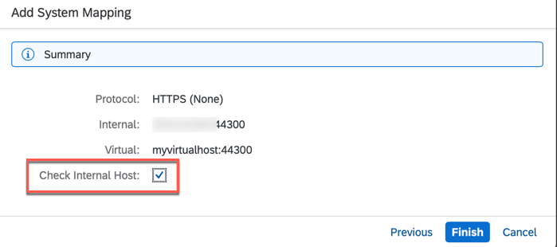
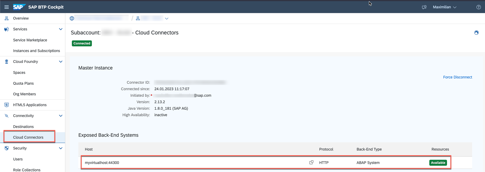

# Configure systems in SAP Cloud Connector 

## Introduction

In this section you are going to configure the SAP Cloud Connector to connect your SAP S/4HANA on-premise system with your SAP Business Technology Platform subaccount. 

> Find more details about the installation of the SAP Cloud Connector on [help.sap.com](https://help.sap.com/viewer/cca91383641e40ffbe03bdc78f00f681/Cloud/en-US/e6c7616abb5710148cfcf3e75d96d596.html)

### Configure Systems in SAP Cloud Connector for access with technical user

1. If you don't have an SAP Cloud Connector installed yet (for example, because you have set up the SAP S/4HANA system via the SAP Cloud Appliance library), please go through the installation steps described on [help.sap.com](https://help.sap.com/viewer/cca91383641e40ffbe03bdc78f00f681/Cloud/en-US/e6c7616abb5710148cfcf3e75d96d596.html).

2. In a Web browser, enter: `https://<hostname>` : `<port>`.
    - `<hostname>` refers to the machine on which the Cloud Connector is installed. If installed on your machine, you can simply enter localhost.
    - `<port>` is the Cloud Connector port specified during installation (the default port is 8443).

    On the logon screen, enter Administrator / manage (case sensitive) for `User Name` / `Password`.
    
    > Hint: adjust the port if you specified another one during the installation. Potentially you might have to use the external IP of your system. 

2. Choose *Add Subaccount* and enter the following data. The required information can be found in your SAP BTP subaccount overview.
    - Region
    - Subaccount
    - Display Name
    - Subaccount User
    - Password
    
    
    Continue with *Save*.
    
3. Navigate to **Cloud to On-Premise**. 
4. To add a new system mapping click on the **+** icon on the right site.
    
 
5. In the pop-up window select **ABAP System** as a *Backend Type* and then choose **Next**.
    
 
6. Select **HTTPS** as a **Protocol** and then choose **Next**.
    
    

7. Enter your values for the fields: **Internal Host** and **Internal Port** then choose **Next**.
   
    
    > Provide the actual hostname and port of your S/4HANA on-premise system!
8. Provide a virtual hostname and port that will later on be used in *Destinations* to reach your on S/4HANA on-premise system using the SAP Cloud Connector. Those values don't exist yet - choose a name for the virtual host yourself. 
    

9.  Choose **Principal Type None** and press **Next**.

10.	Select **Use Virtual Host** for **Host in header** and choose **Next**.

    

11.	Add a **Description** for your system mapping.

12.	Don´t forget to **check the Internal Host checkmark** and double-check if all values are correct and finish the setup with **Finish**.

    

14.	Click on Button **+** to add a resource.
    
 
15.	Provide the resource configuration as shown in the screenshot to give SAP BTP access to certain paths in the S/4HANA on-premise system. 
    - URL Path
    - Check *Path and all sub-paths*
    - Description
  
    

### Create SAP BTP Destination

1.	Open your *SAP BTP Account* in the SAP BTP Cockpit and navigate to your *subaccount*
2.	Choose *Connectivity* in the menu on the left then choose *Cloud Connectors* to check the host details.     
    

3.	Go back to **Connectivity** in the menu on the left, navigate to **Destinations** and create a **New Destination**.
    

4.	Enter the following information for the destination configuration:
    - *Name:* BusinessPartner
    - *Url:* http://myvirtualhost:44300 (or in general http://*virtualhost*:*virtualport*)
    - *Proxy Type*: OnPremise
    - *Authentication:* 'Basic Authentication'
    - *Username:* technical user of the SAP S/4HANA on-premie system you have created in one of the [previous steps](../01_enable_odata_apis/README.md#)
    - *Password:* password of the technical user
    - **Optional:** Add location Id (In case of multiple SAP Cloud Connector instances)

5. Additionally, provide the following properties using the **New Property** button:

    - *WebIDEEnabled*: true
    - *WebIDEUsage*: odata_abap
    - *sap-client*: 100 (or the client you want to connect to)
    - *HTML5.DynamicDestination*: true
    
    
5.	*Save* the destination. 

> optionally you can also *check the connection*. 

