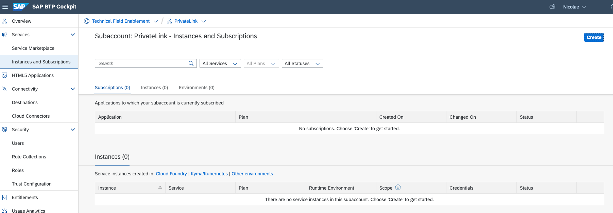

With SAP Private Link service, Cloud Foundry applications running on SAP BTP with AWS as an IaaS provider can communicate with AWS Private Link services via a private connection. This ensures that traffic is not routed through the public internet but stays within the AWS infrastructure.

This connection can be established with help of AWS PrivateLink by creating an AWS **endpoint service** that exposes a network load balancer that routes traffic to the SAP S/4HANA system. This AWS Endpoint must then be used as the resource to which the SAP Private Link service connects. As soon as the connection is established successfully, the SAP Private Link service provides hostnames pointing to the AWS PrivateLink.

## AWS PrivateLink 
AWS PrivateLink can be used to make services in your VPC available to other AWS accounts and VPCs.
The following steps are required to establish private connectivity via SAP Private Link service between SAP BTP and SAP S/4HANA running on AWS.

The following steps must be completed before an AWS Load Balancer can be created.

### Create AWS Target Group
A target group tells a load balancer where to direct traffic to EC2 instances, fixed IP addresses; or AWS Lambda functions, amongst others. When creating a load balancer, you create one or more listeners and configure listener rules to direct the traffic to one target group.

   

The necessary attributes that must be set are shown below for your reference.
- Type: **Instances** (EC2 instance where SAP S/4HANA is running)
- Name: give a name to your target group 
- Protocol & Port: TCP:80 or TLS:443
- VPC: Select the VPC where the SAP S/4HANA is assigned
 
    

As a follow-up step, select the instance of SAP S/4HANA and list the required ports. (In my case for oData access I'll need HTTP/HTTPS -> 50000/44301)

 

Finally, create the target group

  

### Creation of AWS Load Balancer

The Network Load Balancer distributes incoming TCP and UDP traffic across multiple targets such as Amazon EC2 instances, where the SAP S/4HANA system is running. When the load balancer receives a connection request, it selects a target based on the protocol and port that are specified in the listener configuration and the routing rule specified as the default action.

The necessary attributes that must be set are shown below for your reference.
- Name: give a name to your load balancer
- Schema: **Internal**
- IP address type: **IPv4**
- VPC: *select the VPC where the SAP S/4HANA system is running*
- Mapping: *Select at least one Availability Zone and one subnet for each zone. For productive scenarios, the recommendation is to use at least two Availability Zones.
Listeners and routing: Define the rules based on protocol and port and select the target group from the previous step. This determines how the load balancer routes request to its registered targets.
  - TCP:80 -> Target Group from the previous step
  - TCP:443 -> Target Group from the previous step

>Note: In order to be ablte to create a **Internal Network Load Balancer**, your VPC (where the SAP S/4HANA is assigned) should have a **subnet** wihtout auto-asigned public IP.

  

After the successful creation of the Load Balancer, you should be able to see the following two listeners (PORT 80 & 443).
  
  

### Create AWS Endpoint Service

Endpoint services can be created on Network Load Balancers and Gateway Load Balancers. For this scenario, we are going to use the Network Load Balancer which can be accessed using interface endpoints.

The necessary attributes that must be set are shown below for your reference.
- Name: give a name to your endpoint service 
- Load balancer type: Network
- Available load balancer: select the Load Balancer from the previous step
- Supported IP address types: IPv4

    

**Allow principals**

Manage permissions for IAM users, IAM roles, or AWS accounts to create endpoints for your service.

Navigate to Allowed Principals and click on Allowed Principals.

Find the SAP BTP AWS Account IDs for the landscape where your Endpoint Service should be consumed from. A current list of account IDs can be found in <https://me.sap.com/systemsprovisioning/connectivity>

For each account ID, hit Add Principal and enter the ARN in form of _arn:aws:iam::\<SAP BTP account ID from previous step\>:root_

## Create the SAP Private Link Instance

In order to begin creating an SAP Private Link instance on SAP BTP, the **Service **name** of the endpoint is required.
Copy to your clipboard the service name.

Navigate to SAP BTP Cockpit, select the subaccount, under the <code>Instances and Subscriptions</code>, click <code>Create</code> button.

Select from a list of services the <code>Private Link Service</code> and give a name to the instance.

Click the <code>Next ></code> button.

You will find a JSON where the **"serviceName"** field should have a value collected from AWS.

Moreover, you should enter **"desiredAZs"** which you configured on the AWS side (In my example I have only 1 AZ).

Click the <code>Create</code> button.

The new instance of private link creation with the status <code>Creation in Progress</code> will come up on the SAP BTP instances list.

To change the status to <code>Created</code>, an operation on the AWS console is required.

Navigate to AWS Console to <code>Endpoint Services -> Endpoint connections</code>, and accept the pending connection, if no records wait by clicking the refresh button. 

After some time the record will go away as **Available**.

Go back to SAP BTP Cockpit, and the private link instance should have green <code>Created</code> status.

After successful creation, you can add a service key and view created credentials. You can find there the generated hostnames which will be used in upcoming steps for the private communication. 

--- 

You can now go back to configure the CAP application: [Navigate back](./privatelink.md)
