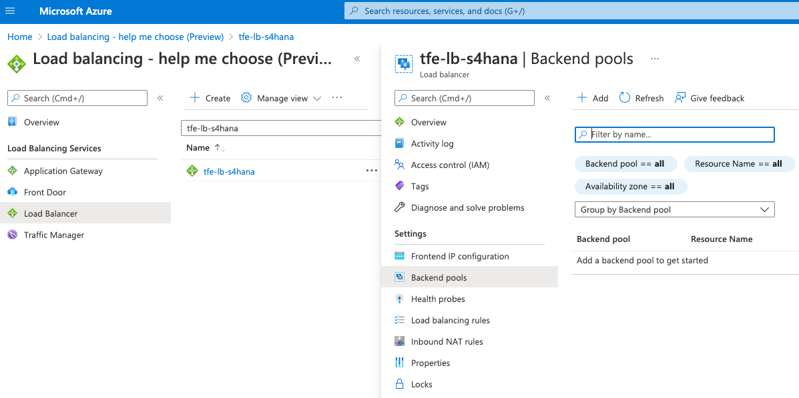

With SAP Private Link service, Cloud Foundry applications running on SAP BTP with Microsoft Azure as an IaaS provider can communicate with Azure Private Link services via a private connection. 
This ensures that traffic is not routed through the public internet but stays within the Azure infrastructure.

This connection can be established by creating an Azure Private Link service that exposes a load balancer that routes traffic to the SAP S/4HANA system. This Azure Private Link service must then be used as the resource to which the SAP Private Link service connects. As soon as the connection is established successfully, the SAP Private Link service provides private DNS hostnames pointing to the Azure Private Link service.

## Azure Private Link Service

Azure Private Link Service can be created only by using an Azure Load Balancer. 

**Very Important**:  [Azure Private Link Service is only supported on Standard Load Balancer.](https://docs.microsoft.com/en-gb/azure/private-link/private-link-service-overview#properties)

### Creation of Azure Load Balancer

As reference see below, where all properties should be yours, the only two properties have to remain unchanged:
- Type: Internal
- SKU: Standard

Once created, navigate to it, under the <code>Settings -> Health probes</code>, health probes records should be added 
by clicking the <code>+ Add</code> button.

For S/4HANA as health probe e.g. endpoint **/sap/public/ping** can serve.

Now is time to add Virtual Machines which will serve the load coming to the current load balancer.

Under the created load balancer, navigate to <code>Settings -> Backend pools</code>, a pools of virtual machines should be added
by clicking the <code>+ Add</code> button. 

**Very Important**:  If Virtual Machine which is supposed to be added to the pool does have an associated Public IP,
then the Public IP should have the Standard SKU. Usually, VMs created using CAL do have Public IP on Basic SKU, 
so manually should be changed to Standard. 

Make sure that a pool has been created and Virtual Machine has been added.

Under the <code>Settings -> Load balancing rules</code>, records should be added
by clicking the <code>+ Add</code> button. Two rules should be created having port and backend port 50000 & 44300 using early create pool and health probe, as reference:

After the status can be checked navigating <code>Monitoring ->Insights</code>, green status required.

### Creation of Azure Private Link Service

A private link service is required to have a private link as an endpoint. 

Navigate to <code>Private Link Center -> Private link services</code> and add new one by clicking the <code>+ Add</code> button. 

Specifying Basics information:

Specifying Outbound information, by selecting an early created load balancer:

**Very Important**:  Enable TCP V2 option should be on "No". 

At the end of wizard click on <code>Create</code> button.

Once create the private link service click on it and look for <code>JSON View</code> link and click on it.

Collect the resource id.

## Create the SAP Private Link Instance

Having the Private Link Service created on Azure and collected the Resource ID, 
ready to start the creation of a private link instance on SAP BTP.

Navigate to SAP BTP Cockpit, select the sub account, under the <code>Instances and Subscriptions</code>, 
click <code>Create</code> button.

Select from a list of services the <code>Private Link Service</code> and give a name to the instance.

Click the <code>Next ></code> button.

You will find a form where the "resourceId" field should have a value collected from Azure created Private Link Service Resource ID. 
Moreover, you can enter "Request Message" which is displayed to the approver on the Azure side.

Click the <code>Create</code> button.

New instance of private link creation with status <code>Creation in Progress</code> will come up on SAP BTP instances list.

To change the status to <code>Created</code>, an operation on the Azure portal is required.

Navigate to Azure Portal on <code>Private Link Center -> Pending connections</code>,
and awaiting connection to be approved, if no records wait by clicking the refresh button. 

Once pending connection displayed, select it and click the <code>Approve</code> and <code>Yes</code> buttons. 
After some time the record will go away as approved.

Go back to SAP BTP Cockpit, and the private link instance should have green <code>Created</code> status.

After successful creation, you can select the created instance and view created credentials. You can find there the generated set of private DNS hostnames which will be used in upcoming steps for the private communication. 

 >   Although Private Link Service is a private tunnel, it is common to use Transport Layer Security (TLS) for security between applications. Private DNS hostname will allow issuing certificates based on an actual hostname for the connected resource and enables TLS connections with verified hostnames.

---

You can now go back to configure the CAP application: [Navigate back](./privatelink.md)
