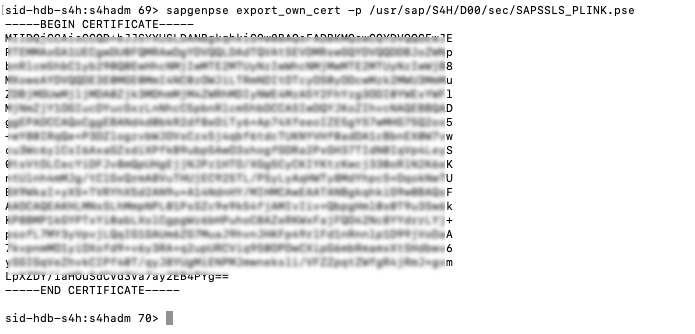

# Enhance core ERP business processes with resilient applications on SAP BTP - SAP Private Link Service

In this section, you can find all the required steps for your Extension Application to use SAP Private Link Service to consume OData resources from the SAP S/4HANA system located on **hyperscaler** subscription. 
More details about [SAP Private Link Service ](https://help.sap.com/docs/PRIVATE_LINK?locale=en-US).

SAP Private Link Service service allows to securely connect applications running on SAP BTP to workloads running on hyperscalers. This ensures that traffic is not routed through the public internet but stays within the hyperscaler infrastructure. This helps to minimize attack vectors and ensures secure communication between SAP BTP and hyperscaler workload.

Having SAP Private Link service in place will no longer require you to expose the systems and communication through the internet and keeps all traffic secured by an internal hyperscaler network.

In our use case, we are going to use the SAP Private Link service to communicate with an SAP S/4HANA system (or other SAP or non-SAP system running on a VM in your hyperscaler account) privately from within SAP BTP, Cloud Foundry Runtime without SAP Cloud Connector.

The current use case is describing an SAP S/4HANA extension, of course having an SAP S/4HANA solution deployed on hyperscaler.


## Architecture Description
With SAP Private Link service, Cloud Foundry applications running on SAP BTP with Microsoft Azur or AWS as an IaaS provider can communicate with hyperscaler services via a private connection. 
This ensures that traffic is not routed through the public internet but stays within the hyperscaler infrastructure.

This connection can be established by creating a private endpoint that exposes a load balancer that routes traffic to the SAP S/4HANA system. 

## Set Up SAP Private Link Service on SAP BTP

The Private link service is available on SAP BTP accounts running on Azure and AWS (Beta) and should be enabled under your SAP BTP subaccount.

To be able to use the functionalities of the SAP Private Link service, you first need to set the entitlements in your subaccount.
On <code>SAP BTP Cockpit -> Entitlements</code>, the <code>Private Link Service</code> should be configured.


>NOTE: for provider Amazon Web Services (AWS) currently only available in beta mode (the service plan is accordingly called beta).


## Setup up SAP PrivateLink service for Microsoft Azure

Here are the configuration details for [Microsoft Azure](./pl-azure.md)
## Setup up SAP PrivateLink service for AWS

Here are the configuration details for [AWS](./pl-aws.md).

## Prepare Extension Application based on CAP (SAP Cloud Application Programming Model) for PrivateLink communication

There are a couple of steps required to enable the Private Link connection in the CAP Application. 

### Adapt Destination for PrivateLink Service - Configure the "BusinessPartner" destination

 * Open your SAP BTP Account and navigate to your Subaccount
 * Choose Connectivity in the menu on the left then choose Destinations
 * Modify the existing "BusinessPartner" or create a new destination and enter the following information into the Destination Configuration:

 Instead of using Proxy Type On-Premise for Cloud Connector connectivity, SAP introduced a new Proxy Type  **PrivateLink**. Choose that proxy type and enter the Private Link hostname from the previous step. 

 Finally, add **TrustAll=true** in Additional Properties **(We will change this property in later steps)**.

 > Note: If TrustAll is set to TRUE in the destination, the server certificate will not be checked for SSL connections. It is intended for test scenarios only, and should not be used in production (the server certificate will not be checked and you will not notice MITM attacks). 

An Example of Destination Configuration you can find below. 


### Destination config
Property | Value |
--- | --- |
Name | BusinessPartner |
Tyoe | HTTP |
URL | https://40a42b84-39bb-xxx-9729-287xxxxe72c.d0c0e029c004f9xxxx8eda0225a83xxxxxxaae23ff65b.p6.pls.sap.internal (replace with your PrivateLink hostname) |
Proxy Type | PrivateLink |
Authentication | BasicAuthentication |
User | <<  username >> |
Password | <<  password >> |

### Additional Properties
Property | Value |
--- | --- |
sap-client | 400 (or the client you want to connect to) |
TrustAll | true  (should not be used in production) |
HTML5.DynamicDestination | true |
WebIDEEnabled | true |
WebIDEUsage | odata_abap |

### Bind application to Private Link service

Upon the creation of a binding between a CF application and a private link service instance, the Private Link service creates a space-scoped Cloud Foundry application security group that enables network access to the IP address associated with the Private Endpoint. 

Open the MTA deployment descriptor and add the following PrivateLink resource to your MTA and assign it to *BusinessPartnerVerification-srv*

```diff

modules:
  - name: BPVerification-srv
    type: nodejs
    path: gen/srv
    requires:
+      - name: BPVerification-pl
      - ...

...

resources:
  # PrivateLink Service
+  - name: BPVerification-pl
+    type: org.cloudfoundry.existing-service
+    parameters:
+      service: privatelink 
+      service-name: private-link-s4hana # change to your instance name
+      service-plan: standard

```

### Redeploy the Application and Test it

Build the Multi-Target Application Archive (MTA Archive) by executing the following command in the root directory of your project in the terminal:

  ```
  mbt build -e live.mtaext--mtar BPVerification.mtar
  ```

This will produce a .mtar file in the mta_archives directory. Some of the values for the service instance creation depend on the environment you are deploying to, that's why the *-e* for *extension* is used here. 

Deploy the application to SAP BTP, Cloud Foundry Runtime by executing the following command in the root directory of your project in the terminal:

  ```
  cf deploy mta_archives/BPVerification.mtar
  ```

This will trigger the deployment to SAP BTP, Cloud Foundry Runtime including the creation of the necessary service instances and service bindings to the corresponding services like PrivateLink. 

Try the application by creating new or modifying Business Partners as described [here](https://github.com/SAP-samples/s4hana-btp-extension-devops/tree/mission/08-TestApplication#test-basic-scenario-end-to-end).

## Setup end-to-end SSL

Instead of ignoring the server certificates by property TrustALL, for **Productive** scenarios we can upload the server certificate of the HTTPS server (in this case S/4HANA) in the Trust Store of Destination Service.

For the Scenarios where you have SAP WebDispatcher in front of your SAP S/4HANA System, you can configure SSL in SAP WebDispatcher. Please refer to the following [blog post](https://blogs.sap.com/2021/12/01/btp-private-linky-swear-with-azure-how-to-setup-ssl-end-to-end-with-private-link-service/)  

As you can remember, SAP Private Link service creates private DNS entries for hyperscaler Private Link services. These entries can be used to issue TLS certificates so that connected systems can identify themselves.

 * **hostname** - the subdomain consists of service instance id and resource hash and is more stable for creating wildcard certificates. This will allow using the same certificate for multiple private link connections to the same hyperscaler Private Link service.
 * **additionalHostname**  - is shorter due to the domain name length limitation of some certificate providers and can be used for those cases, but keep in mind that for every new instance that you create it may change.

### Configuring SSL for PrivateLink in S/4HANA System

1. Connect to your S/4HANA system using SSH 
    
    In this example, I'm connecting using keypair authentication by providing the **IdentityFile (-i)** (In case you are using CAL System, you can download it from CAL cockpit)

    ```
    ssh <user>@<hostname/IP> -i <IdentityFile>.pem 
    ```

2. Switch User to Admin

    ```
    su – <sid>adm  // e.g. s4hadm
    ```

3. Creating an additional PSE (Personal Security Environment) dedicated to the PrivateLink connections. (Optionally you can create a CA request as well in case you want to sign the certificate using the local certificate authority)
    
    >NOTE: The current approach is limited to self-signed certificates and public CAs cannot be used since the Private Link service has internal DNS names and CAs will not provide certificates for internal name

    In SAP NetWeaver PSE is a secure location where the public-key information of a user or component is stored. The SSL server PSE contains the security information of the application server that it needs to communicate using SSL as the server component. 

    With the command below you can create a new PSE called *SAPSSLS_PLINK.pse* by providing **Distinguished Name** which is the hostname of the PrivateLink service instance from SAP BTP. 

    > You can use following pattern: **"CN=< PrivateLink-Hostname >"**

    ```
    sapgenpse get_pse -p /usr/sap/S4H/D00/sec/SAPSSLS_PLINK.pse "CN=40a42b84-39bb-4f42-9729-28703961e72c.d0c0e029c004f9708f238eda0225a8309caac87824aa1aae23ff658b.p6.pls.sap.internal"
    ```
      
    >The above command will create the PSE file containing a self-signed certificate. Please refer to APPENDIX in case you want to sign the certificate with the local Certificate Authority (CA)

4. You can confirm with the following command that the PSE was successfully created
  
   ```
   sapgenpse get_my_name -p /usr/sap/S4H/D00/sec/SAPSSLS_PLINK.pse
   ```

5. Now after having the PSE file we can export the self-signed certificate to add it to the client application

   ```
   sapgenpse export_own_cert -p /usr/sap/S4H/D00/sec/SAPSSLS_PLINK.pse
   ```

6. Copy the certificate to a file and save it as **"plink_self_signed_cert.pem"**

   

7. Set ICM Parameters and restart the application server

   We need to set a couple of parameters in ICM (Internet Communication Manager) to ensure that communication between the SAP NetWeaver Application Server and the outside world via HTTPS protocol works properly.
   
   * Sign-in into you S/4HANA System and open Transaction: **SMICM**
   * Open menu GoTo > Parameters > Change

    ```
    icm/server_port2 = PROT=HTTPS,PORT=44300,TIMEOUT=300,PROCTIMEOUT=7200,**SSLCONFIG=ssl_config_9**
    icm/ssl_config_9 = ID=ssl_config_9, CRED=SAPSSLS.pse,**SNI_CREDS=SAPSSLS_PLINK.pse**
    ```

   * *icm/server_port2* specifies for HTTPS port the SSL Configuration (in this example we named it **ssl_config_9**) 
   * *icm/ssl_config_9* controls the general SSL configuration, where we add the PrivateLink PSE (in this example **SNI_CREDS=SAPSSLS_PLINK.pse**)

  Restart the ICM to pull the changes (Navigate to Administration > ICM > Exit Hard > Global. The ICM restart message will appear. Select Yes.)

  >In case the changes in ICM cannot be set permanently you can use Transaction: RZ10, select the profile e.g. S4H_D00_VHCALS4HCI, and change these two parameters there.

### Configuring SSL for PrivateLink in SAP BTP Destination Service

* Go to SAP BTP Cockpit and open the "BusinessPartner" Destination which we previously configured.
* Remove the Additional Property **TrustAll=true** 
* Upload the certificate of S/4HANA System (**plink_self_signed_cert.pem**). See the Step 6 above.

  

* Select the uploaded (**plink_self_signed_cert.pem**) in Trust Store Location and Save the destination.

  

### Testing the scenario end-to-end

After successfully finishing the above-mentioned steps, the application will run like before but using Private Link connectivity.


## Appendix

### Instead of using a self-signed certificate, it is also possible to sign the certificate with the local Certificat Authority (CA)

>NOTE: In the current approach public CAs cannot be used since the Private Link service has internal DNS names and CAs will not provide certificates for internal name

1. Creating an additional PSE with certificate signing request

     ```
    sapgenpse get_pse -p /usr/sap/S4H/D00/sec/SAPSSLS_PLINK.pse -r /usr/sap/S4H/D00/sec/CA_REQUEST.csr "CN=40a42b84-39bb-4f42-9729-28703961e72c.d0c0e029c004f9708f238eda0225a8309caac87824aa1aae23ff658b.p6.pls.sap.internal"
    ```

2. Open the generated CA Signing Request **CA_REQUEST.csr** in an editor and copy (or copy directly) to your local file system. We will use the CA Signing Request in the next step to sign it.

    ```
    vim CA_REQUEST.csr 
    ```

3. Sign the certificate using the Certificate Signing Request from the previous step 

    With *OpenSSL* we can sign using CA and CAkey

    ```
    openssl x509 -req -in csr/plink/CA_REQUEST.csr -days 365 -CA trustedca.crt -CAkey trustedca.key -CAcreateserial -out plink_signed_cert.pem
    ```
  
    The CA response with a signed public-key certificate will be available with a filename **plink_signed_cert.pem** 

4. Importing the Certificate Request Response into our PrivateLink PSE

   The CA will send you a certificate request response that contains the signed public-key certificate. Once you have received this response (in this example **plink_signed_cert.pem** ), import it into the SAP NetWeaver's corresponding PSE (in this example **SAPSSLS_PLINK.pse**). 

   >Before importing, copy the Certificate Request Response (plink_signed_cert.pem) and RootCA Cert file (trustedca. pem) into your SAP NetWeaver System

   ```
    sapgenpse import_own_cert -c plink_signed_cert.pem -r trustedca.pem  -p SAPSSLS_PLINK.pse
   ```

   **-r** parameter is necessary if the CA root and any intermediate CA certificates are not included in the certificate request response

5. Add the root certificate (trustedca.pem) into the chain of the created certificate. (You can use any editor to add it).

    ```
    -----BEGIN CERTIFICATE-----
              ...
    -----END CERTIFICATE-----
    -----BEGIN CERTIFICATE-----
              ...
    -----END CERTIFICATE-----
    ```
    
6. Updload the certificate into Destination Service as described [here](#configuring-ssl-for-privatelink-in-btp-destination-service)

### Start Stop Application server
```
/usr/sap/hostctrl/exe/sapcontrol -nr 00 -function Stop
/usr/sap/hostctrl/exe/sapcontrol -nr 00 -function Start
```
