# Deploy SAP Cloud Application Programming Model (CAP) Application

## Introduction

Clone a Node.js application utilizing the SAP Cloud Application Programming Model (CAP) in SAP Business Application Studio and deploy it to SAP BTP, Cloud Foundry Runtime.

### Clone the existing application in SAP Business Application Studio


*If you prefer to work with Visual Studio code, the steps are almost identical. We'd recommend to use SAP Business Application Studio for this kind of application because of the usage of SAP Cloud Connector which is not reachable by design outside of SAP BTP. If you'd like to run the application locally in your IDE, you won't be able to do that straight forward without SAP Business Application Studio.* 
---
1. Open the SAP BTP Cockpit: <https://cockpit.eu10.hana.ondemand.com/cockpit/>
2. Navigate to the subaccount you want to deploy the application to.
   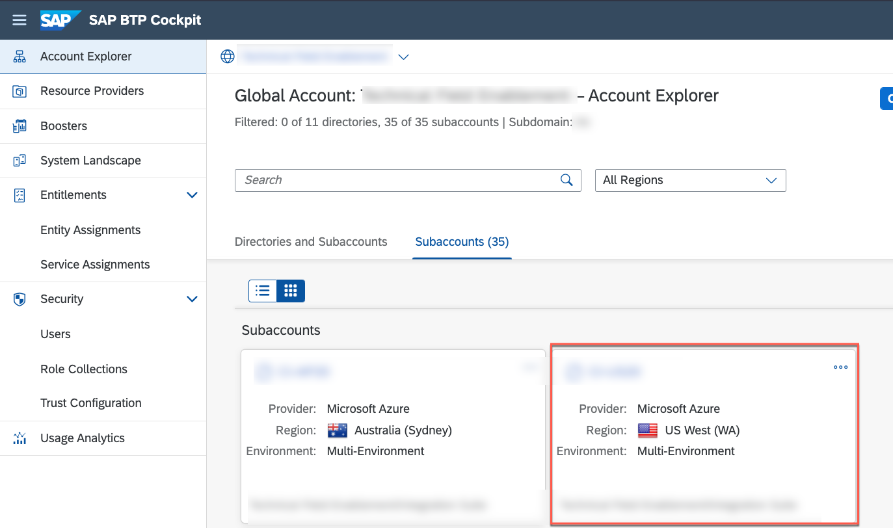

3. Go to _Services_ and select _Instances and Subscriptions_.

4. Select **SAP Business Application Studio** located in the _Subscriptions_ tab and click on the icon to open the application.
   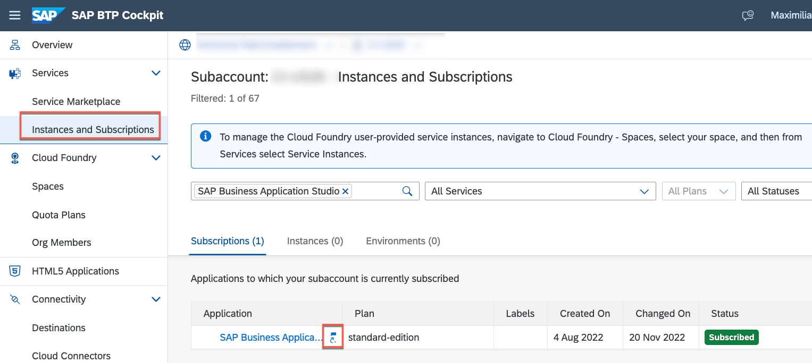

5. Create a **Dev Space** once the SAP Business Application Studio home appears.
   

6. Enter a **Dev Space name** e.g 'BusinessProcessDev', select the type _Full Stack Cloud Application_. Hit **Create Dev Space** to create the Dev Space.
   

7. Your Dev Space is now being created. As soon as the Dev Space is running you can click on your Dev Space name to access it.
   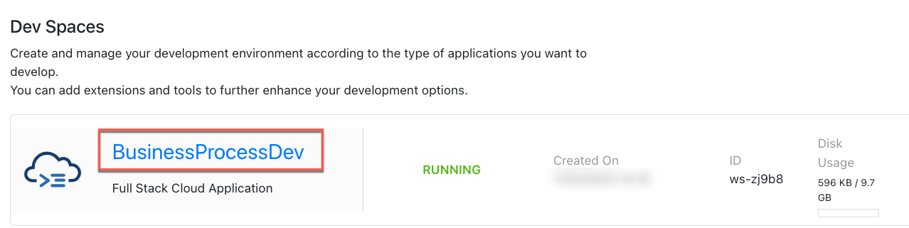

8. Go to <https://github.com/SAP-samples/btp-build-resilient-apps> and **fork** the repository. So that you have your own fork on github.com. (In one of the subsequent steps you will then connect your fork with the SAP Continuous Integration and Delivery service to run certain pipelines.)
   

9. Fork the repository by selecting **your user** as the destination, ensuring that the option to **copy the main branch only** is NOT selected (all branches should be included!), and selecting **Create fork**.
   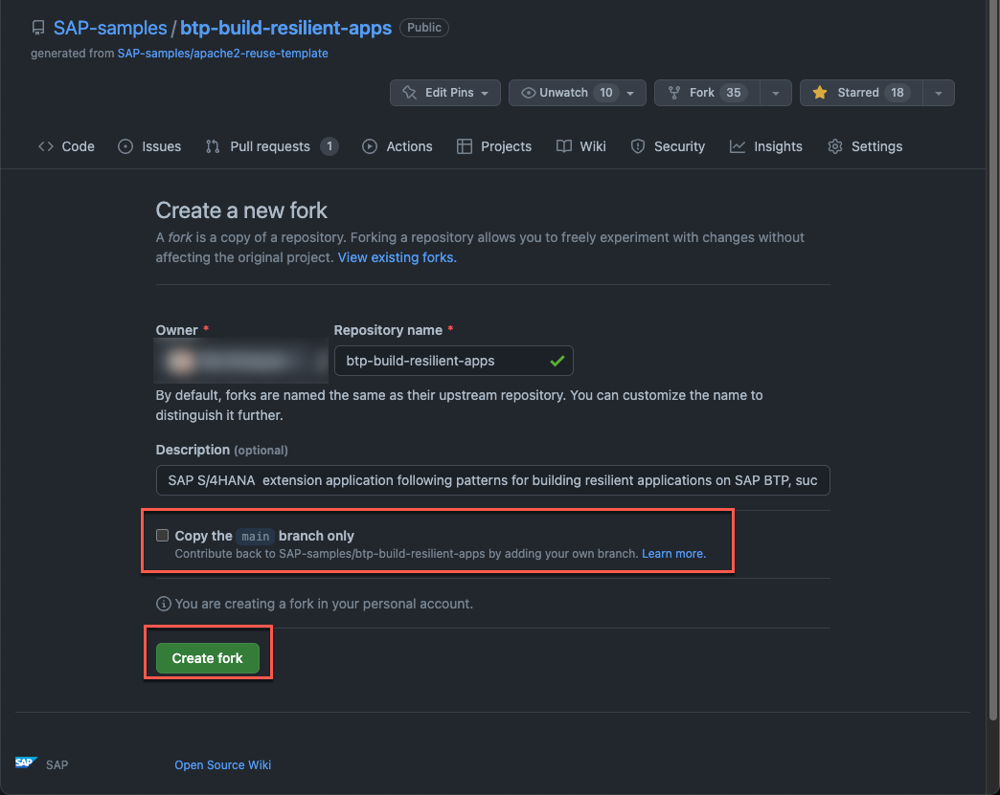

   You should now have the following repository: github.com/**YourUser**/btp-build-resilient-apps

10. Go back to the **SAP Business Application Studio**. Type in **> New Terminal** in the menu on the top of your screen and select the first entry using the cursor.
    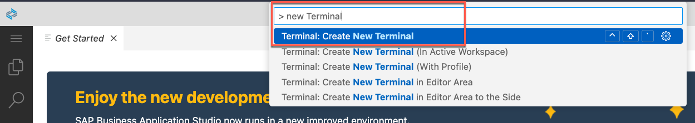

11. Navigate to the **projects** directory and clone your forked sample GitHub repository by using the following command in the terminal:
   ```
   cd projects && git clone -b extension https://github.com/YourUser/btp-build-resilient-apps
   ```
   > **IMPORTANT:** ❗️Replace **YourUser** with your actual username.

   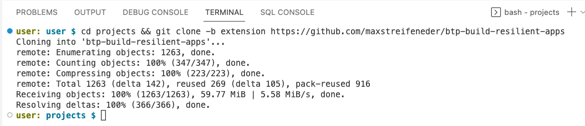

12. Select the **file** icon in the side menu, click on **Open Folder** and provide the path to the cloned repo. (*/home/user/projects/btp*)
    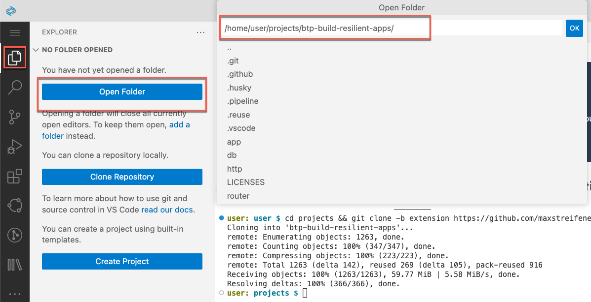

13. Install the needed npm dependencies (like TypeScript globally and all the other packages defined in the package.json file):

    ```
    npm i -g typescript ts-node && npm install
    ```

   The installation of dependencies will take a few momements.

14. In order to verify, if the setup in your SAP Business Application Studio is fine, run the test for the application: 
   ```
   npm run test
   ```

   The tests take a few seconds and will produce the following output: 
   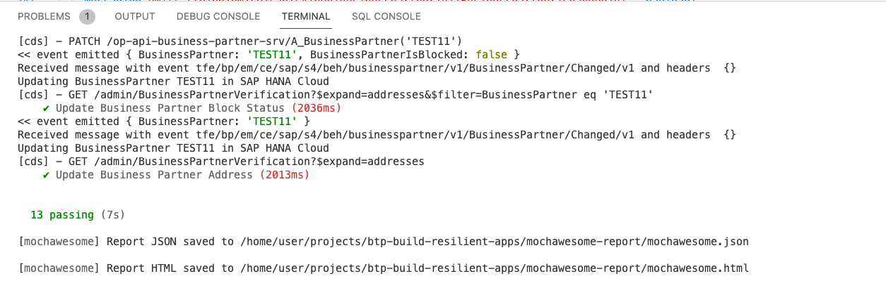

15. You are now good to go to deploy the entire application to the SAP BTP, Cloud Foundry Runtime following these steps:

    - Search for **Login to Cloud Foundry** and press **Enter** to confirm.
      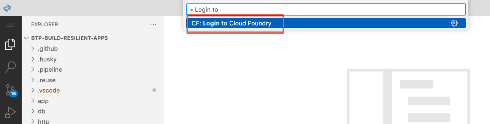

    - Copy & Paste the API Endpoint of your subaccount from the SAP BTP Cockpit.
      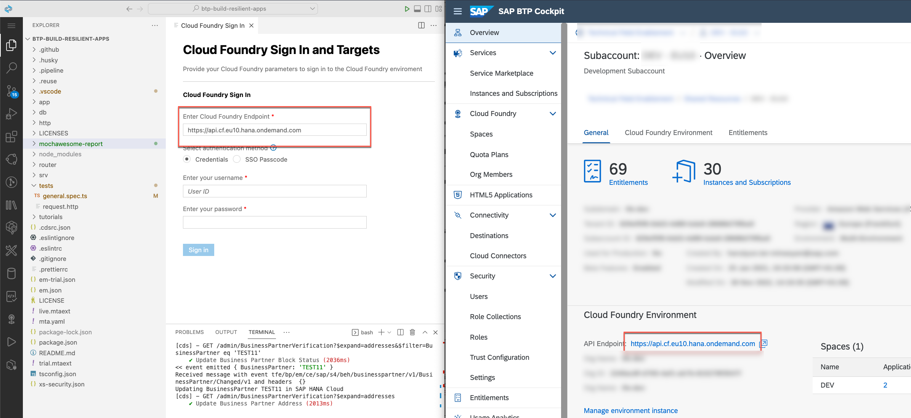

    - Enter your SAP BTP password and username and continue with **Sign in**. 

16. Pick the Cloud Foundry organization and Cloud Foundry space you want to deploy the application to from the dropdown lists and continue with **Apply**.
    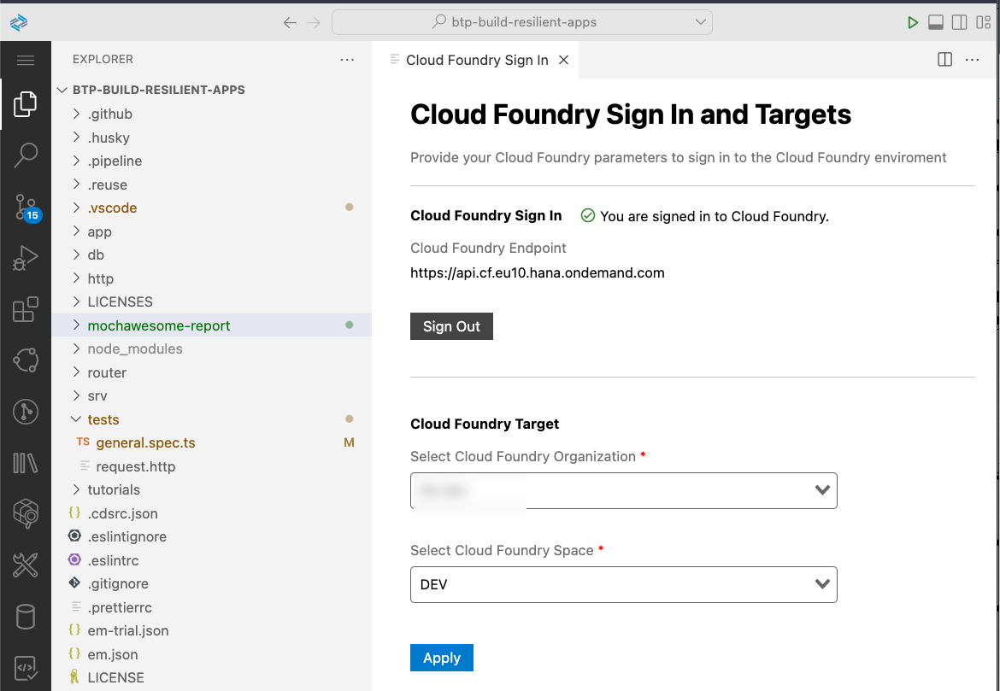
    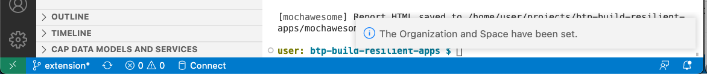

17. Build the Multi-Target Application Archive (MTA Archive) by executing the following command in the root directory of your project in the terminal:
    ```
    npm run build:cf
    ```

    This will create a **gen** directory in the root of your project, containing the generated artifacts that will be used for deployment.

    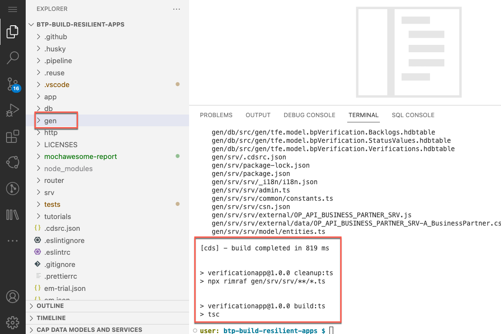

    > If you're curious about what the npm script is doing, take a look at the package.json file in the root of your project. Specifically, check line 74 of the [package.json](../../package.json#L74) file.

18. Deploy the application to SAP BTP, Cloud Foundry Runtime by executing the following command in the root directory of your project in the terminal:

    If you want to deploy it to the SAP BTP, Cloud Foundry Runtime in the trial environment:
    ```
    npm run deploy:trial
    ```

    If you want to deploy the application to the SAP BTP, Cloud Foundry Runtime in your non-trial environment:
    ```
    npm run deploy:live
    ```

    This will trigger the deployment to SAP BTP, Cloud Foundry Runtime including the creation of the necessary service instances and service bindings to the corresponding apps.

    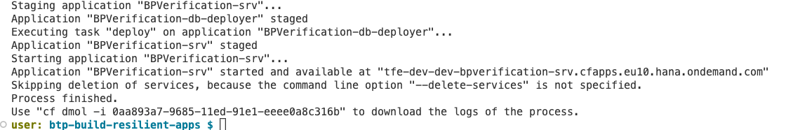

19. Verify the result of the recent deployment using the [SAP BTP Cockpit](https://cockpit.eu10.hana.ondemand.com/cockpit/). Navigate to the subaccount and open the **HTML Applications** menu and check, if the application was deployed to the HTML5 Application repository. This was succesful, once the following entry in the list appears:
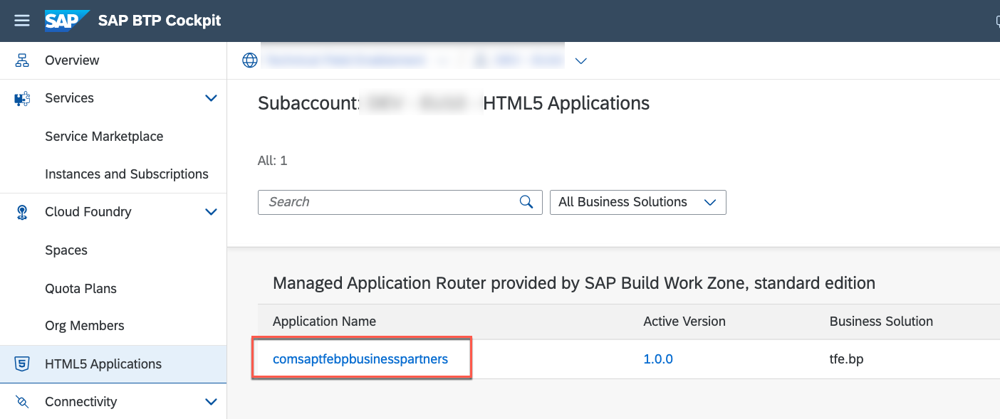


