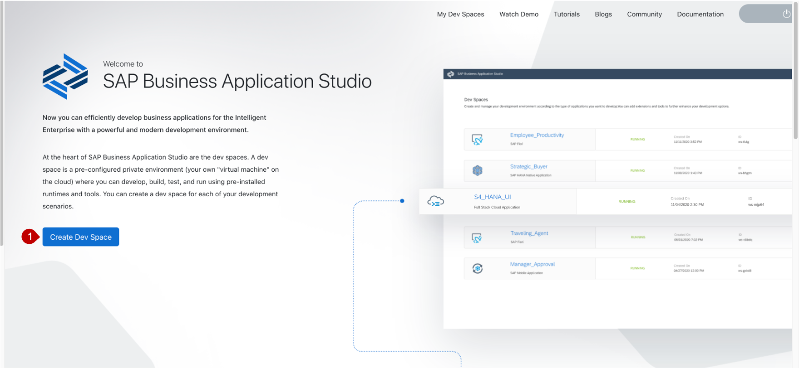
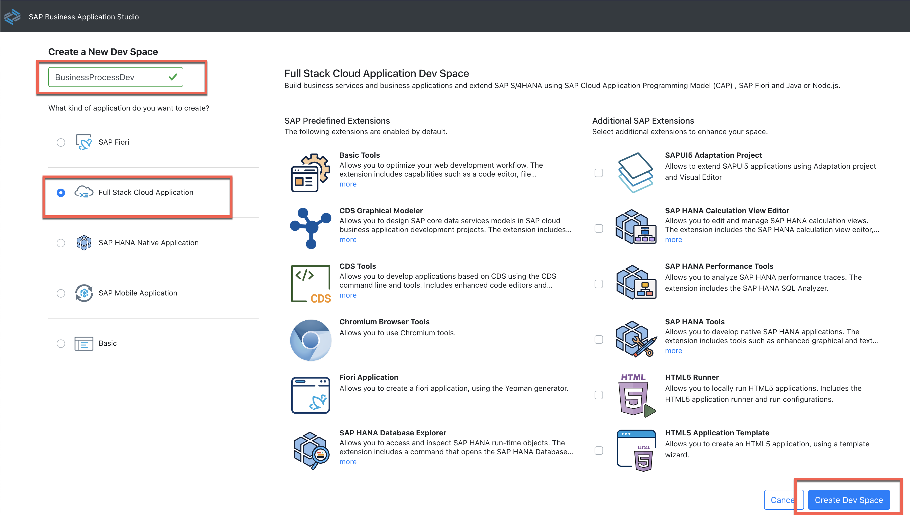
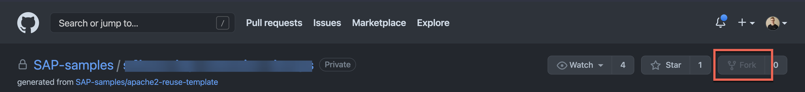
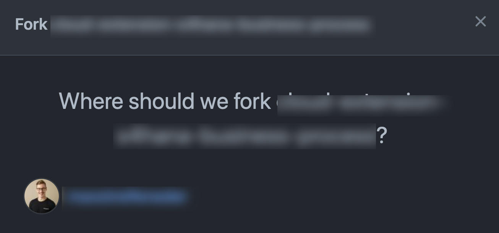
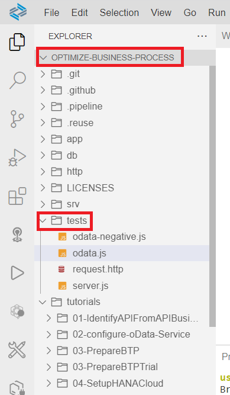
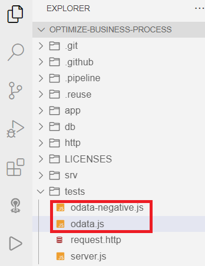
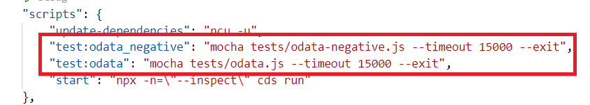
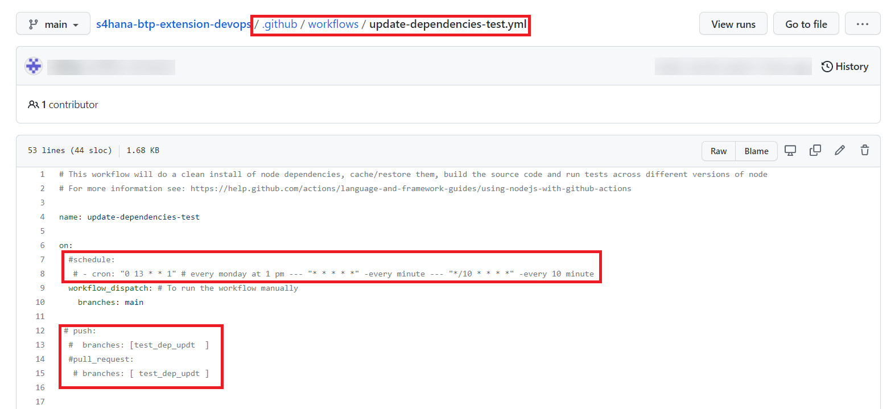

# Deploy SAP Cloud Application Programming Model (CAP) Application

## Introduction

Clone an existing CAP application in SAP Business Application Studio and deploy it to SAP BTP, Cloud Foundry Runtime.

### Clone the existing application in SAP Business Application Studio

1.	Make sure you have opened your *SAP BTP Account* and navigate to your *subaccount*.
   
2.	Go to *Services* and select *Instances and Subscriptions*.
   
3.	Select **SAP Business Application Studio** located in the *Subscriptions* tab and click on the icon to open the application.
   

4. Create a **Dev Space** once the SAP Business Application Studio home appears.
   

5.	Enter a **Dev Space name** e.g 'BusinessProcess', select the type *Full Stack Cloud Application*.
   Don´t forget to click on the button *Create Dev Space*
   
    
6.	Your Dev Space is now being created. As soon as the Dev Space is running you can click on your Dev Space name to  access it.

7. Go to <https://github.com/SAP-samples/btp-build-resilient-apps> and fork the repository. So that you have a dedicated fork on github.com. In one of the subsequent steps you can connect your fork with the SAP Continuous Integration and Delivery service to run certain pipelines. 
   
   > the screenshot was created when the repository was still private. that's why the fork button appears to be disabled. 

8. Choose your user as destination for the fork. 
   

   You should now have the following repository: github.com/**YourUser**/btp-build-resilient-apps. (TODO replace with renamed repo)
   > To Update the dependencies automatically using GitHub Actions [GitHub Actions to Update Dependencies](#gitHub-actions-to-update-dependencies)

9.	Choose *Terminal -> New Terminal* in the menu on the top of your screen.
   

10. In the opened terminal go to projects folder with executing

   ``` 
 cd projects/btp-build-resilient-apps/
   ```

11. Clone your forked sample GitHub repository for this mission. 
  
     ```
    git checkout extension-workflow
    ```
    
    > **IMPORTANT:** Replace **YourUser** with your actual username. 
    
    > As the repository is already cloned in SAP workflow setup no need to clone again

12. Click on *File* in the menu on the top and choose *Open Workspace* in the Dropdown menu.
   

13. Open the project by selecting projects -> btp-build-resilient-apps and click on *Open*

14. Run the application locally in your SAP Business Application Studio environment by executing the following command in the root directory of your project in the terminal:

    ```
    cds watch
    ```

    Click on `Expose and Open` in the appearing PopUp. 
   


14. To logon to the SAP BTP, Cloud Foundry Runtime follow these steps:

    - Click on **View > Find Command** in the menu on the top.
     
     
    - Search for **Login to Cloud Foundry** and press **Enter** to confirm.
      

    - Copy & Paste the API Endpoint of your subaccount from the SAP BTP Cockpit. 
      

    - Follow the process by entering the credentials of your SAP BTP account and by selecting the Cloud Foundry org and space you want to deploy the application to.

> NOTE: to add test cases please check [Test cases for SAP CAP Application](#test-cases-for-sap-cap-application)

15. Build the Multi-Target Application Archive (MTA Archive) by executing the following command in the root directory of your project in the terminal:

    ```
    mbt build -e trial.mtaext
    ```

> **IMPORTANT:** this will produce a .mtar file in the mta_archives directory. Some of the values for the service instance creation depend on the environment you are deploying to, that's why the *-e* for *extension* is used here. If you are using a production environment, use <code>mbt build -e live.mtaext</code>

16. Deploy the application to SAP BTP, Cloud Foundry Runtime by executing the following command in the root directory of your project in the terminal:

    ```
    cf deploy mta_archives/BusinessPartnerVerification_1.2.0.mtar
    ```

    This will trigger the deployment to SAP BTP, Cloud Foundry Runtime including the creation of the necessary service instances and service bindings to the corresponding apps. 
    
    
## Test cases for SAP CAP Application

1. Please find the test cases available in the directory **btp-build-resilient-apps/tests/**.

 

2. The test cases are split up into two seperate files, namely **odata-negative.js** and **odata.js**.

 
 
3. All the test cases are written in [Chai](https://www.chaijs.com/) - (Chai is a BDD / TDD assertion library for node). An example can look as follows:

 
 
4. The "/admin/$metadata" Path (the metadata service document of one of the OData services from the deployed CAP application) is validated against two conditions -  the response code and response header. 

 
 
 The respone code needs to to be **200** and the response header should contain **content-type** to equal **"application/xml"** and **odata-version** to be **4.0**.

5. Adding these scripts to the package.json has already been done.



6. These test cases can now be executed from the terminal using <code>npm run test:odata_negative</code> or <code>npm run test:odata</code> 


## APPENDIX

### GitHub Actions to Update Dependencies

1. After forking the repository go to **.github/workflows/update-dependencies-test.yml** 
   

2. To Schedule the workflow uncomment the **Schedule** and **Cron** entries and also specify the required  **Cron Expression**.
   > The workflow can also be triggered on **Push** events and **Pull Requests**.

3. Enter the **username** and **email** to push the GitHub commits after dependency updates.
   
