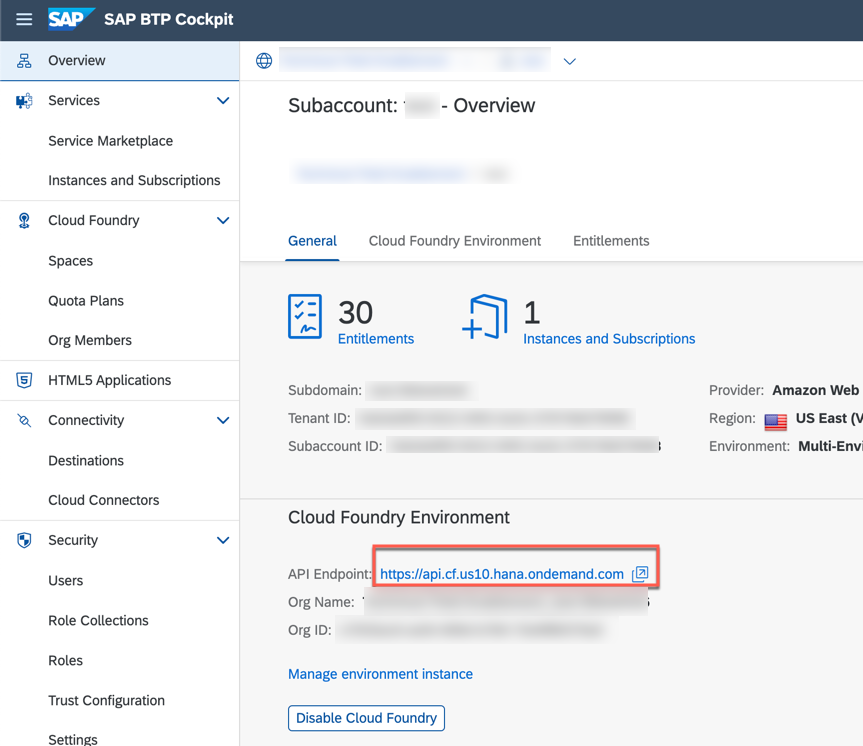

# Configure event based communication between S/4 and SAP Event Mesh
## Introduction

In this step, you will establish a connection between your SAP S/4HANA on-premise system and SAP Event Mesh. This connection is needed to trigger events from the SAP S/4HANA system. Those events can be consumed from various subscribers, for instance the SAP Cloud Application Programming Model application that you have deployed earlier. 

If you are using an S/4HANA 1909 (or older version), please follow the following instruction to setup a connection to the SAP Event Mesh service: https://help.sap.com/viewer/810dfd34f2cc4f39aa8d946b5204fd9c/1909.latest/en-US/fbb2a5980cb54110a96d381e136e0dd8.html

### Configure Endpoint

1. Open your browser and navigate to your subaccount in the SAP BTP Cockpit. 
2. Select **Instances & Subscriptions** in the menu on the left.
   

3. Scroll to the **Instances** and look for the **Event Mesh** service instance in the table. Now click on the 3 dots to open the context menu and choose **Create Service Key**.
   

4. Provide a service key name e.g. **EMServiceKey** and **Create** the service key.
   

5. Click on your created service key to get the service key details.
   

6. Make sure you have the right service key opened. Click **Copy JSON** to copy the entire service key content. 
   
 
 ### Configure Channel

1. Log on to your SAP S/4HANA on-premise system (with an administrative user, not with the user that you have created in one of the previous steps) and open the transaction **/IWXBE/CONFIG**.
2. Select **via Service Key**.

3. Choose a **channel name** e.g. 'S4EM', provide a description and paste the **Service Key content** (JSON) you have received in one of the previous steps. 
   
> **IMPORTANT:** 
>
> - If you are using SAP Event Mesh in the SAP BTP Trial environment: please provide the highlighted namespace ("tfe/bpem/em", including the semicolon at the end of the line) manually after pasting the service key content. It needs to be exactly the mentioned namespace, as this defines the exact topic/queue names the SAP Cloud Application Programming Model application is expecting.
> - If you are using SAP Event Mesh from a productive SAP BTP account, just paste the copied service key content without adding the namespace manually. (this should already be part)

4. **Save** the configuration.

5. Once your configuration is saved, select the newly created channel and hit the **Activate - Deactivate** button.
    
   
   > Note: In case of errors, please have a look at the [import Certificate](#importing-the-certificate) section.

6. Select **Check connection** to check that everything is fine with the configuration.
> **Troubleshooting:** In case of errors, please have a look at the following blog post: https://blogs.sap.com/2020/08/27/enterprise-event-enablement-troubleshooting/

7. Select **Outbound Bindings**.
   
    

2. In the next screen, first click on **Create**.
    

 3.  Use the F4 help to look for the **BusinessPartner** topics. Select **BusinessPartner/*** to get all events related to BusinessPartners. (the wildcard enables all BusinessPartner related events such as *Created* or *Changed* )
    

3.  Finish the setup and **Save**. 
   
    

> the topic name in SAP Event Mesh is effectively a combination of the namespace you have provided within the service key ("tfe/bpem/em") concatenated with the actual topic name you have selected in this step. Hence, the resulting topic name is: *tfe/bpem/em/sap/s4/beh/businesspartner/v1/BusinessPartner/*. 
### Importing The Certificate 

1. Open the **SAP BTP cockpit** and go to the subaccount verview and click on the **API Endpoint**.
   

2. Select **Connection is Secure**.
   

3. Click on **Certification is Valid**.

   

4. Go to **Certificate Path** and then to **View Certificate**.

   

5. View the **Details**. Select **Copy to File** and Click **Next**.

   

6. Select **Base 64 Encoded X.509(.cer)**, click **Next** to specify a filename.

   

7. Logon to your SAP S/4HANA on-premise system open the transaction **STRUST**. 
   

8. Select **SSL Client SSL Client(standard)**.
   
   > Note: In case of Errors, please add the certificate also to **SSL client SSL Client(Anonymous)**.

10. Select the **Import Certificate** icon.
   

11. Once you have imported the certificate, select **Add to Certificate List** and don't forget to save it.
   

--- 

Congratulations! You have now done the required steps in the SAP S/4HANA on-premise system, so that the system can proactively send events to the SAP Event Mesh service on SAP BTP. 
