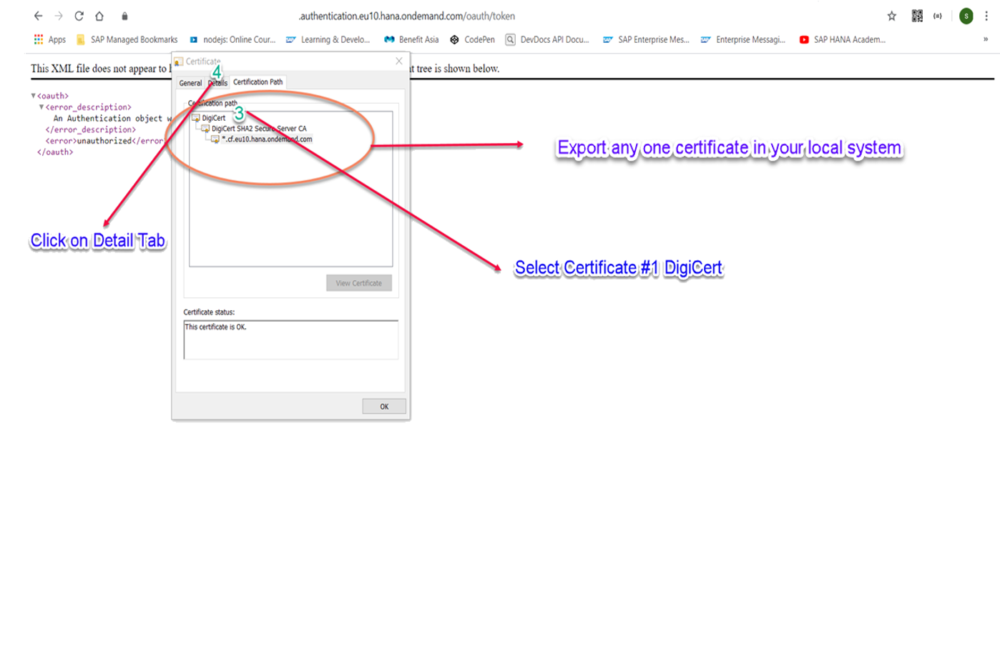
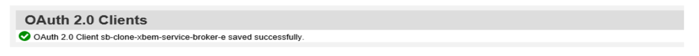
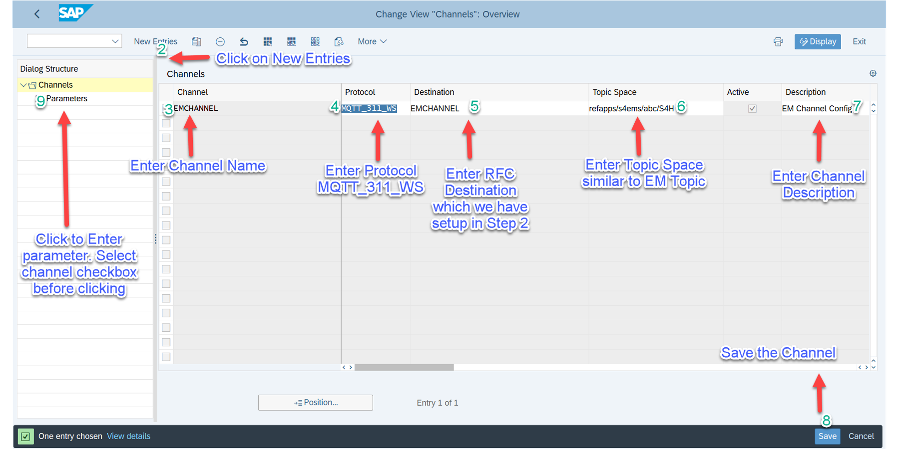

# Configure event based communication between S/4 and SAP Event Mesh
## Introduction

In this how to guide, you will establish a connection between your S/4HANA on Premise System and Event Mesh. This connection is needed to transport events from the SAP S/4HANA system to Event Mesh. 

Additional documentation on configuring trust and creating the RFC destination can be found in the official guide:
 
https://help.sap.com/viewer/810dfd34f2cc4f39aa8d946b5204fd9c/1809.000/en-US/12559a8c26f34e0bbe8c6d82b7501424.html

**Persona:** S/4HANA Developer

### Configure Endpoint

1. Open your browser. Then go to your sub account in SAP BTP and from there to your BusinessPartner space. 
2. Click on *Service Instances* (on the left).
3. Click on your Event Mesh instance.
4. Click on the menu option (3 dots) followed by Create service key (on the right) 

 
 
5. Provide a service key name. Click on create.

 
 
6.  Under service keys, click on menu. Click on view

  
  
7. Find and copy your Event Mesh token endpoint URL. Look for token endpoint and then copy the URL.

 

8. In your browser, open your Event Mesh token endpoint url (*https:// ... Event Mesh URL ... /oauth/token*). 

9. Click on view site information button (lock symbol on top left corner)and open the *certificate*

 

10. Import a certificate
> Hint: You can either download the DigCert certificate on the digicert website or follow the steps below. The steps for exporting the certificates might work differently depending on your browser and operating system. On a Mac for example, you could just drag and drop the certificates to a folder in your file system. 

10.1 Choose the tab *certificate path* and double click on "DigCert" 

Hint: it is sufficient to export any of the three certificates. Later on you will import only a single one.

 

11. Next choose the tab *Details* and click on the button *Copy to files*, then choose *Next*

 

12. Click on *Next*. Then, on the next screen, click on *Next* again

 

13. Then copy your file name into the empty space (Alternatively you can browse for the file)

 

14. Click on *Next*, then *Finish*

 

15. In the pop-up window click on *Ok* for confirmation 

 

16. Go back to your S/4HANA system
17. Go to transcaction - 'STRUST'.

 

18.	Switch to Change mode
19.	Right Click on SSL client SSL Client (Anonymous) and Select *Create*
20. Click Enter
21. Click Save
22. Double Click on SSL Anonymous Node
23. Import  the Certificate from local folder
24. Save

 
You will end up importing a single certificate of choice to the Anonymous Node.

 

25. Enter transaction  "/nsmicm" to go and clear the cache.
26. Navigate to Administration -> iCM -> Exit soft -> Local
27. Click on *Yes* to finish

28. Enter the transaction '/nspro', then click on *SAP Reference IMG* button to execute

 

29. Now you need to navigate in the structure to configure a RFC Connection
30. Navigate to SAP NetWeaver -> Enterprise Event Enablement -> Administration -> Channel Connection Settings ->

 

31. Click on Manage RFC destination and click on the execute icon
32. On your new screen choose the icon to create a new destination
33. Enter a destination name 'EMS4' and select connection type 'G Http connection to external server' from the drop down

 

34. Click on the check icon to finish
35. Enter host name - enter the service key from em. <app-url> eg: enterprise-messaging-messaging-gateway.cfapps.eu10.hana.ondemand.com
 
  
 
36. Enter path prefix - /protocols/mqtt311ws
37. Click on ‘logon and security‘ tab

  

38. Scroll to security options 
39. Click on radio button "active"  for SSl
40. Select SSL client 'Anonymous'
41. Click on *save*
42. Click on *back* 
43. Click on *back*
44. On the next screen click on the *execute icon* for "manage Oauth client setup"

  

45. Change the port from 44301 to 44300 in the url
46. Open the Logon and use your Technical User credentials to log into the system

  

47. On the next screen click on the *create* button to create a new OAuth 2.0 Client

  

48. Enter field name  '/IWXBE/MGW_MQTT' for *OAuth 2.0 Client profile* or select it from the drop down
49. Enter a Configuration Name for the auth 'refappsEMAuth'
50. Enter OAuth client ID

  

51. Click on OK to finish

52. Click on *Details* tab and choose *Administration* 

53. Enter *Client Secret* given in the Service Key

  

54. Enter *Authorization Endpoint* and *Token Endpoint*.  Replace *token* with *authorize* in the url for the authorization endpoint. 
55. For *Resource access authentication* choose *Header Field*
56. For *Grant Type* choose *Client Credential*
57. Don´t forget to click on *Save*

  
 
  

58. Go back to the Screen Display IMG
59. Click on the icon to execute 'Manage Channel and Parameters'

 

60. Click on *New Entries*

 

61. Enter 'EMChannel' in the channel tab of the table
62. Select the protocol 'MQTT_311_WS’'
63. Enter 'EMS4' destination 
64. Enter the topic name created in CP

To identify your topic name, go the the SAP BTP Cockpit and click on *Subscriptions*. Look up the *Event Mesh* tile. Click on *Go to Application*. This opens up Event Mesh. Click on your messaging client and copy the value under *Namespace*. 

65. Enter a Description
66. Click on save to finish
67. Select EMChannel
68. Double click on parameters

69. Click on *new entries*
70. Configure your channel as described in the following:
- *Parameter name* "MAX_RECONNECT_ATTEMPTS" -->  Leave the parameter value field empty.
- *Parameter name* MQTT_QOS --> *Parameter value* 1
- *Parameter name* OAUTH_20_CLIENT_PROFILE  -->  *Parameter value* /IWXBE/MGW_MQTT
- *Parameter name* OAUTH_20_CONFIGURATION --> *Parameter value*  EMCONFIG (the name you had used earlier in step 50 for the auth 'refappsEMAuth')
- *Parameter name* RECONNECT_WAITTIME --> Leave parameter value field empty. 

71. Click on *Save*

 

72. Click on *back* 
73. Click on *display/ change*

 

74. Select the channel
75. Click on *active- inactive* button

Make sure the channel is active.

76. Test the connection

 

77. click on *Back* and go back to the Screen Display IMG
78. Click on *Configuration*
79. Click on *Maintain Event Topics*

 

80. Enter channel 'EMChannel' created in the steps before
81. Click on the check icon to finish

82. Change to screen: Change View - Enterprise Event Enablement Channel Topics: Overview	
83. Click on *New Entries*

 

84. Click on the *mirror icon* or press F4 in keyboard
85. Select BO/BusinessPartner/Created in the Topic Filter field
86. Click on the mirror icon or press F4 in keyboard
87. Select BO/BusinessPartner/Changed in the Topic Filter field
88. Click on *Save* to finish