# Test Entire Application
## Introduction

Now it is time to test your artefacts that you have deployed. As a result of the following steps you will be able start up your application, trigger an event in your SAP S/4HANA on-premise system and see the Business Partner you have created appear in your application.

# Run application and test entire bussiness scenario

1. To access the application, the respective user needs to have the **BPAdmin** RoleCollection assigned.  Go to your subaccount in the SAP BTP cockpit and navigate to **Security -> User**. Assign the **BPAdmin** RoleCollection to the respective user(s).
   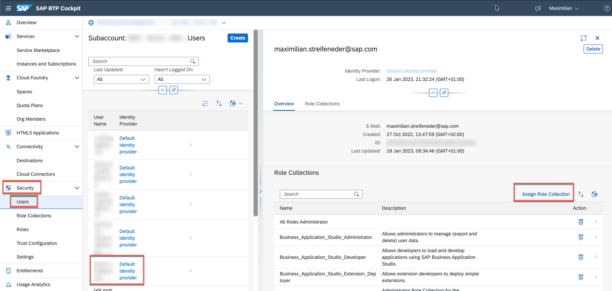
   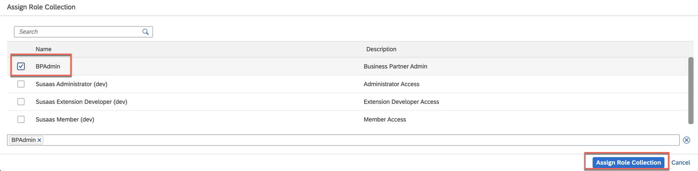

2. Navigate to **HTML5 Applications** in the SAP BTP Cockpit and click on the URL to access the SAP Fiori Elements application. 
   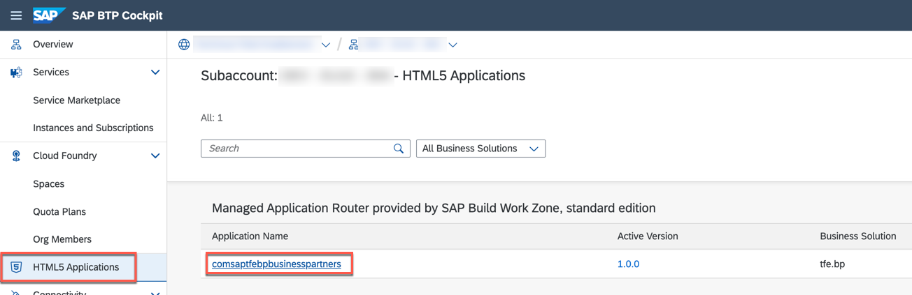

3. Select the Business Partner Validation tile.
   
   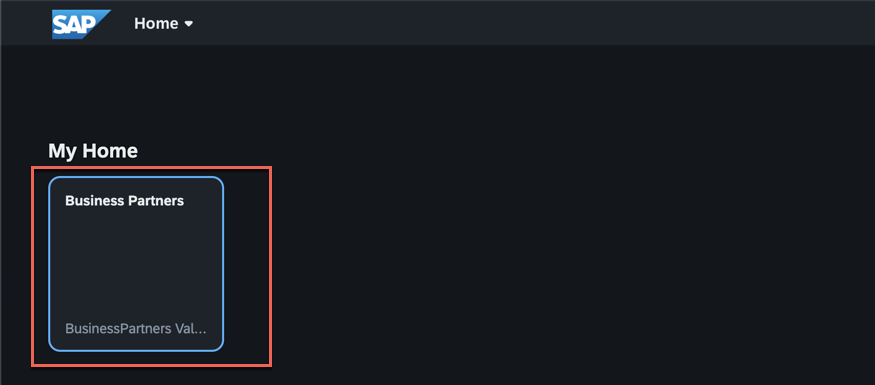

4. You should see an empty list of business partners. Since none have (most likely, if not somebody else on your SAP S/4HANA on-premise system) been created so far, the list is empty. 
   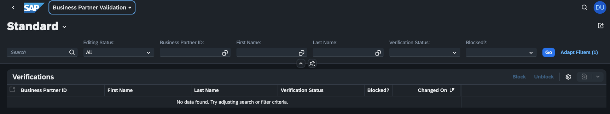

5. Now log on to the SAP S/4HANA on-premise system in order to create a new business partner. Log on with the user have created in one of the previous steps!
   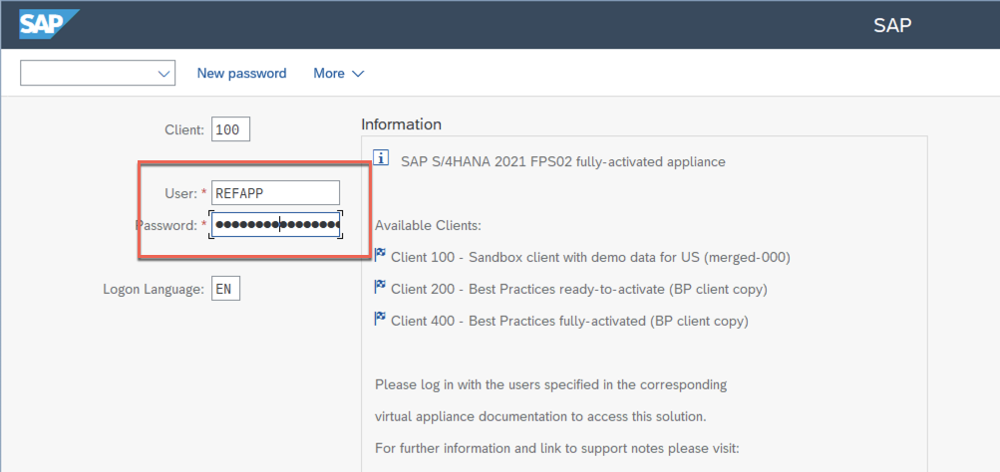

6. Enter the transaction code **bp** or select the item from the users **Favorites**.
   
   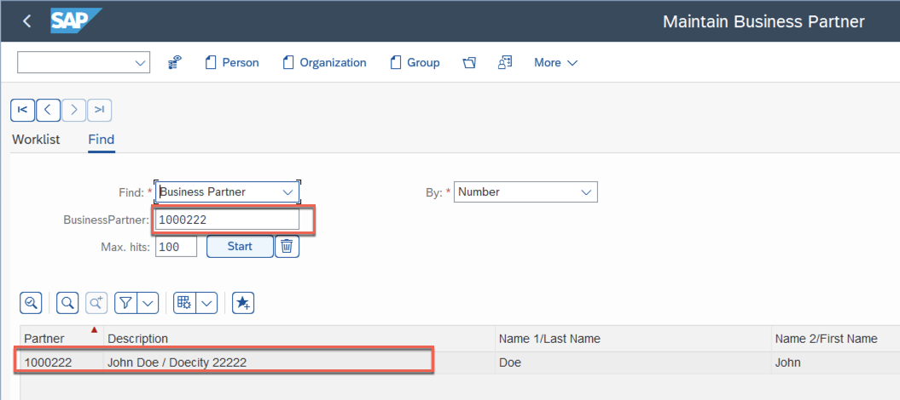

7. Select to create a new **Person**.

   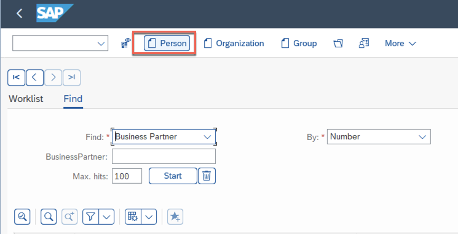
 
8. Provide a first name and last name as well as an entire address for the business partner. After that, open the **status tab**.
   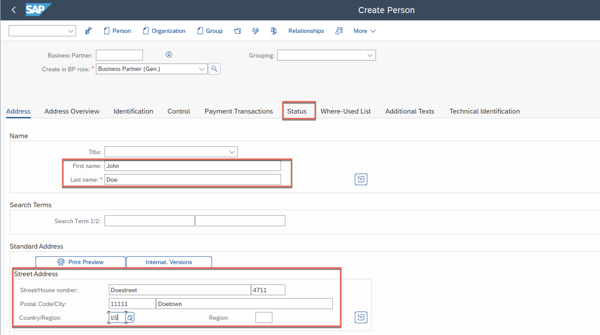
  
9.  Set the **Central Block** lock and save the business partner. This will create a new business partner in the SAP S/4HANA on-premise system and implicitly and asynchronously trigger an event on SAP Event Mesh. This event will be catched by all subscribers that have subscribed to the corresponding topic. Right now, only the SAP Cloud Application Model application on SAP BTP, Cloud Foundry Runtime (as the only subscriber) will catch the event and start the processing then. 
   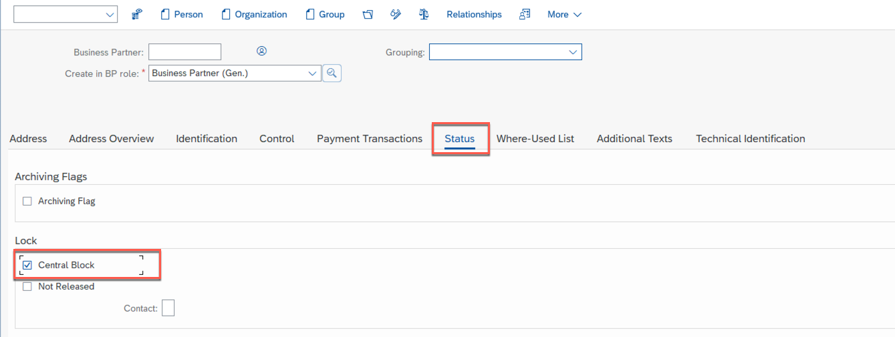

### Check the results on SAP BTP 

1. Now go back to the BPVerification application on SAP BTP (the SAP Fiori Elements frontend that you have accessed using the **HTML5 Applications** option in the SAP BTP Cockpit), refresh the page or click on **Go** to see if the newly created Business Partner was processed properly and appears in the UI.
   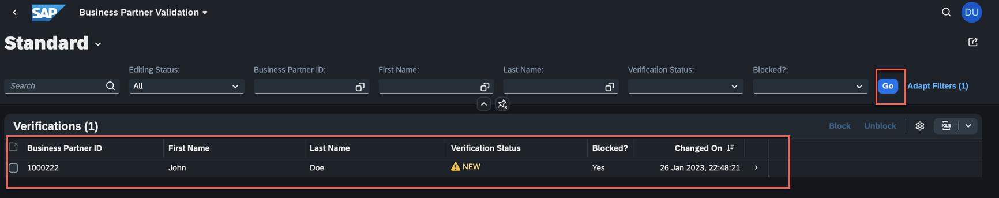

2. **Unblock** the newly created business partner using the button. 
   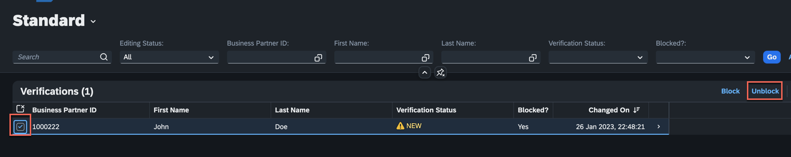

3.  Additionally, you can navigate to the business partner details (click on the business partner) to edit the address and status information. 

4.  Click on **Edit** and update the address or set status for instance to e.g. *verified*
   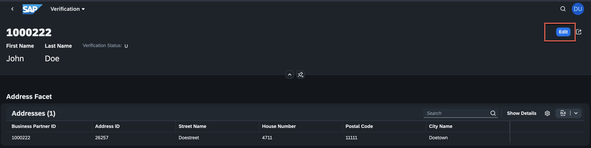
   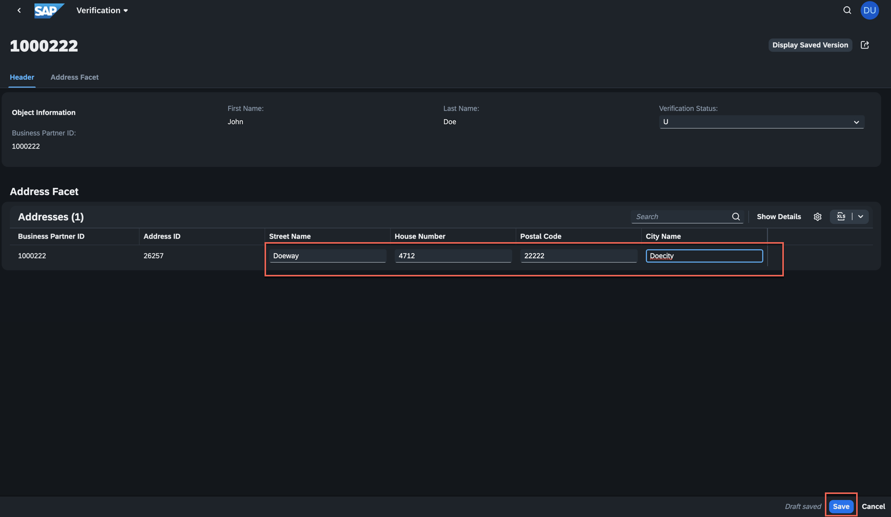

5.  Go back to your SAP S/4HANA on-premise system to check if the changes you did using the SAP Fiori Elements application are reflected. Therefore go to the transaction **bp**, search for the business partner ID and select **Start*. The business partner should appear in the result list - double click to open the details. 
   

6.  Verify if the check the changes you did in the extension application on SAP BTP are reflected in the SAP S/4HANA on-premise system. 
   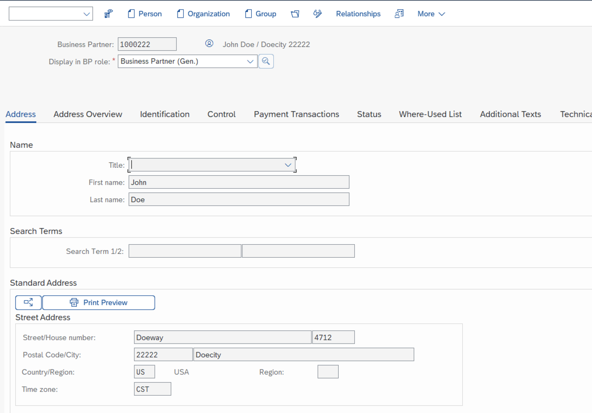

7.  Go to the Status tab. You can see that the central Block has been removed due to the **Unblock** button you have used in the extension application. 
   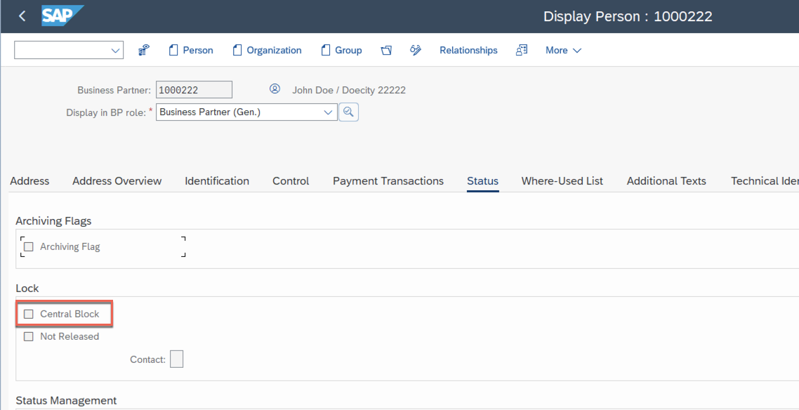
