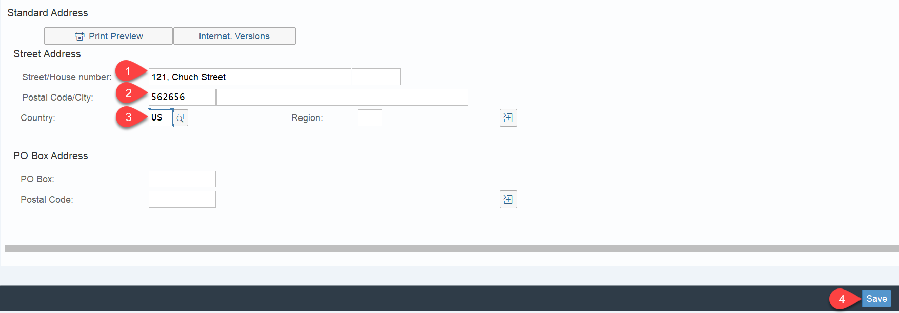

# Test Entire Application
## Introduction

Now it is time to test your artefacts that you have deployed. As a result of the following steps you will be able start up your application, trigger an event in your SAP S/4HANA on-premise system and see the Business Partner you have created appear in your application.

# Run application and test entire bussiness scenario

1. To access the application, the respective user needs to have the **BPAdmin** RoleCollection assigned.  Go to your subaccount in the SAP BTP cockpit and navigate to **Security -> User**. Assign the **BPAdmin** RoleCollection to the respective user(s).
   

2. Navigate to **HTML5 Applications** in the SAP BTP Cockpit and click on the URL to access the SAP Fiori Elements application. 
   

3. Select the Business Partner Validation tile.
   

4. The list of BusinessPartners along with their validation status gets displayed.
   

5. Now switch to the SAP S/4HANA on-premise system to create a new business partner or modify an existing one.
   

6. Enter the transaction code **bp**.
   

7. Create a new Business Partner:

- Select on **Person**.
   
 
- Provide a first name and last name for the business partner.
   
  
- Provide an address.  
   
 
 - Move to the status tab and check the **Central Block** lock and save the Business Partner. This will create a new Business Partner in the SAP S/4HANA on-premise system and implicitly trigger an event on SAP Event Mesh. This event will be catched by all subscribers that have subscribed to the corresponding topic. Right now, only the SAP Cloud Application Model application on SAP BTP, Cloud Foundry Runtime (as the only subscriber) will catch the event and start the processing then. 
   

8. Now go back to the BusinessPartnerValidation application on SAP BTP (the SAP Fiori Elements frontend that you have accessed using the **HTML5 Applications** option in the SAP BTP Cockpit) to see if the newly created Business Partner was processed properly and appears in the UI.
   

9. **Unblock** the newly created business partner using the button. 
   

10. Additionally, you can navigate to the business partner details to edit the address and status information. 

11. Click on **Edit** and update the address or set status for instance to e.g. *verified*
   
   

12. Go back to your SAP S/4HANA on-premise system to check if the changes you did using the SAP Fiori Elements application are reflected. Therefore go to the transaction **bp**.
   

13. Open the details of the business partner you have just updated and check the changes.
   

14. Go to the Status tab. You can see that the central Block has been removed.
   
