# Test the entire application
## Introduction

Now it is time to test your artefacts that you have deployed. As a result of the following steps you will be able start up your application, trigger an event in your SAP S/4HANA on-premise system and see the Business Partner you have created appear in your application.

# Run Application and test entire Business Scenario

1. To access the application, the respective user needs to have the **BPAdmin** RoleCollection assigned.  Go to your subaccount in the SAP BTP cockpit and navigate to **Security -> User**. Assign the **BPAdmin** RoleCollection to the respective user(s).
   

2. Navigate to **HTML5 Applications** in the SAP BTP Cockpit and click on the URL to access the SAP Fiori Elements application. 
   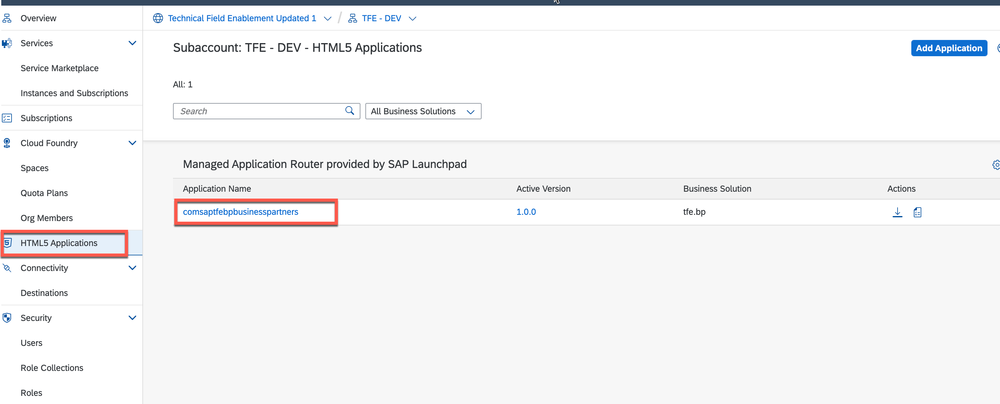

3. Select the Business Partner Validation tile.
   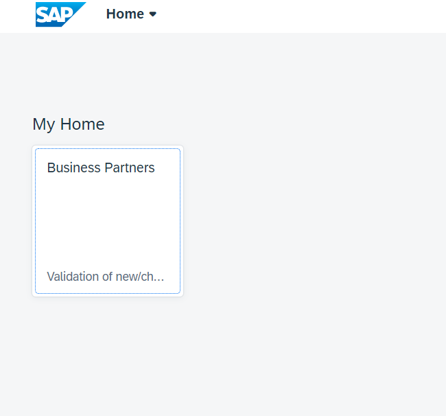

4. The list of BusinessPartners along with their validation status gets displayed.
   

5. Now switch to the SAP S/4HANA on-premise system to create a new business partner or modify an existing one.
   

6. Enter the transaction code **bp**.
   

7. Create a new Business Partner:

- Select **Person**.
   
 
- Provide a first name and last name for the business partner.
   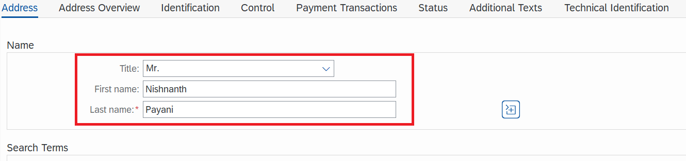
  
- Provide an address.   
   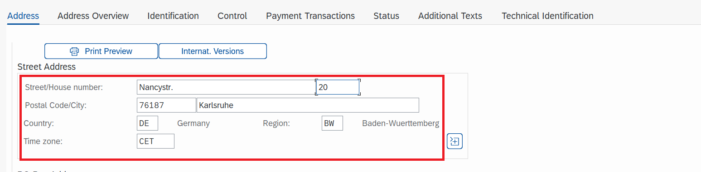
 
8. Move to the status tab and check the **Central Block** lock and **save** the business partner. This will create a new business partner in the SAP S/4HANA on-premise system and implicitly trigger an event on SAP Event Mesh. This event will be catched by all subscribers that have subscribed to the corresponding topic. Right now, only the SAP Cloud Application Model application on SAP BTP, Cloud Foundry Runtime (as the only subscriber) will catch the event and start the processing then. 
   

9. Now go back to the BusinessPartnerValidation application on SAP BTP (the SAP Fiori Elements frontend that you have accessed using the **HTML5 Applications** option in the SAP BTP Cockpit) to see if the newly created Business Partner was processed properly and appears in the UI.
   

10. **Unblock** the newly created business partner using the button. 
   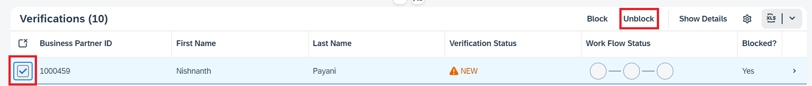

11. This will trigger a new workflow instance in SAP Workflow Management. The progress of the workflow is updated in the app itself.
   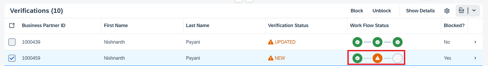 

**IMPORTANT:** Steps 12 to 14 needs to be done by a manager (or the approver that you have maintained in Busines Rules capability of SAP Workflow Management some steps before)

12. Open SAP Workflow Management from the SAP BTP cockpit. 
   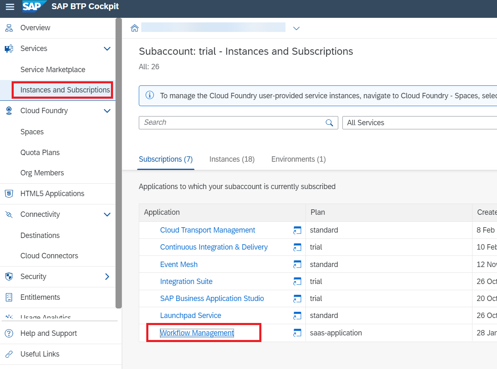

13. In the SAP Fiori Launchpad of SAP Workflow Managment, select **My Inbox** in the **Productivity Tools** section.
   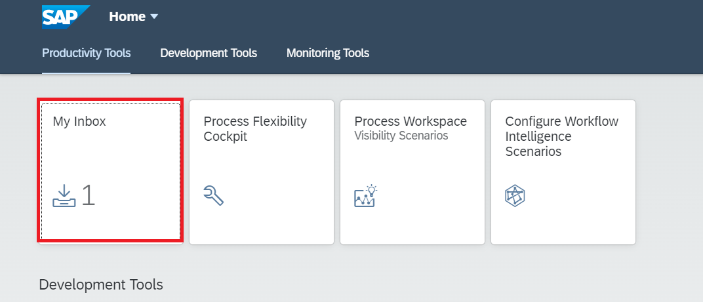

14. You should see a new task of the previously triggered workflow instance appearing, that you can either **Approve** or **Reject**.
   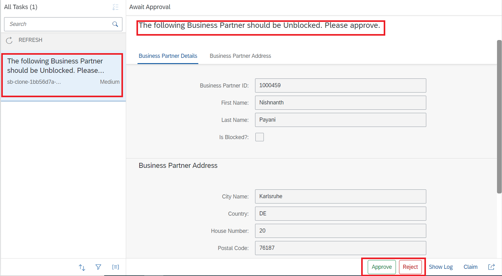

15. In case you have approved the task, the workflow status in your application will be updated accordingly. Also, the status in the SAP S/4HANA on-premise system has been updated in the background. 
   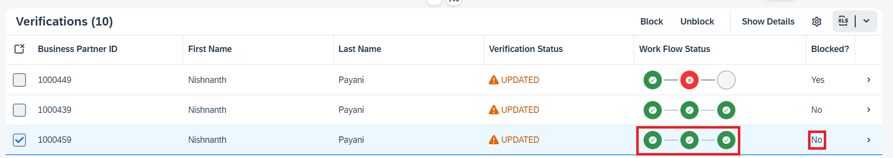

16. In case you have rejected the task, the workflow status in your application will be updated as follows. The status in the SAP S/4HANA system will not be updated, since the workflow has been rejected.
   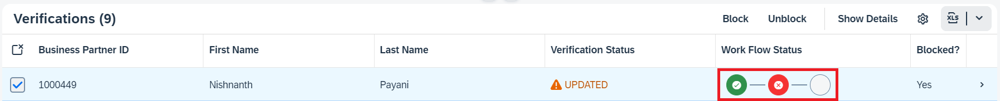

17. The **Central Block** should be in the same state as in your extension application on SAP BTP. 
   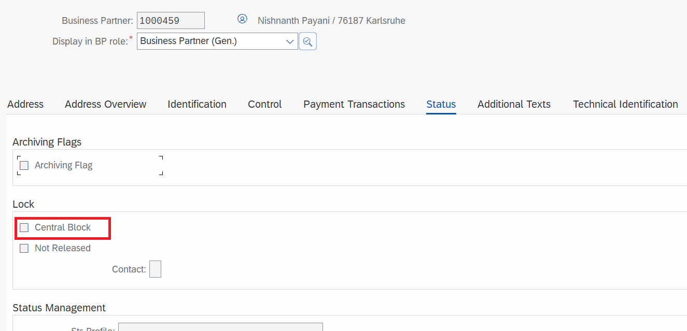
