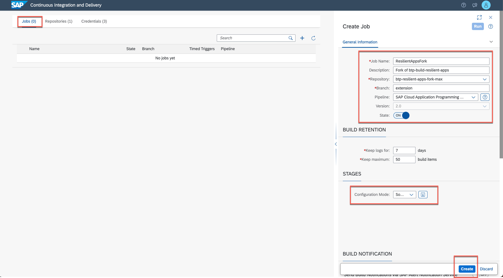

# Setup CI/CD Pipeline

Learn how to set up and execute a pre-defined Continuous Integration and Delivery (CI/CD) pipeline to automate testing, building, and deploying your code changes. This will streamline your development and delivery process.
--- 
**SAP Continuous Integration and Delivery (CI/CD)** is a service on SAP BTP, which lets you configure and run predefined continuous integration and delivery pipelines. It connects with your Git SCM repository and builds, tests, and deploys your code changes. In its user interface, you can easily monitor the status of your builds and detect errors as soon as possible, which helps you prevent integration problems before completing your development.

SAP Continuous Integration and Delivery has a ready-to-use pipeline for CAP, that is applicable to multi-target application (MTA) and Node.js based projects. It does not require you to host your own Jenkins instance and it provides an easy, UI-guided way to configure your pipelines.

For more information on how to configure and run predefined pipelines for your own CI/CD process, have a look at **[What Is SAP Continuous Integration and Delivery](https://help.sap.com/viewer/SAP-Cloud-Platform-Continuous-Integration-and-Delivery)**.

1. Make sure you have the right entitlements in your subaccount to use the SAP Continuous Integration and Delivery service. Go to your subaccount and make sure you have **ONE** (either one is fine, you don't need both) of the following entitlements: 

    - **Continous Integration & Delivery**: free (Application) OR
    - **Continous Integration & Delivery**: default (Application)

    

    If you are missing one of the entitlements, please use the **Add Service Plans** button to assign one of the above required entitlements. (❗️ Don't forget to **Save** in case you have adjusted the entitlements)

    > If you have already used a Booster in one the previous step, you can most likely skip this step. 

2. Navigate to the **Service Marketplace** and subscribe to the SAP Continuous Integration and Delivery service. Choose either the **free** or **default** plan, depending on what you have assigned in the previous step. 

    
    

3. To assign the needed Role Collections, go to **Security > Role Collections**, select **CICD Service Administrator** and hit the **Edit** button to subsequently change the user assignments. 
    

4. In the **Users** section, enter your user and select an Identity Provider. Keep the setting *Default Identity Provider* unless you have a custom identity provider configured.

    

5. Access the SAP Continuous Integration and Delivery service. You can find it by clicking on **Service Marketplace > Instances and Subscriptions** and searching for **Continuous Integration & Delivery** in the search bar. Once you've located it click **Go to application** to open the SAP Continuous Integration and Delivery application. 

    

6. In this step, you will set up the credentials for the deployment (of the Multi-Target Application Archive) as part of the pipeline to the Cloud Foundry space in your SAP BTP subaccount. This process is similar to how you manually deployed it in a previous step. Go to the **credentials** tab and **click on the plus icon** to add a new set of credentials:

    

7. Provide the following values: 
    - Enter a freely chosen ID (name) for your credential, which is unique in your SAP BTP subaccount. In this example, the name of the credential is *cf-credential*.
    - As type select *Basic Authentication* 
    - For Username, enter your SAP BTP Account Email
    - For Password, use your SAP BTP Account password
    
    Click on **Create**.

    >Note, if you choose another credential name than **cf-credential**, you need to adjust the pre-configured pipeline file (*.pipeline/config.yml*) accordingly.
    
    

8.  If your GitHub repository is not private, you can skip this step. If your GitHub repository is private, configure credentials for it, so that SAP Continuous Integration and Delivery service can connect to it. Create another credential and provide the following information: 

    - Enter a freely chosen ID (name) for your credential, which is unique in your SAP BTP subaccount. In this example, the name of the credential is *github-private*.
    - As type select *Basic Authentication* 
    - For Username, enter your GitHub username.
    - For Password, use the personal access token for GitHub
    - (Hint: access tokens can be created in [GitHub by going to *Settings* -> *Developer Settings*](https://docs.github.com/en/github/authenticating-to-github/keeping-your-account-and-data-secure/creating-a-personal-access-token))
    
    Click on **Create**.

    
    

9. Add your Repository.
   - Navigate to **"Repository"** Tab in CI/CD Service and click on ‘+’ to add your repository
   - Give a name for repository. e.g. **btp-build-resilient-apps** 
   - Enter the *Repository URL*, which you **forked** to your Github account. (github.com/**YourUser**/btp-build-resilient-apps)
   - Select the github credentials (*github-private*) created in previous step. 

   

10. GitHub webhooks allow you to automate CI/CD builds. Whenever you push changes to your GitHub repository, a webhook push event is sent to the service to trigger a build of the connected job. To create a webhook in GitHub, you need some data that has been automatically created during the previous step. 

    You can find this data, the Payload URL and Secret, when you open the detail view of an existing repository in the Repositories tab and navigate to **Webhook Data**.
   
    
   
11. Keep the Browser tab with the Webhook data of the SAP Continuous Integration & Delivery service open and open your GitHub fork (github.com/YourUserName/btp-build-resilient-apps) in a new tab, so that you can copy data from one tab to the other. 
    
12. Go to the **Settings** tab of your work, navigate to **Webhooks** and select **Add webhook**.
    

13. Fill in the values provided by the SAP Continous Integration & Delivery service: 

    - Copy & paste the Payload URL
    - Change the Content-Type to **application/json**
    - Copy & paste the Secret
    - Select **Just the push event**
    - Select **Active**

    Click on **Add webhook**

    

15. Go back to SAP Business Application Studio where you have cloned your fork to your local file system. Open the *.pipeline/config.yml* file. 
    
16. Replace the following placeholder with the information of your SAP BTP subaccount and Cloud Foundry org and space name. This can be found in the SAP BTP subaccount overview: 
    - `<cf-org>`
    - `<cf-space>`
    - `<cf-api>`

    > The left half of the screenshot shows the config.yml file, the right half of the screenshot shows the subaccount information of SAP BTP Cockpit with the needed values.
    > NOTE: In case you are using SAP BTP Trial enviroment, change the **_mtaBuild > extensions_ ** to **"trial.mtaext"**

    

17.  In the **Jobs** tab in SAP Continuous Integration and Delivery, select the **plus icon** to create a new job and provide the following details:

- **Job Name**: Enter a freely chosen name for your job, which is unique in your SAP BTP subaccount, for example **ResilientAppsFork**.
- **Repository**: Pick the previously created repository
- **Branch**: **extension** (❗️not main or any other since you are going to be working with the extension branch)
- **Pipeline** SAP Cloud Application Programming Model 

In the Stages section, select **Source Repository** from the Configuration Mode dropdown list. As an alternative, you can also use the Job Editor to configure the pipeline steps through the user interface. In this example, the pipeline configuration is already provided and part of the forked repository. The configuration for the pipeline can be found in the root directory, in the *.pipeline/config.yml* file.



18. Now go to the terminal of the SAP Business Application Studio and and execute the commands below to push the changes to your fork. This will also trigger the first job if everything went fine. 

```shell
git add .
git commit -m "config.yml configured for deployment target"
git push
``` 

 

19. Go back to the SAP Continous Integration and Delivery service. The previous *git commit* and *git push* should have triggered a job in the SAP Continuous Integration and Delivery service. Wait a few minutes until the job has succesfully finished. The entire application should now be available in your SAP BTP subaccount. Double-check if the artifacts have been deployed using the SAP BTP Cockpit - similarly to what you have done after the manual deployment. 

 


