# Configure SAP Alert Notification service for SAP BTP

SAP Alert Notification service for SAP BTP is a service in the DevOps portfolio of SAP Business Technology Platform (SAP BTP). It supports the operations by exposing real-time information about cloud-native as well as hybrid solutions. The service standardizes an environment-agnostic model across SAP Business Technology Platform, so that users can benefit from the same configuration lifecycle and information model.

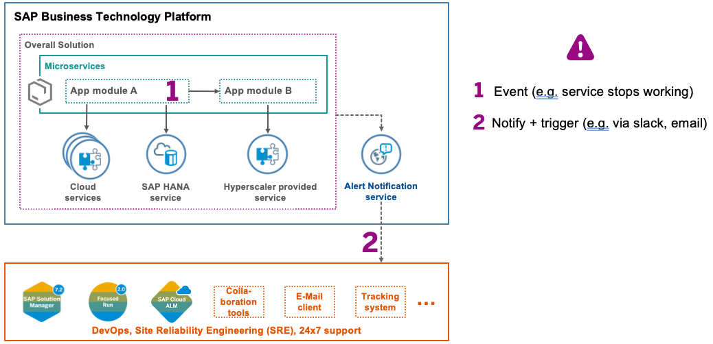

Service offers a variety of Built-In Events. The complete list can be found [here](https://help.sap.com/viewer/5967a369d4b74f7a9c2b91f5df8e6ab6/Cloud/en-US/2ef9c72833df4f2690f071c47f50f5af.html)

For this scenario you will define the following alerts:
* *Application Events* - get notifications when an application crashes, a process crashes or alike
* *Multitarget Application Events* - get notified when the deployment or removal of a specific multi-target application has been initiated

>Note, add the required entitlement SAP Alert Notification service for SAP BTP, in case it is missing in your SAP BTP subaccount. Follow the steps of ["Configure BTP Environment"](https://github.com/SAP-samples/btp-build-resilient-apps/tree/extension/03-PrepareBTP).

1. Navigate to the Service Marketplace and create a new service instance for the Alert Notification service.
    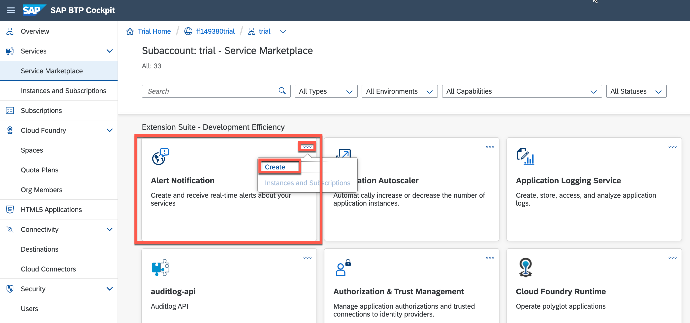
    
2. Provide a service instance name (e.b. alert-notification) and continue with **Create**.
    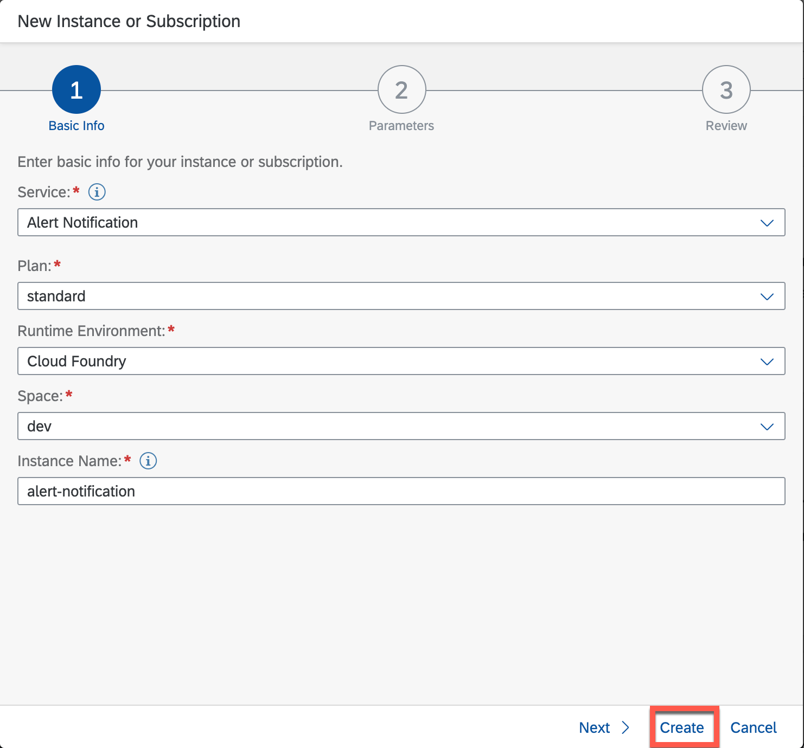

3. Select the newly created instance and click on **Manage Instance** to navigate the to Alert Notification service cockpit.
   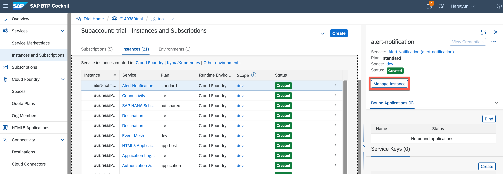

4. Navigate to **Export and Import**, copy and paste the below configuration JSON. **Replace `<your@email.com>`** with your email, where you want to receive the notifications.
   
   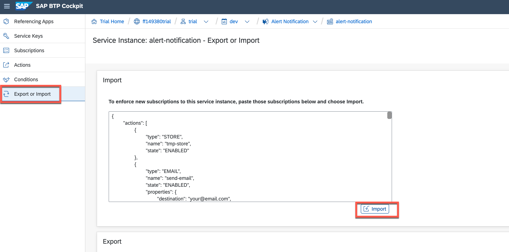

    ```json
        {
        "actions": [
            {
                "type": "EMAIL",
                "name": "send-email",
                "state": "ENABLED",
                "properties": {
                    "destination": "your@email.com",
                    "useHtml": "false"
                }
            },
            {
                "type": "STORE",
                "name": "tmp-store",
                "state": "ENABLED"
            }
        ],
        "conditions": [
            {
                "name": "Audit-App-Crash",
                "mandatory": false,
                "propertyKey": "eventType",
                "predicate": "EQUALS",
                "propertyValue": "app.crash",
                "labels": [],
                "description": ""
            },
            {
                "name": "Audit-App-Update",
                "mandatory": false,
                "propertyKey": "eventType",
                "predicate": "EQUALS",
                "propertyValue": "audit.app.update",
                "labels": [],
                "description": ""
            },
            {
                "name": "mta-category",
                "mandatory": false,
                "propertyKey": "category",
                "predicate": "EQUALS",
                "propertyValue": "NOTIFICATION",
                "labels": [],
                "description": ""
            },
            {
                "name": "Audit-App-Stop",
                "mandatory": false,
                "propertyKey": "eventType",
                "predicate": "CONTAINS",
                "propertyValue": "audit.app.stop",
                "labels": [],
                "description": ""
            },
            {
                "name": "Audit-App-Process-Crash",
                "mandatory": false,
                "propertyKey": "eventType",
                "predicate": "EQUALS",
                "propertyValue": "audit.app.process.crash",
                "labels": [],
                "description": "audit.app.process.crash"
            },
            {
                "name": "Audit-App-Start",
                "mandatory": false,
                "propertyKey": "eventType",
                "predicate": "EQUALS",
                "propertyValue": "audit.app.start",
                "labels": [],
                "description": ""
            },
            {
                "name": "mta-deployment",
                "mandatory": false,
                "propertyKey": "eventType",
                "predicate": "EQUALS",
                "propertyValue": "DEPLOYMENT",
                "labels": [],
                "description": ""
            },
            {
                "name": "mta-undeployment",
                "mandatory": false,
                "propertyKey": "eventType",
                "predicate": "EQUALS",
                "propertyValue": "UNDEPLOYMENT",
                "labels": [],
                "description": ""
            }
        ],
        "subscriptions": [
            {
            "name": "MTA",
            "conditions": [
                "mta-deployment",
                "mta-undeployment"
            ],
            "actions": [
                "tmp-store",
                "send-email"
            ],
            "state": "ENABLED"
            },
            {
            "name": "App-Audit",
            "conditions": [
                "Audit-App-Process-Crash",
                "Audit-App-Stop",
                "Audit-App-Crash",
                "Audit-App-Update"
            ],
            "actions": [
                "tmp-store",
                "send-email"
            ],
            "state": "ENABLED"
            }
        ]
    }
    ```

5. Select **Import** to finish the configuration import. 

6. After the import process has finished, you will find two actions in your Alert Notification cockpit:
   
   * *send-email*: sends e-mail when an alert gets raised happens
   * *tmp-store*: stores the alert temporary in the service. Later it can be accessed e.g. via SAP Cloud ALM
  
   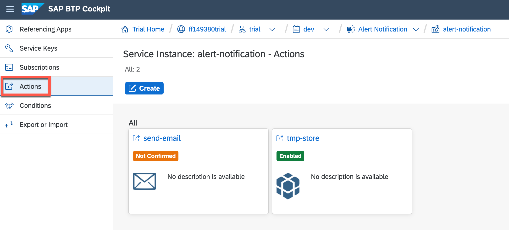
  
 >There are much more notification channels like Slack, Microsoft Teams and many more. The full list can be found [here](https://help.sap.com/viewer/5967a369d4b74f7a9c2b91f5df8e6ab6/Cloud/en-US/8a7e092eebc74b3ea01d506265e8c8f8.html). You can follow the documentation to configure further actions.

7. Confirm your e-mail to activate the e-mail channel.
   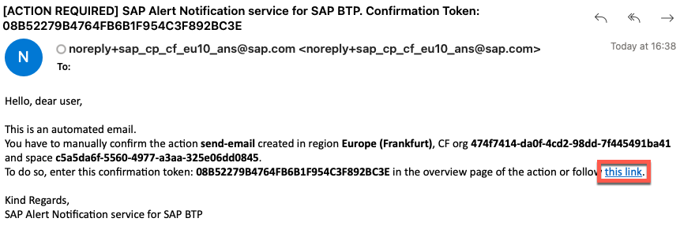

8. To receive notifications about relevant events by the SAP Alert Notification service for SAP BTP, you need subscriptions to these alerts.

   You have defined two Subscriptions while importing the configuration:
   * *App Audit* - get notifications when an app has stopped, crashed, a process has crashed or alike
   * *MTA* - get a notification when the deployment or removal of a multi-target application has been initiated

   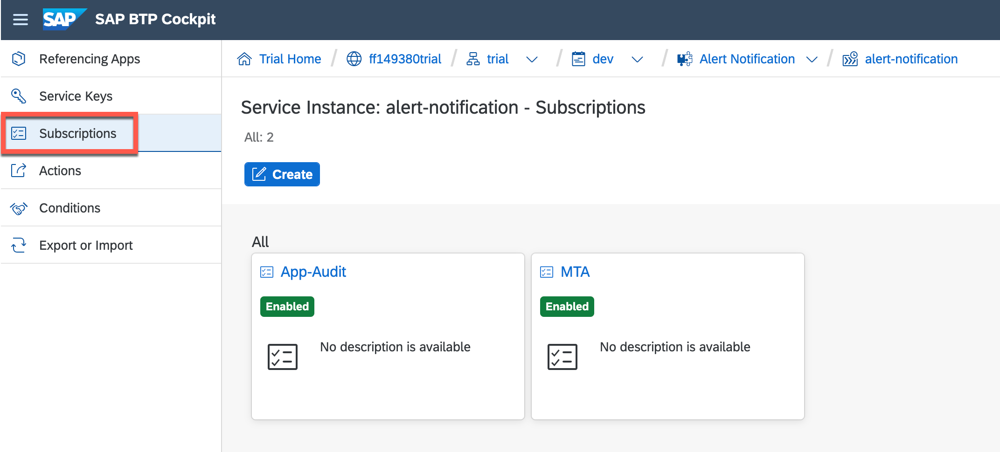

7. Open one of the above mentioned Subscriptions e.g. *App Audit* and check the conditions when the alert will be triggered. 
   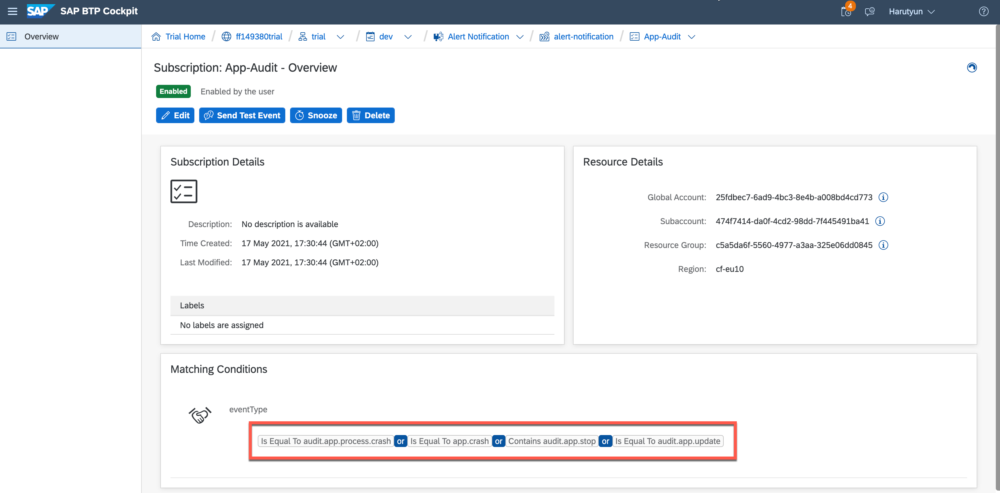

   Whenever one of following conditions will be matched, an alert notification will be triggered - in this example via e-mail:
   - application stops
   - application crashes
   - application process crashes
   - application gets updated

8. For application events, you need to add the respective existing technical users according to their relevant data center. This user must have the **SpaceAuditor** permission. Add the user to the Cloud Foundry space of your SAP BTP subaccount by using its e-mail address.
   
   - the list of technical users depending on the data center can be found [here](https://help.sap.com/viewer/5967a369d4b74f7a9c2b91f5df8e6ab6/Cloud/en-US/4255e6064ea44f20a540c5ae0804500d.html) 
   - in your case, the service should be running in AWS-Frankfurt and the technical user is: sap_cp_eu10_ans@sap.com
   - go to the Cloud Foundry space of your SAP BTP subaccount where your application is deployed and add the user as a member with **SpaceAuditor** role
   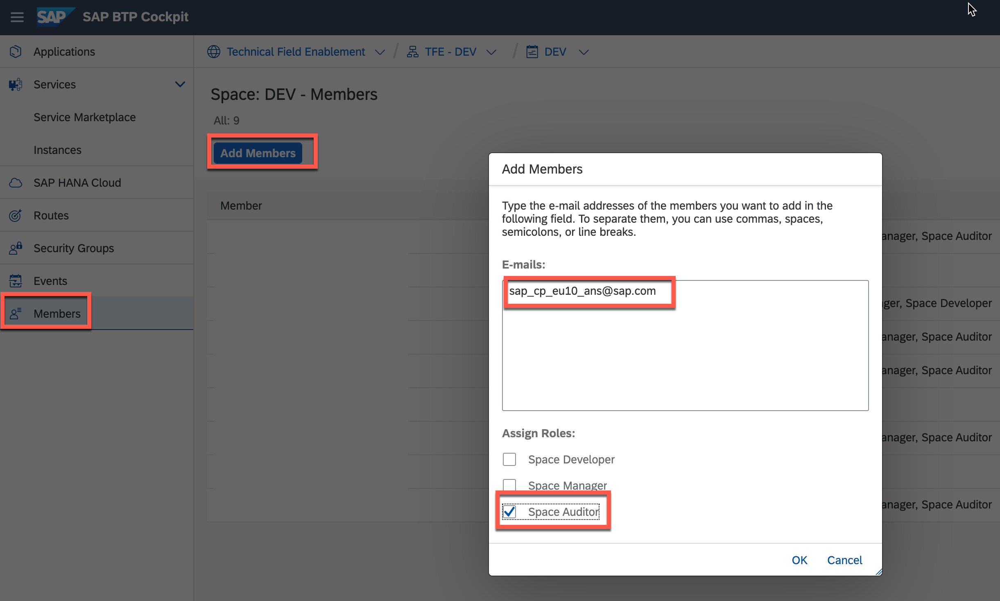

9. To test the alert notification, trigger an event for app audit. You can manually stop the application, which will trigger the event and notify you via e-mail.

    - Go to the Cloud Foundry space in your SAP BTP subaccount and stop the application.
    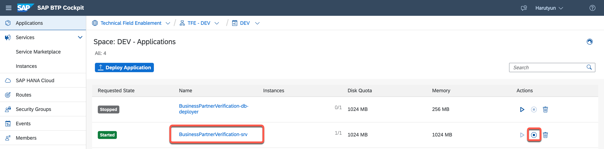
     
    - Check your e-mail inbox. You should have received the information that the application was stopped.
    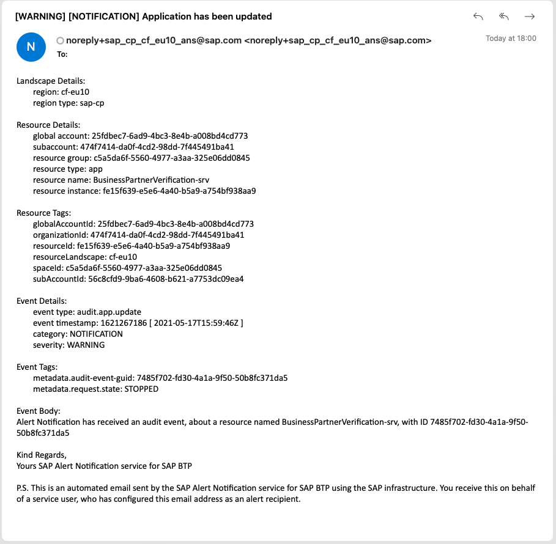
