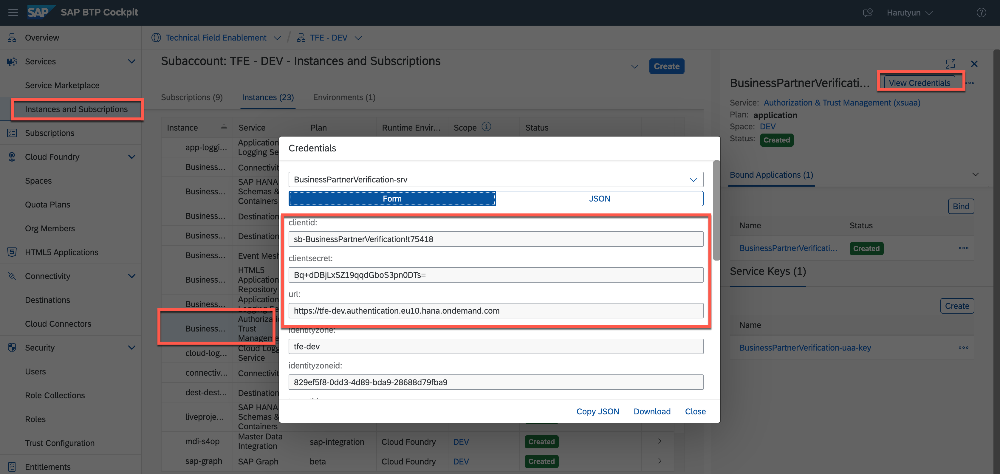
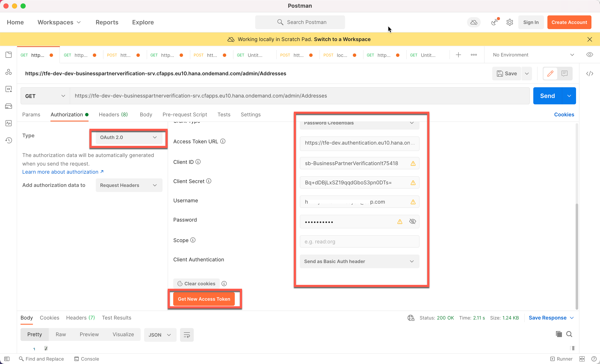
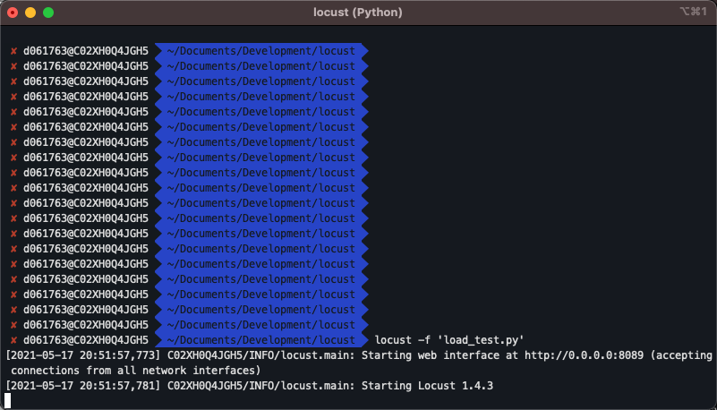
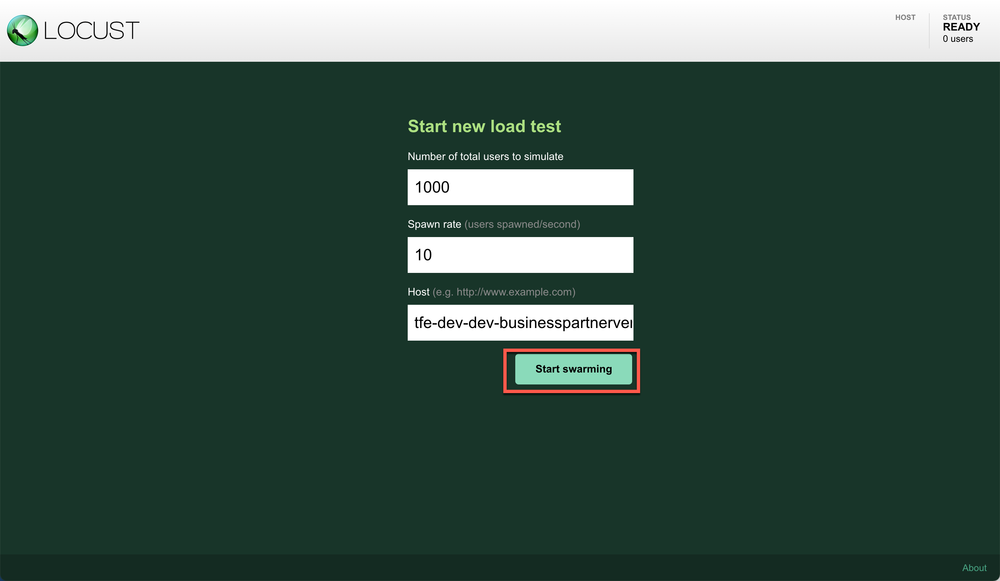
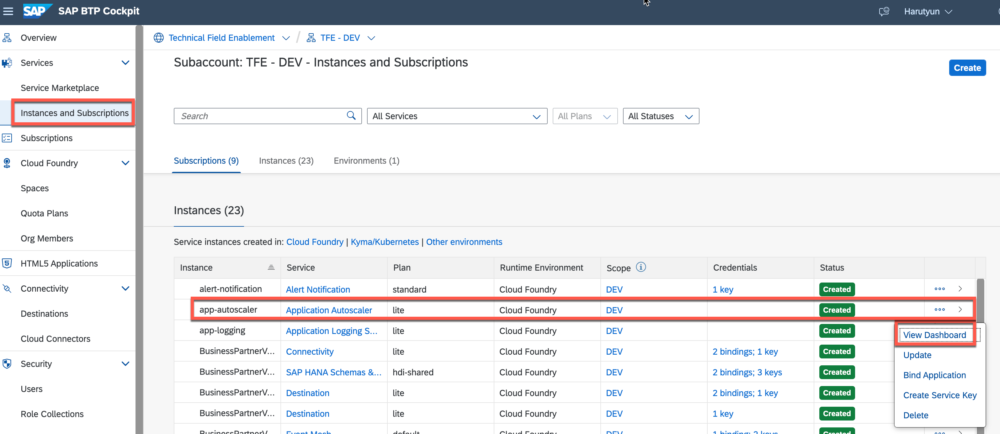
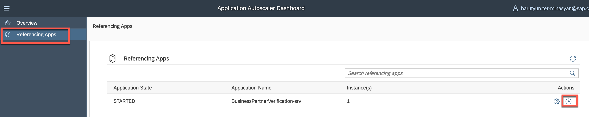
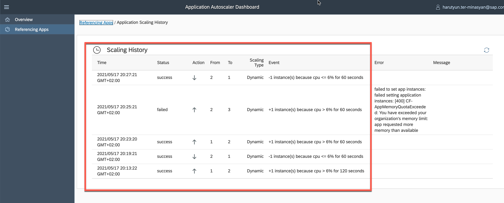

# Test Application Autoscaler

The CAP application running on SAP BTP, Cloud Foundry Runtime produces different metrics such as CPU usage, memory utilized, response times and network traffic.

The application's workload may change over time. In this case, based on usage, the workload can grow or shrink at a specific time. For example, if our extension application is used in parallel by 1000 users, more resources will be required than if only a few users are used in order to keep response times low and the application stable.

To deal with such situations, we can allocate a large number of resources to the application, but this is inefficient because the unused resources will be idle the majority of the time.

A better approach is to use Application Autoscaler service on SAP BTP, Cloud Foundry Runtime to automatically scale applications to meet dynamic resource needs.

---

1. The application autoscaler service instance was created during the deployment of the Multi-Target Application (MTA) using the [mta.yaml](../../mta.yaml#L13-L41) file. The relevant service instance is called **BPVerification-autoscaler** and gets the relevant policy passed directly. **Note: You don't need to do anything here, it's just an explanation what has already happened in earlier steps.**

   ```yaml
   - name: BPVerification-autoscaler
        parameters:
          config:
            instance_min_count: 1
            instance_max_count: 5
            scaling_rules:
            - metric_type: cpu
              threshold: 6
              operator: '>'
              adjustment: '+1'
              breach_duration_secs: 60
              cool_down_secs: 60
            - metric_type: cpu
              threshold: 6
              operator: '<='
              adjustment: '-1'
              breach_duration_secs: 60
              cool_down_secs: 60
   ```
   

> To begin scaling an application, you must first define a policy. A policy an array of rules or a single scaling rule. Scaling policies are classified into two types: 
> - **Dynamic Scaling Policy:** Scale your application instances according to memory/CPU usage, response time, throughput, or custom metrics. -
> - **Schedule-Based Scaling Policy** - Use schedules to scale your application instances.

> For this example you have defined a Dynamic Policy. This rule states that, for the rule to execute, the application must have one instance running at minimum and the Application Autoscaler can scale the application till it has 5 instances running at maximum. The scaling rules are for CPU and states the following things.

> - Whenever threshold value of CPU reaches above 6, scale the application.
> - Breach duration seconds of 60 defines that the amount of time required to analyze the collected data of the metric CPU is 60 seconds.
> - Cool down seconds of 60 defines that the amount of time required between two successive scale triggers is 60 seconds.
> - Adjustment defines what to do when the rule conditions are satisfied. There are two rules in this case. one rule is scaling up the application instances and the other one is scaling down the instances.

    You can find further polices [here](https://help.sap.com/viewer/7472b7d13d5d4862b2b06a730a2df086/Cloud/en-US/e6927e5af85e45f4a8a056c8662fa784.html)

    >Note: the 6% CPU threshold is just an example to demonstrate the feature. In real usecases you should choose realistic thresholds.

3. To test the autoscaling, we may use Locust, an OpenSource load testing tool, to access the application endpoint numerous times in parallel and force the application to auto scale. Install Locust on your machine as follows: Follow the instructions in the official [documentation](https://docs.locust.io/en/stable/installation.html) for your operating system.
   
4. Create a new file on your local machine called *load_test.py* and copy the following snippet. Don't forget to **Save** the file.
   
    ```py

    from locust import HttpUser, TaskSet, task, between

    headers = {
        'cache-control': 'max-age=0',
        'dnt': '1',
        'upgrade-insecure-requests': '1',
        'user-agent': 'Mozilla/5.0 (Macintosh; Intel Mac OS X 10_15_3) AppleWebKit/537.36 (KHTML, like Gecko) Chrome/79.0.3945.130 Safari/537.36',
        'accept': 'text/html,application/xhtml+xml,application/xml;q=0.9,image/webp,image/apng,*/*;q=0.8,application/signed-exchange;v=b3;q=0.9',
        'sec-fetch-site': 'none',
        'sec-fetch-mode': 'navigate',
        'accept-encoding': 'gzip, deflate, br',
        'accept-language': 'en-US,en;q=0.9,de-DE;q=0.8,de;q=0.7,zh-CN;q=0.6,zh;q=0.5',
    }

    class UserBehaviour(HttpUser):
        wait_time = between(5, 9)
        token = "<JWT Access Token>"

        def make_request(self, method, endpoint):
            url = self.host + endpoint
            req_headers = headers
            req_headers['Authorization'] = 'Bearer ' + self.token
            with self.client.request(method=method, url=url, headers=req_headers, catch_response=True) as response:
                if response.status_code == 200:
                    response.success()

        @task()
        def task_1(self):
            self.make_request("GET", '/admin/Addresses?$top=1000')

        @task()
        def task_2(self):
            self.make_request("GET", '/admin/BusinessPartnerVerification?$top=1000')

        @task()
        def task_3(self):
            self.make_request("GET", '/admin/StatusValues')


    ```

7. Go the SAP BTP Cockpit, select the BPVerification-srv application and Select **View credentials**. Note down the **url, clientid and clientsecret**. You are going to use them in the next step to generate a JWT Token, which will allow you hit the secured endpoints of the CAP application from Locust. 
   

8. Use Postman (or curl or any other tool) to get an access token from the UAA instance.
   
   - *Authorization Type:* OAuth 2.0
   - *Grant Type:* Password Credentials
   - *Access Token URL:* BPVerification-srv -> url
     > Note: Please Add "/oauth/token" at the end of url
   - *Client ID:* BPVerification-srv -> clientid
   - *Client Secret:* BPVerification-srv -> clientsecret
   - *Username:* SAP BTP email
   - *Password:* SAP BTP password
   

8. Open a new terminal and navigate to the directory in which you have stored the **load_test.py** file previously. Open the file, replace `<JWT Token>` with the actual JWT Token you have produced in the previous step and **Save**. Then execute the following command:

    ```bash
     locust -f 'load_test.py'
    ```
    
    

9.  Open the Locust Dashboard: <http://0.0.0.0:8089>.

   

11. Start a new load test:
    - Number of total users to simulate: 1000
    - Spawn rate (users spawned/second): 10
    - Host: BusinessPartnerverification-srv URL (e.g. https://tfe-dev-dev-businesspartnerverification-srv.cfapps.eu10.hana.ondemand.com)

    
    > run the test Approximately 2-3min and stop it

12. After the load test we can check the effect of the Application Autoscaler service on the CAP application. 
    
    - open the Application Autoscaler Dashboard.
    
     

    - open Scaling History.
    
     

    - the scaling history shows that when the condition *CPU > 6 percent * is met, an additional app instance is launched.
    
     

      >Note: the 6% CPU threshold is just an example to demonstrate the feature. In real usecases you should choose a more realistic thresholds.
